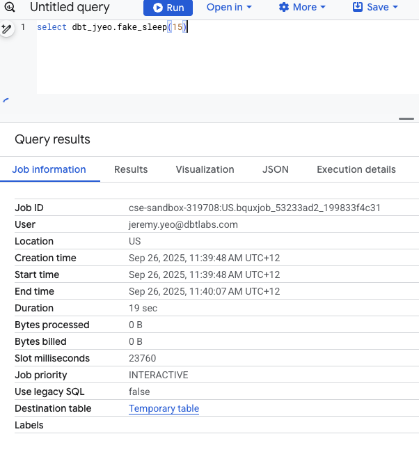
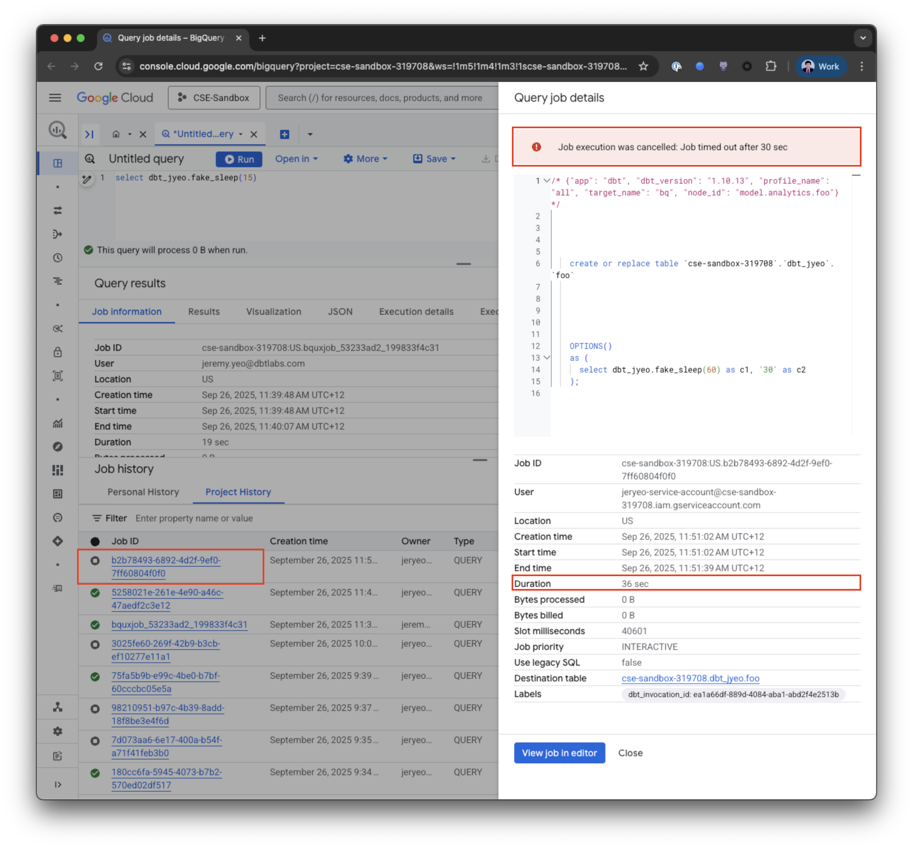
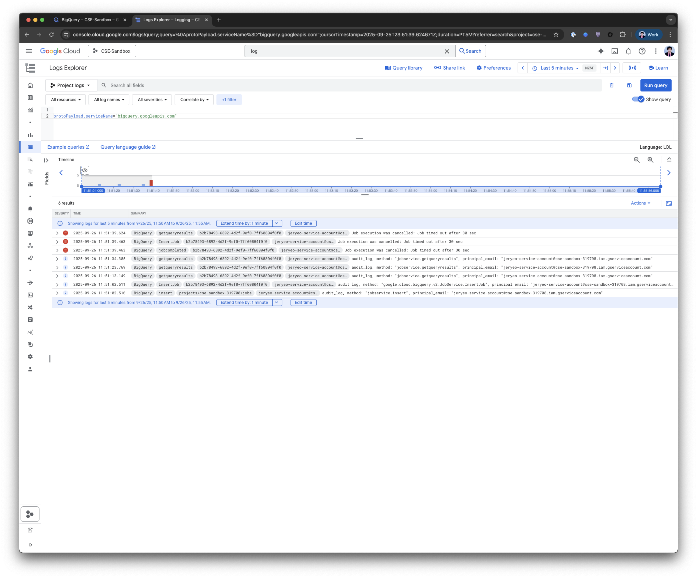
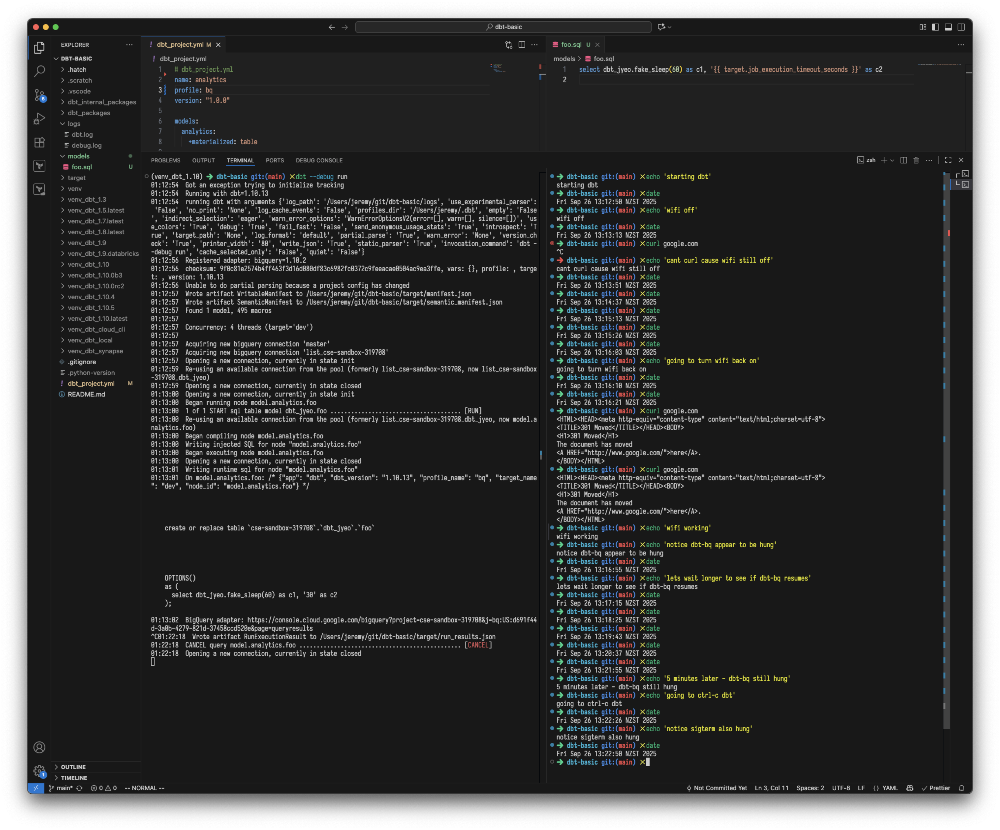
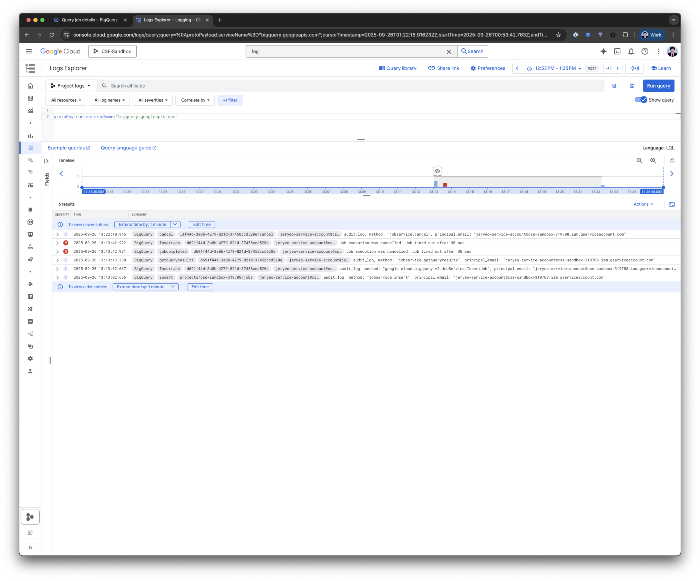

---
---

# BigQuery timeout testing

Some investigation into dbt-bigquery timeout behaviour. The following tests were on:

```sh
$ pip freeze | grep dbt
dbt-adapters==1.16.6
dbt-bigquery==1.10.2
dbt-common==1.29.0
dbt-core==1.10.13
dbt-databricks==1.10.12
dbt-extractor==0.6.0
dbt-protos==1.0.375
dbt-semantic-interfaces==0.9.0
dbt-snowflake==1.10.2
dbt-spark==1.9.3

$ python --version
Python 3.11.9
```

## Long running query simulation

BigQuery doesn't have any native sleep function (unlike say Snowflake with `system$wait()`) so we need to simulate that with a BQ python function:

```sql
create or replace function dbt_jyeo.fake_sleep(seconds int64)
returns string
language python
options(runtime_version="python-3.11", entry_point="main")
as r'''
# python function takes time to spin up so this is a lower bound (wait at minimum).
import time
def main(seconds):
  time.sleep(seconds)
  return f'waited at least {seconds} seconds'
''';
```



^ Query took at minimum 15 seconds.

## No network issues

Let's test when we have no network issues...

```yaml
# ~/.dbt/profiles.yml
bq:
  target: dev
  outputs:
    dev:
      type: bigquery
      job_execution_timeout_seconds: 30
      ...

# dbt_project.yml
name: analytics
profile: bq
models:
  analytics:
    +materialized: table
```

```sql
-- models/foo.sql
select dbt_jyeo.fake_sleep(60) as c1, '{{ target.job_execution_timeout_seconds }}' as c2
```

1. job_execution_timeout_seconds is set to 30 seconds.
2. Model foo is going to run for at minimum 60 seconds.

```sh
$ dbt --debug build

23:50:55  Got an exception trying to initialize tracking
23:50:55  Running with dbt=1.10.13
23:50:55  running dbt with arguments {'printer_width': '80', 'fail_fast': 'False', 'warn_error': 'None', 'introspect': 'True', 'empty': 'False', 'debug': 'True', 'use_colors': 'True', 'log_cache_events': 'False', 'version_check': 'True', 'partial_parse': 'True', 'warn_error_options': 'WarnErrorOptionsV2(error=[], warn=[], silence=[])', 'cache_selected_only': 'False', 'log_format': 'default', 'no_print': 'None', 'quiet': 'False', 'invocation_command': 'dbt --debug run', 'target_path': 'None', 'send_anonymous_usage_stats': 'True', 'write_json': 'True', 'profiles_dir': '/Users/jeremy/.dbt', 'log_path': '/Users/jeremy/git/dbt-basic/logs', 'static_parser': 'True', 'indirect_selection': 'eager', 'use_experimental_parser': 'False'}
23:50:57  Registered adapter: bigquery=1.10.2
23:50:57  checksum: 9f0c81e2574b4ff463f3d16d080df83c6982fc0372c9feeacae0504ac9ea3ffe, vars: {}, profile: , target: , version: 1.10.13
23:50:57  Unable to do partial parsing because of a version mismatch
23:50:57  Wrote artifact WritableManifest to /Users/jeremy/git/dbt-basic/target/manifest.json
23:50:57  Wrote artifact SemanticManifest to /Users/jeremy/git/dbt-basic/target/semantic_manifest.json
23:50:57  Found 1 model, 495 macros
23:50:57
23:50:57  Concurrency: 4 threads (target='bq')
23:50:57
23:50:57  Acquiring new bigquery connection 'master'
23:50:57  Acquiring new bigquery connection 'list_cse-sandbox-319708'
23:50:57  Opening a new connection, currently in state init
23:50:59  Re-using an available connection from the pool (formerly list_cse-sandbox-319708, now list_cse-sandbox-319708_dbt_jyeo)
23:50:59  Opening a new connection, currently in state closed
23:51:00  Opening a new connection, currently in state init
23:51:00  Began running node model.analytics.foo
23:51:00  1 of 1 START sql table model dbt_jyeo.foo ...................................... [RUN]
23:51:00  Re-using an available connection from the pool (formerly list_cse-sandbox-319708_dbt_jyeo, now model.analytics.foo)
23:51:00  Began compiling node model.analytics.foo
23:51:00  Writing injected SQL for node "model.analytics.foo"
23:51:00  Began executing node model.analytics.foo
23:51:00  Opening a new connection, currently in state closed
23:51:01  Writing runtime sql for node "model.analytics.foo"
23:51:01  On model.analytics.foo: /* {"app": "dbt", "dbt_version": "1.10.13", "profile_name": "all", "target_name": "bq", "node_id": "model.analytics.foo"} */
    create or replace table `cse-sandbox-319708`.`dbt_jyeo`.`foo`
    OPTIONS()
    as (
      select dbt_jyeo.fake_sleep(60) as c1, '30' as c2
    );
23:51:02  BigQuery adapter: https://console.cloud.google.com/bigquery?project=cse-sandbox-319708&j=bq:US:b2b78493-6892-4d2f-9ef0-7ff60804f0f0&page=queryresults

<APPROX 30 SECONDS LATER>

23:51:39  BigQuery adapter: Unhandled error while running:
/* {"app": "dbt", "dbt_version": "1.10.13", "profile_name": "all", "target_name": "bq", "node_id": "model.analytics.foo"} */
    create or replace table `cse-sandbox-319708`.`dbt_jyeo`.`foo`
    OPTIONS()
    as (
      select dbt_jyeo.fake_sleep(60) as c1, '30' as c2
    );

23:51:39  BigQuery adapter: 499 GET https://bigquery.googleapis.com/bigquery/v2/projects/cse-sandbox-319708/queries/b2b78493-6892-4d2f-9ef0-7ff60804f0f0?maxResults=0&location=US&prettyPrint=false: Job execution was cancelled: Job timed out after 30 sec

Location: US
Job ID: b2b78493-6892-4d2f-9ef0-7ff60804f0f0

23:51:39  Database Error in model foo (models/foo.sql)
  499 GET https://bigquery.googleapis.com/bigquery/v2/projects/cse-sandbox-319708/queries/b2b78493-6892-4d2f-9ef0-7ff60804f0f0?maxResults=0&location=US&prettyPrint=false: Job execution was cancelled: Job timed out after 30 sec

  Location: US
  Job ID: b2b78493-6892-4d2f-9ef0-7ff60804f0f0

  compiled code at target/run/analytics/models/foo.sql
23:51:39  1 of 1 ERROR creating sql table model dbt_jyeo.foo ............................. [ERROR in 39.19s]
23:51:39  Finished running node model.analytics.foo
23:51:39  Marking all children of 'model.analytics.foo' to be skipped because of status 'error'.  Reason: Database Error in model foo (models/foo.sql)
  499 GET https://bigquery.googleapis.com/bigquery/v2/projects/cse-sandbox-319708/queries/b2b78493-6892-4d2f-9ef0-7ff60804f0f0?maxResults=0&location=US&prettyPrint=false: Job execution was cancelled: Job timed out after 30 sec

  Location: US
  Job ID: b2b78493-6892-4d2f-9ef0-7ff60804f0f0

  compiled code at target/run/analytics/models/foo.sql.
23:51:39  Opening a new connection, currently in state closed
23:51:39  Connection 'master' was properly closed.
23:51:39  Connection 'model.analytics.foo' was properly closed.
23:51:39
23:51:39  Finished running 1 table model in 0 hours 0 minutes and 42.31 seconds (42.31s).
23:51:39  Command end result
23:51:39  Wrote artifact WritableManifest to /Users/jeremy/git/dbt-basic/target/manifest.json
23:51:39  Wrote artifact SemanticManifest to /Users/jeremy/git/dbt-basic/target/semantic_manifest.json
23:51:39  Wrote artifact RunExecutionResult to /Users/jeremy/git/dbt-basic/target/run_results.json
23:51:39
23:51:39  Completed with 1 error, 0 partial successes, and 0 warnings:
23:51:39
23:51:39  Failure in model foo (models/foo.sql)
23:51:39    Database Error in model foo (models/foo.sql)
  499 GET https://bigquery.googleapis.com/bigquery/v2/projects/cse-sandbox-319708/queries/b2b78493-6892-4d2f-9ef0-7ff60804f0f0?maxResults=0&location=US&prettyPrint=false: Job execution was cancelled: Job timed out after 30 sec

  Location: US
  Job ID: b2b78493-6892-4d2f-9ef0-7ff60804f0f0

  compiled code at target/run/analytics/models/foo.sql
23:51:39
23:51:39    compiled code at target/compiled/analytics/models/foo.sql
23:51:39
23:51:39  Done. PASS=0 WARN=0 ERROR=1 SKIP=0 NO-OP=0 TOTAL=1
23:51:39  Resource report: {"command_name": "run", "command_success": false, "command_wall_clock_time": 44.49159, "process_in_blocks": "0", "process_kernel_time": 0.398243, "process_mem_max_rss": "390578176", "process_out_blocks": "0", "process_user_time": 2.535424}
23:51:39  Command `dbt run` failed at 11:51:39.958650 after 44.49 seconds
23:51:39  Flushing usage events
```

dbt logged that the "Job timed out after 30 sec". What do we see on the BigQuery UI?



We see that for that query/job:

> Job execution was cancelled: Job timed out after 30 sec

And from the GCP Logs Explorer:



## Network issues

To simulate networking issues, we're going to start the dbt invocation, and then after we see dbt log that the query has been sent to BQ, I'm going to turn off my wifi for a few minutes and then turn it back on.



^ As we can see, once the network drops, and we turn it back on a few minutes later, dbt is in a hung state / stall.

How does this appear on the BQ UI? Just like before, we see "Job execution was cancelled: Job timed out after 30 sec"


And in Logs Explorer:



^ There's only a single `getqueryresults` this time compared to the previous one, since we dropped the network, we didn't come around to `getqueryresults` a second time.

## Network issues (Snowflake)

As a counter example, let's see how dbt-snowflake behaves when we disconnect for a few minutes:

```sql
-- models/foo.sql
select system$wait(60) as c
```

Start our dbt invocation:

```sh
$ export DBT_SNOWFLAKE_CONNECTOR_DEBUG_LOGGING=true
$ dbt --debug run

01:36:02  Got an exception trying to initialize tracking
01:36:02  Running with dbt=1.10.13
01:36:02  running dbt with arguments {'log_cache_events': 'False', 'use_colors': 'True', 'fail_fast': 'False', 'target_path': 'None', 'use_experimental_parser': 'False', 'log_path': '/Users/jeremy/git/dbt-basic/logs', 'debug': 'True', 'introspect': 'True', 'version_check': 'True', 'no_print': 'None', 'invocation_command': 'dbt --debug run', 'send_anonymous_usage_stats': 'True', 'log_format': 'default', 'warn_error_options': 'WarnErrorOptionsV2(error=[], warn=[], silence=[])', 'cache_selected_only': 'False', 'warn_error': 'None', 'partial_parse': 'True', 'quiet': 'False', 'static_parser': 'True', 'write_json': 'True', 'empty': 'False', 'indirect_selection': 'eager', 'profiles_dir': '/Users/jeremy/.dbt', 'printer_width': '80'}
01:36:03  Snowflake adapter: Setting snowflake.connector to DEBUG
01:36:03  Snowflake adapter: Setting botocore to DEBUG
01:36:03  Snowflake adapter: Setting boto3 to DEBUG
01:36:03  Registered adapter: snowflake=1.10.2
01:36:03  checksum: 9f0c81e2574b4ff463f3d16d080df83c6982fc0372c9feeacae0504ac9ea3ffe, vars: {}, profile: , target: , version: 1.10.13
01:36:03  Partial parsing enabled: 0 files deleted, 0 files added, 0 files changed.
01:36:03  Partial parsing enabled, no changes found, skipping parsing
01:36:03  Wrote artifact WritableManifest to /Users/jeremy/git/dbt-basic/target/manifest.json
01:36:03  Wrote artifact SemanticManifest to /Users/jeremy/git/dbt-basic/target/semantic_manifest.json
01:36:03  Found 1 model, 479 macros
01:36:03
01:36:03  Concurrency: 1 threads (target='ci')
01:36:03
01:36:03  Acquiring new snowflake connection 'master'
01:36:03  Acquiring new snowflake connection 'list_db'
01:36:03  Using snowflake connection "list_db"
01:36:03  On list_db: show terse schemas in database db
    limit 10000
/* {"app": "dbt", "dbt_version": "1.10.13", "profile_name": "sf", "target_name": "ci", "connection_name": "list_db"} */
01:36:03  Opening a new connection, currently in state init
01:36:03  reading configuration file from /Users/jeremy/Library/Application Support/snowflake/connections.toml
DEBUG:snowflake.connector.config_manager:reading configuration file from /Users/jeremy/Library/Application Support/snowflake/connections.toml
01:36:03  Snowflake Connector for Python Version: 3.17.3, Python Version: 3.11.9, Platform: macOS-15.6-arm64-arm-64bit
INFO:snowflake.connector.connection:Snowflake Connector for Python Version: 3.17.3, Python Version: 3.11.9, Platform: macOS-15.6-arm64-arm-64bit
01:36:03  connect
DEBUG:snowflake.connector.connection:connect
01:36:03  __config
DEBUG:snowflake.connector.connection:__config
01:36:03  Connecting to GLOBAL Snowflake domain
INFO:snowflake.connector.connection:Connecting to GLOBAL Snowflake domain
01:36:03  This connection is in OCSP Fail Open Mode. TLS Certificates would be checked for validity and revocation status. Any other Certificate Revocation related exceptions or OCSP Responder failures would be disregarded in favor of connectivity.
DEBUG:snowflake.connector.connection:This connection is in OCSP Fail Open Mode. TLS Certificates would be checked for validity and revocation status. Any other Certificate Revocation related exceptions or OCSP Responder failures would be disregarded in favor of connectivity.
01:36:03  use_numpy: False
DEBUG:snowflake.connector.converter:use_numpy: False
01:36:03  REST API object was created: ska67070.snowflakecomputing.com:443
DEBUG:snowflake.connector.connection:REST API object was created: ska67070.snowflakecomputing.com:443
01:36:03  authenticate
DEBUG:snowflake.connector.auth._auth:authenticate
01:36:03  IMDS ENDPOINT: http://169.254.169.254/
DEBUG:botocore.utils:IMDS ENDPOINT: http://169.254.169.254/
01:36:03  Changing event name from creating-client-class.iot-data to creating-client-class.iot-data-plane
DEBUG:botocore.hooks:Changing event name from creating-client-class.iot-data to creating-client-class.iot-data-plane
01:36:03  Changing event name from before-call.apigateway to before-call.api-gateway
DEBUG:botocore.hooks:Changing event name from before-call.apigateway to before-call.api-gateway
01:36:03  Changing event name from request-created.machinelearning.Predict to request-created.machine-learning.Predict
DEBUG:botocore.hooks:Changing event name from request-created.machinelearning.Predict to request-created.machine-learning.Predict
01:36:03  Changing event name from before-parameter-build.autoscaling.CreateLaunchConfiguration to before-parameter-build.auto-scaling.CreateLaunchConfiguration
DEBUG:botocore.hooks:Changing event name from before-parameter-build.autoscaling.CreateLaunchConfiguration to before-parameter-build.auto-scaling.CreateLaunchConfiguration
01:36:03  Changing event name from before-parameter-build.route53 to before-parameter-build.route-53
DEBUG:botocore.hooks:Changing event name from before-parameter-build.route53 to before-parameter-build.route-53
01:36:03  Changing event name from request-created.cloudsearchdomain.Search to request-created.cloudsearch-domain.Search
DEBUG:botocore.hooks:Changing event name from request-created.cloudsearchdomain.Search to request-created.cloudsearch-domain.Search
01:36:03  Changing event name from docs.*.autoscaling.CreateLaunchConfiguration.complete-section to docs.*.auto-scaling.CreateLaunchConfiguration.complete-section
01:36:03  Starting new HTTP connection (1): 169.254.169.254:80

<!!! Logs are very verbose so truncating for brevity !!!>

01:36:07  beginning to schedule result batch downloads
DEBUG:snowflake.connector.result_set:beginning to schedule result batch downloads
01:36:07  Began running node model.analytics.foo
01:36:07  1 of 1 START sql table model sch.foo ........................................... [RUN]
01:36:07  Re-using an available connection from the pool (formerly list_db_sch, now model.analytics.foo)
01:36:07  Began compiling node model.analytics.foo
01:36:07  Writing injected SQL for node "model.analytics.foo"
01:36:07  Began executing node model.analytics.foo
01:36:07  Writing runtime sql for node "model.analytics.foo"
01:36:07  Using snowflake connection "model.analytics.foo"
01:36:07  On model.analytics.foo: create or replace transient table db.sch.foo

    as (select system$wait(60) as c
    )

/* {"app": "dbt", "dbt_version": "1.10.13", "profile_name": "sf", "target_name": "ci", "node_id": "model.analytics.foo"} */;
01:36:07  cursor
DEBUG:snowflake.connector.connection:cursor
01:36:07  executing SQL/command
DEBUG:snowflake.connector.cursor:executing SQL/command
01:36:07  query: [create or replace transient table db.sch.foo    as (select system$wait(60) as c ...]
DEBUG:snowflake.connector.cursor:query: [create or replace transient table db.sch.foo    as (select system$wait(60) as c ...]
01:36:07  binding: [create or replace transient table db.sch.foo    as (select system$wait(60) as c ...] with input=[None], processed=[{}]
DEBUG:snowflake.connector.cursor:binding: [create or replace transient table db.sch.foo    as (select system$wait(60) as c ...] with input=[None], processed=[{}]
01:36:07  sequence counter: 3
DEBUG:snowflake.connector.connection:sequence counter: 3
01:36:07  Request id: c4e58221-06fc-4b6a-bc95-9a5fdd2a4bb3
DEBUG:snowflake.connector.cursor:Request id: c4e58221-06fc-4b6a-bc95-9a5fdd2a4bb3
01:36:07  running query [create or replace transient table db.sch.foo    as (select system$wait(60) as c ...]
DEBUG:snowflake.connector.cursor:running query [create or replace transient table db.sch.foo    as (select system$wait(60) as c ...]
01:36:07  is_file_transfer: False
DEBUG:snowflake.connector.cursor:is_file_transfer: False
01:36:07  Failed to set SIGINT handler. Not in main thread. Ignored...
DEBUG:snowflake.connector.cursor:Failed to set SIGINT handler. Not in main thread. Ignored...
01:36:07  _cmd_query
DEBUG:snowflake.connector.connection:_cmd_query
01:36:07  serialize_to_dict() called
DEBUG:snowflake.connector._query_context_cache:serialize_to_dict() called
01:36:07  Cache Entry: (0, 1758850567439754, 0)
DEBUG:snowflake.connector._query_context_cache:Cache Entry: (0, 1758850567439754, 0)
01:36:07  serialize_to_dict(): data to send to server {'entries': [{'id': 0, 'timestamp': 1758850567439754, 'priority': 0, 'context': {'base64Data': 'CILvmIEw'}}]}
DEBUG:snowflake.connector._query_context_cache:serialize_to_dict(): data to send to server {'entries': [{'id': 0, 'timestamp': 1758850567439754, 'priority': 0, 'context': {'base64Data': 'CILvmIEw'}}]}
01:36:07  sql=[create or replace transient table db.sch.foo    as (select system$wait(60) as c ...], sequence_id=[3], is_file_transfer=[False]
DEBUG:snowflake.connector.connection:sql=[create or replace transient table db.sch.foo    as (select system$wait(60) as c ...], sequence_id=[3], is_file_transfer=[False]
01:36:07  Opentelemtry otel injection failed
DEBUG:snowflake.connector.network:Opentelemtry otel injection failed
Traceback (most recent call last):
  File "/Users/jeremy/git/dbt-basic/venv_dbt_1.10/lib/python3.11/site-packages/snowflake/connector/network.py", line 448, in request
    from opentelemetry.trace.propagation.tracecontext import (
ModuleNotFoundError: No module named 'opentelemetry'
01:36:07  remaining request timeout: N/A ms, retry cnt: 1
DEBUG:snowflake.connector.network:remaining request timeout: N/A ms, retry cnt: 1
01:36:07  Request guid: c2094015-1278-4412-8dac-89107dd5108f
DEBUG:snowflake.connector.network:Request guid: c2094015-1278-4412-8dac-89107dd5108f
01:36:07  socket timeout: 60
DEBUG:snowflake.connector.network:socket timeout: 60

```

!!! TURN OFF WIFI HERE !!!

```sh
...
01:37:07  retrying: errorclass=<class 'snowflake.connector.vendored.requests.exceptions.ReadTimeout'>, error=HTTPSConnectionPool(host='ska67070.snowflakecomputing.com', port=443): Read timed out. (read timeout=60), counter=1, sleeping=1(s)
DEBUG:snowflake.connector.network:retrying: errorclass=<class 'snowflake.connector.vendored.requests.exceptions.ReadTimeout'>, error=HTTPSConnectionPool(host='ska67070.snowflakecomputing.com', port=443): Read timed out. (read timeout=60), counter=1, sleeping=1(s)
01:37:08  Update retry count to 1
DEBUG:snowflake.connector.time_util:Update retry count to 1
01:37:08  Update sleep time to 0 seconds
DEBUG:snowflake.connector.time_util:Update sleep time to 0 seconds
01:37:08  remaining request timeout: N/A ms, retry cnt: 2
DEBUG:snowflake.connector.network:remaining request timeout: N/A ms, retry cnt: 2
01:37:08  Request guid: 71bf43c3-5836-40a1-96d2-15a25e5bd7af
DEBUG:snowflake.connector.network:Request guid: 71bf43c3-5836-40a1-96d2-15a25e5bd7af
01:37:08  socket timeout: 60
DEBUG:snowflake.connector.network:socket timeout: 60
01:37:08  Starting new HTTPS connection (2): ska67070.snowflakecomputing.com:443
DEBUG:snowflake.connector.vendored.urllib3.connectionpool:Starting new HTTPS connection (2): ska67070.snowflakecomputing.com:443
...
01:38:08  Update retry count to 2
DEBUG:snowflake.connector.time_util:Update retry count to 2
01:38:08  Update sleep time to 4 seconds
DEBUG:snowflake.connector.time_util:Update sleep time to 4 seconds
01:38:08  remaining request timeout: N/A ms, retry cnt: 3
DEBUG:snowflake.connector.network:remaining request timeout: N/A ms, retry cnt: 3
01:38:08  Request guid: c79b726e-b7db-4750-8b4f-112b9c487cfe
DEBUG:snowflake.connector.network:Request guid: c79b726e-b7db-4750-8b4f-112b9c487cfe
01:38:08  socket timeout: 60
DEBUG:snowflake.connector.network:socket timeout: 60
01:38:08  Starting new HTTPS connection (4): ska67070.snowflakecomputing.com:443
DEBUG:snowflake.connector.vendored.urllib3.connectionpool:Starting new HTTPS connection (4): ska67070.snowflakecomputing.com:443
...
01:40:16  Update retry count to 4
DEBUG:snowflake.connector.time_util:Update retry count to 4
01:40:16  Update sleep time to 1 seconds
DEBUG:snowflake.connector.time_util:Update sleep time to 1 seconds
01:40:16  remaining request timeout: N/A ms, retry cnt: 5
DEBUG:snowflake.connector.network:remaining request timeout: N/A ms, retry cnt: 5
01:40:16  Request guid: 8ec29801-40dc-4542-84f2-83831cc4790c
DEBUG:snowflake.connector.network:Request guid: 8ec29801-40dc-4542-84f2-83831cc4790c
01:40:16  socket timeout: 60
DEBUG:snowflake.connector.network:socket timeout: 60
01:40:16  Starting new HTTPS connection (8): ska67070.snowflakecomputing.com:443
DEBUG:snowflake.connector.vendored.urllib3.connectionpool:Starting new HTTPS connection (8): ska67070.snowflakecomputing.com:443
...
```

^ While the network is down, connector polls continuously to check the query result status with exp backoff.

!!! TURN ON WIFI HERE (4 minutes later) !!!

```sh
...
01:40:59  OCSP Mode: FAIL_OPEN, OCSP response cache file name: None
DEBUG:snowflake.connector.ssl_wrap_socket:OCSP Mode: FAIL_OPEN, OCSP response cache file name: None
01:40:59  ocsp_response_cache_uri: file:///Users/jeremy/Library/Caches/Snowflake/ocsp_response_cache.json

<TRUNCATE FOR BREVITY>

DEBUG:snowflake.connector.network:SUCCESS
01:41:00  ret[code] = None, after post request
DEBUG:snowflake.connector.network:ret[code] = None, after post request
01:41:00  Query id: 01bf4c80-0809-8dba-000d-378354a74702
DEBUG:snowflake.connector.network:Query id: 01bf4c80-0809-8dba-000d-378354a74702
01:41:00  deserialize_json_dict() called: data from server: {'entries': [{'id': 0, 'timestamp': 1758850860031962, 'priority': 0, 'context': 'CKLvmIEw'}]}
DEBUG:snowflake.connector._query_context_cache:deserialize_json_dict() called: data from server: {'entries': [{'id': 0, 'timestamp': 1758850860031962, 'priority': 0, 'context': 'CKLvmIEw'}]}
01:41:00  Cache Entry: (0, 1758850567439754, 0)
DEBUG:snowflake.connector._query_context_cache:Cache Entry: (0, 1758850567439754, 0)
01:41:00  deserialize {'id': 0, 'timestamp': 1758850860031962, 'priority': 0, 'context': 'CKLvmIEw'}
DEBUG:snowflake.connector._query_context_cache:deserialize {'id': 0, 'timestamp': 1758850860031962, 'priority': 0, 'context': 'CKLvmIEw'}
01:41:00  sync_priority_map called priority_map size = 0, new_priority_map size = 1
DEBUG:snowflake.connector._query_context_cache:sync_priority_map called priority_map size = 0, new_priority_map size = 1
01:41:00  trim_cache() called. treeSet size is 1 and cache capacity is 5
DEBUG:snowflake.connector._query_context_cache:trim_cache() called. treeSet size is 1 and cache capacity is 5
01:41:00  trim_cache() returns. treeSet size is 1 and cache capacity is 5
DEBUG:snowflake.connector._query_context_cache:trim_cache() returns. treeSet size is 1 and cache capacity is 5
01:41:00  deserialize_json_dict() returns
DEBUG:snowflake.connector._query_context_cache:deserialize_json_dict() returns
01:41:00  Cache Entry: (0, 1758850860031962, 0)
DEBUG:snowflake.connector._query_context_cache:Cache Entry: (0, 1758850860031962, 0)
01:41:00  Failed to reset SIGINT handler. Not in main thread. Ignored...
DEBUG:snowflake.connector.cursor:Failed to reset SIGINT handler. Not in main thread. Ignored...
01:41:00  sfqid: 01bf4c80-0809-8dba-000d-378354a74702
DEBUG:snowflake.connector.cursor:sfqid: 01bf4c80-0809-8dba-000d-378354a74702
01:41:00  query execution done
DEBUG:snowflake.connector.cursor:query execution done
01:41:00  SUCCESS
DEBUG:snowflake.connector.cursor:SUCCESS
01:41:00  PUT OR GET: False
DEBUG:snowflake.connector.cursor:PUT OR GET: False
01:41:00  Query result format: json
DEBUG:snowflake.connector.cursor:Query result format: json
01:41:00  parsing for result batch id: 1
DEBUG:snowflake.connector.result_batch:parsing for result batch id: 1
01:41:00  Number of results in first chunk: 1
DEBUG:snowflake.connector.cursor:Number of results in first chunk: 1
01:41:00  SQL status: SUCCESS 1 in 292.538 seconds
01:41:00  1 of 1 OK created sql table model sch.foo ...................................... [SUCCESS 1 in 292.59s]
01:41:00  Finished running node model.analytics.foo
01:41:00  Connection 'master' was properly closed.
01:41:00  Connection 'model.analytics.foo' was left open.
01:41:00  On model.analytics.foo: Close
01:41:00  closed
DEBUG:snowflake.connector.connection:closed

<TRUNCATE FOR BREVITY>

DEBUG:snowflake.connector.network:remaining request timeout: 5000 ms, retry cnt: 1
01:41:00  Request guid: b1714b72-ab6c-45a1-88ad-e20053c6b147
DEBUG:snowflake.connector.network:Request guid: b1714b72-ab6c-45a1-88ad-e20053c6b147
01:41:00  socket timeout: 60
DEBUG:snowflake.connector.network:socket timeout: 60
01:41:00  https://ska67070.snowflakecomputing.com:443 "POST /telemetry/send?request_guid=b1714b72-ab6c-45a1-88ad-e20053c6b147 HTTP/1.1" 200 None
DEBUG:snowflake.connector.vendored.urllib3.connectionpool:https://ska67070.snowflakecomputing.com:443 "POST /telemetry/send?request_guid=b1714b72-ab6c-45a1-88ad-e20053c6b147 HTTP/1.1" 200 None
01:41:00  SUCCESS
DEBUG:snowflake.connector.network:SUCCESS
01:41:00  ret[code] = None, after post request
DEBUG:snowflake.connector.network:ret[code] = None, after post request
01:41:00  Successfully uploading metrics to telemetry.
DEBUG:snowflake.connector.telemetry:Successfully uploading metrics to telemetry.
01:41:00  No async queries seem to be running, deleting session
DEBUG:snowflake.connector.connection:No async queries seem to be running, deleting session
01:41:00  remaining request timeout: 5000 ms, retry cnt: 1
DEBUG:snowflake.connector.network:remaining request timeout: 5000 ms, retry cnt: 1
01:41:00  Request guid: 747c8ea7-0c02-407d-a9bf-85bf4ae17953
DEBUG:snowflake.connector.network:Request guid: 747c8ea7-0c02-407d-a9bf-85bf4ae17953
01:41:00  socket timeout: 60
DEBUG:snowflake.connector.network:socket timeout: 60
01:41:00  https://ska67070.snowflakecomputing.com:443 "POST /session?delete=true&request_guid=747c8ea7-0c02-407d-a9bf-85bf4ae17953 HTTP/1.1" 200 None
DEBUG:snowflake.connector.vendored.urllib3.connectionpool:https://ska67070.snowflakecomputing.com:443 "POST /session?delete=true&request_guid=747c8ea7-0c02-407d-a9bf-85bf4ae17953 HTTP/1.1" 200 None
01:41:00  SUCCESS
DEBUG:snowflake.connector.network:SUCCESS
01:41:00  ret[code] = None, after post request
DEBUG:snowflake.connector.network:ret[code] = None, after post request
01:41:00  clear_cache() called
DEBUG:snowflake.connector._query_context_cache:clear_cache() called
01:41:00  Session is closed
DEBUG:snowflake.connector.connection:Session is closed
01:41:00
01:41:00  Finished running 1 table model in 0 hours 4 minutes and 57.18 seconds (297.18s).
01:41:00  Command end result
01:41:00  Wrote artifact WritableManifest to /Users/jeremy/git/dbt-basic/target/manifest.json
01:41:00  Wrote artifact SemanticManifest to /Users/jeremy/git/dbt-basic/target/semantic_manifest.json
01:41:00  Wrote artifact RunExecutionResult to /Users/jeremy/git/dbt-basic/target/run_results.json
01:41:00
01:41:00  Completed successfully
01:41:00
01:41:00  Done. PASS=1 WARN=0 ERROR=0 SKIP=0 NO-OP=0 TOTAL=1
01:41:00  Resource report: {"command_name": "run", "command_success": true, "command_wall_clock_time": 297.8143, "process_in_blocks": "0", "process_kernel_time": 0.293581, "process_mem_max_rss": "229343232", "process_out_blocks": "0", "process_user_time": 1.521705}
01:41:00  Command `dbt run` succeeded at 13:41:00.551194 after 297.81 seconds
01:41:00  Flushing usage events
```

^ We see that the Snowflake connector picks right back up, once the network connection comes back around.
