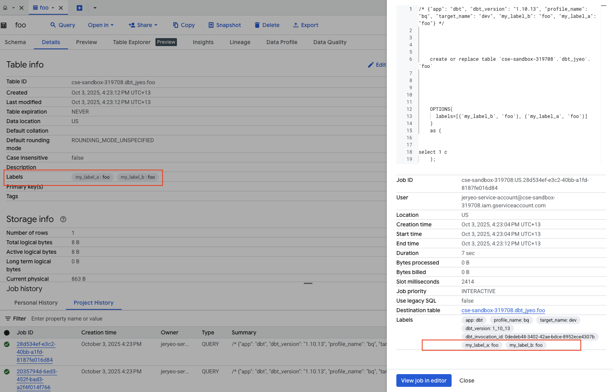
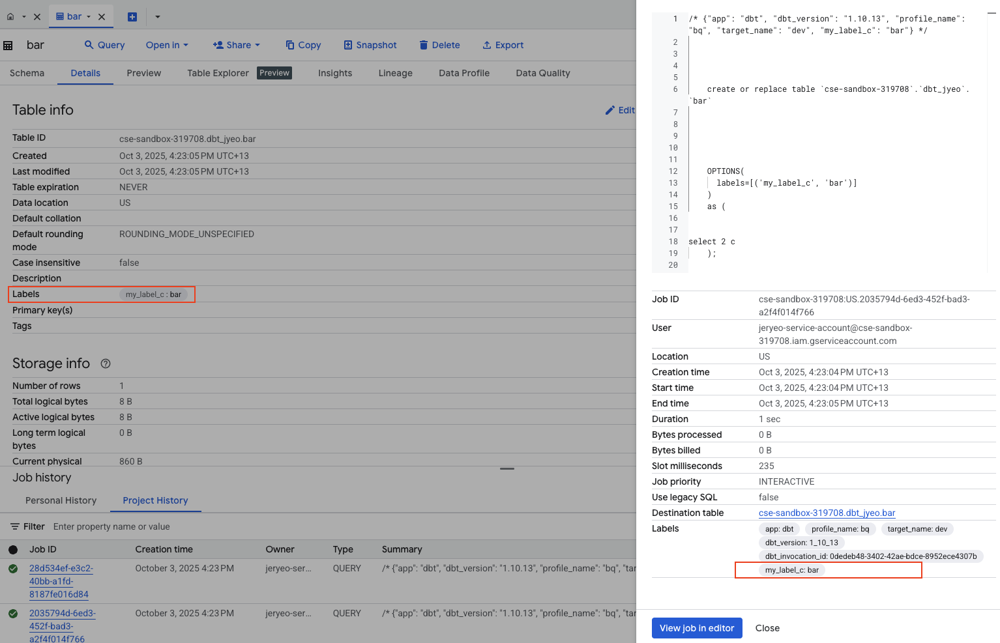

---
---

# Using model labels as BigQuery job labels

```yaml
# dbt_project.yml
name: analytics
profile: bq
version: "1.0.0"

models:
  analytics:
    +materialized: table

query-comment:
  comment: "{{ query_comment(node) }}"
  job-label: true
```

```sql
-- macros/query_comment.sql

    
    
    
      
    
      
    
    


-- models/foo.sql
{{ config(labels = {'my_label_a': 'foo', 'my_label_b': 'foo'}) }}
select 1 c

-- models/bar.sql
{{ config(labels = {'my_label_c': 'bar'}) }}
select 2 c
```

Both the object and the job that built those objects will have the model's labels:




