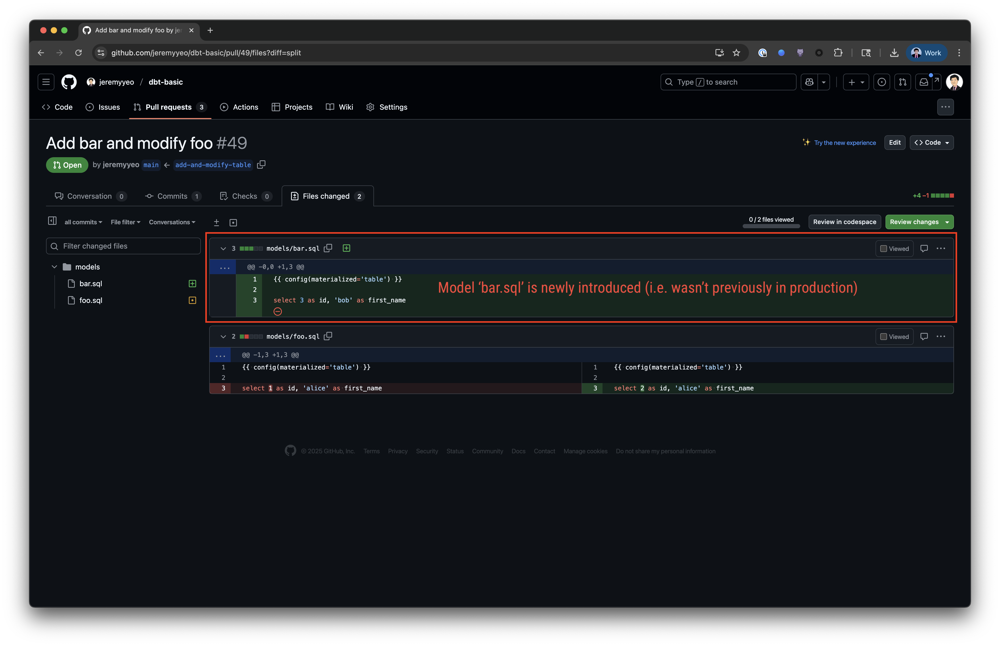
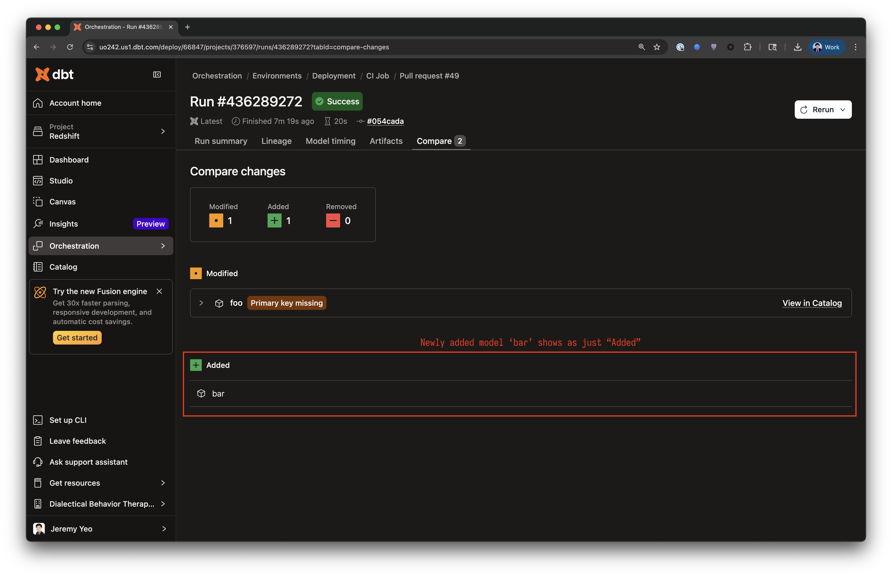
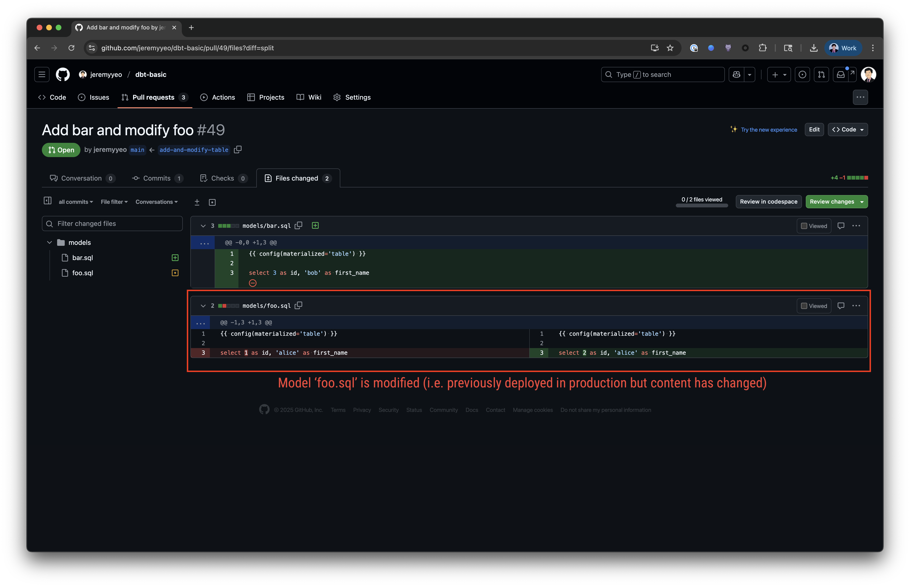
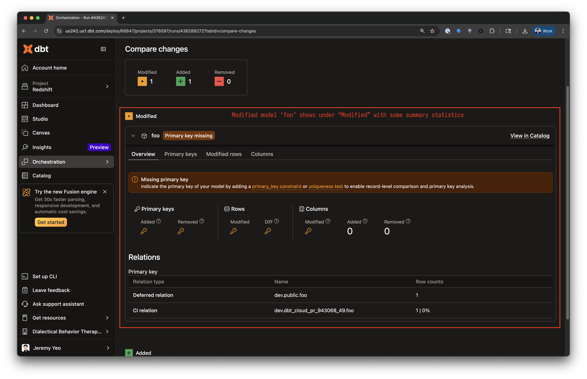

---
---

# dbt Cloud advanced CI compare changes

https://docs.getdbt.com/docs/deploy/advanced-ci

A quick overview of what to expect depending on the materialization type and the "change" type.

## Table materialization

### New to the project

<table><tr><td></td><td></td></tr></table>

### Modified from previous

<table><tr><td></td><td></td></tr></table>

## How does dbt generate the compare / summary statistics?

In order to know summary statistics, dbt has to run some SQL commands which are visible in the dbt debug logs.

At the start of the run, we see dbt gathering information about the existing objects in the schemas:

```sh
2025-10-14 04:01:41.372144 (ThreadPoolExecutor-0_0): 04:01:41  On list_dev_dbt_cloud_pr_943068_49: /* {"app": "dbt", "dbt_version": "2025.10.10+79ec687", "profile_name": "user", "target_name": "default", "connection_name": "list_dev_dbt_cloud_pr_943068_49"} */
select
        table_catalog as database,
        table_name as name,
        table_schema as schema,
        'table' as type
    from information_schema.tables
    where table_schema ilike 'dbt_cloud_pr_943068_49'
    and table_type = 'BASE TABLE'
    union all
    select
      table_catalog as database,
      table_name as name,
      table_schema as schema,
      case
        when view_definition ilike '%create materialized view%'
          then 'materialized_view'
        else 'view'
      end as type
    from information_schema.views
    where table_schema ilike 'dbt_cloud_pr_943068_49'
2025-10-14 04:01:41.398418 (ThreadPoolExecutor-0_0): 04:01:41  SQL status: SUCCESS in 0.025 seconds
2025-10-14 04:01:41.419224 (ThreadPoolExecutor-0_0): 04:01:41  On list_dev_dbt_cloud_pr_943068_49: ROLLBACK
2025-10-14 04:01:41.426788 (ThreadPoolExecutor-0_0): 04:01:41  On list_dev_dbt_cloud_pr_943068_49: Close
2025-10-14 04:01:41.433140 (MainThread): 04:01:41  Using redshift connection "master"
2025-10-14 04:01:41.433648 (MainThread): 04:01:41  On master: BEGIN
2025-10-14 04:01:41.434120 (MainThread): 04:01:41  Opening a new connection, currently in state init
2025-10-14 04:01:41.434601 (MainThread): 04:01:41  Redshift adapter: Connecting to Redshift with 'database' credentials method
2025-10-14 04:01:41.435424 (MainThread): 04:01:41  Redshift adapter: Establishing connection using ssl with `sslmode` set to 'prefer'.To connect without ssl, set `sslmode` to 'disable'.
2025-10-14 04:01:41.518393 (MainThread): 04:01:41  SQL status: SUCCESS in 0.084 seconds
2025-10-14 04:01:41.519724 (MainThread): 04:01:41  Using redshift connection "master"
2025-10-14 04:01:41.520329 (MainThread): 04:01:41  On master: /* {"app": "dbt", "dbt_version": "2025.10.10+79ec687", "profile_name": "user", "target_name": "default", "connection_name": "master"} */
with
    relation as (
        select
            pg_class.oid as relation_id,
            pg_class.relname as relation_name,
            pg_class.relnamespace as schema_id,
            pg_namespace.nspname as schema_name,
            pg_class.relkind as relation_type
        from pg_class
        join pg_namespace
          on pg_class.relnamespace = pg_namespace.oid
        where pg_namespace.nspname != 'information_schema'
          and pg_namespace.nspname not like 'pg\_%'
    ),
    dependency as (
        select distinct
            coalesce(pg_rewrite.ev_class, pg_depend.objid) as dep_relation_id,
            pg_depend.refobjid as ref_relation_id,
            pg_depend.refclassid as ref_class_id
        from pg_depend
        left join pg_rewrite
          on pg_depend.objid = pg_rewrite.oid
        where coalesce(pg_rewrite.ev_class, pg_depend.objid) != pg_depend.refobjid
    )

select distinct
    dep.schema_name as dependent_schema,
    dep.relation_name as dependent_name,
    ref.schema_name as referenced_schema,
    ref.relation_name as referenced_name
from dependency
join relation ref
    on dependency.ref_relation_id = ref.relation_id
join relation dep
    on dependency.dep_relation_id = dep.relation_id
2025-10-14 04:01:41.621033 (MainThread): 04:01:41  SQL status: SUCCESS in 0.100 seconds
```

For the newly added model `bar`, dbt ran a query that look similar to:

```sh
2025-10-14 04:01:41.769291 (Thread-2 (worker)): 04:01:41  On model.analytics.bar: /* {"app": "dbt", "dbt_version": "2025.10.10+79ec687", "profile_name": "user", "target_name": "default", "node_id": "model.analytics.bar"} */

      with bound_views as (
        select
          ordinal_position,
          table_schema,
          column_name,
          data_type,
          character_maximum_length,
          numeric_precision,
          numeric_scale

        from information_schema."columns"
        where table_name = 'bar'
    ),

    unbound_views as (
      select
        ordinal_position,
        view_schema,
        col_name,
        case
          when col_type ilike 'character varying%' then
            'character varying'
          when col_type ilike 'numeric%' then 'numeric'
          else col_type
        end as col_type,
        case
          when col_type like 'character%'
          then nullif(REGEXP_SUBSTR(col_type, '[0-9]+'), '')::int
          else null
        end as character_maximum_length,
        case
          when col_type like 'numeric%'
          then nullif(
            SPLIT_PART(REGEXP_SUBSTR(col_type, '[0-9,]+'), ',', 1),
            '')::int
          else null
        end as numeric_precision,
        case
          when col_type like 'numeric%'
          then nullif(
            SPLIT_PART(REGEXP_SUBSTR(col_type, '[0-9,]+'), ',', 2),
            '')::int
          else null
        end as numeric_scale

      from pg_get_late_binding_view_cols()
      cols(view_schema name, view_name name, col_name name,
           col_type varchar, ordinal_position int)
      where view_name = 'bar'
    ),

    external_views as (
      select
        columnnum,
        schemaname,
        columnname,
        case
          when external_type ilike 'character varying%' or external_type ilike 'varchar%'
          then 'character varying'
          when external_type ilike 'numeric%' then 'numeric'
          else external_type
        end as external_type,
        case
          when external_type like 'character%' or external_type like 'varchar%'
          then nullif(
            REGEXP_SUBSTR(external_type, '[0-9]+'),
            '')::int
          else null
        end as character_maximum_length,
        case
          when external_type like 'numeric%'
          then nullif(
            SPLIT_PART(REGEXP_SUBSTR(external_type, '[0-9,]+'), ',', 1),
            '')::int
          else null
        end as numeric_precision,
        case
          when external_type like 'numeric%'
          then nullif(
            SPLIT_PART(REGEXP_SUBSTR(external_type, '[0-9,]+'), ',', 2),
            '')::int
          else null
        end as numeric_scale
      from
        pg_catalog.svv_external_columns
      where
        schemaname = 'dbt_cloud_pr_943068_49'
        and tablename = 'bar'

    ),

    unioned as (
      select * from bound_views
      union all
      select * from unbound_views
      union all
      select * from external_views
    )

    select
      column_name,
      data_type,
      character_maximum_length,
      numeric_precision,
      numeric_scale

    from unioned

    where table_schema = 'dbt_cloud_pr_943068_49'

    order by ordinal_position
...
2025-10-14 04:01:42.013436 (Thread-2 (worker)): 04:01:42  1 of 2 OK created partial comparison of model bar .............................. [SKIP (Added model) in 0.36s]
```

Now, for the "modified" model `foo`, there are a few more queries to run:

```sh
2025-10-14 04:01:41.770231 (Thread-3 (worker)): 04:01:41  On model.analytics.foo: /* {"app": "dbt", "dbt_version": "2025.10.10+79ec687", "profile_name": "user", "target_name": "default", "node_id": "model.analytics.foo"} */

      with bound_views as (
        select
          ordinal_position,
          table_schema,
          column_name,
          data_type,
          character_maximum_length,
          numeric_precision,
          numeric_scale

        from information_schema."columns"
        where table_name = 'foo'
    ),

    unbound_views as (
      select
        ordinal_position,
        view_schema,
        col_name,
        case
          when col_type ilike 'character varying%' then
            'character varying'
          when col_type ilike 'numeric%' then 'numeric'
          else col_type
        end as col_type,
        case
          when col_type like 'character%'
          then nullif(REGEXP_SUBSTR(col_type, '[0-9]+'), '')::int
          else null
        end as character_maximum_length,
        case
          when col_type like 'numeric%'
          then nullif(
            SPLIT_PART(REGEXP_SUBSTR(col_type, '[0-9,]+'), ',', 1),
            '')::int
          else null
        end as numeric_precision,
        case
          when col_type like 'numeric%'
          then nullif(
            SPLIT_PART(REGEXP_SUBSTR(col_type, '[0-9,]+'), ',', 2),
            '')::int
          else null
        end as numeric_scale

      from pg_get_late_binding_view_cols()
      cols(view_schema name, view_name name, col_name name,
           col_type varchar, ordinal_position int)
      where view_name = 'foo'
    ),

    external_views as (
      select
        columnnum,
        schemaname,
        columnname,
        case
          when external_type ilike 'character varying%' or external_type ilike 'varchar%'
          then 'character varying'
          when external_type ilike 'numeric%' then 'numeric'
          else external_type
        end as external_type,
        case
          when external_type like 'character%' or external_type like 'varchar%'
          then nullif(
            REGEXP_SUBSTR(external_type, '[0-9]+'),
            '')::int
          else null
        end as character_maximum_length,
        case
          when external_type like 'numeric%'
          then nullif(
            SPLIT_PART(REGEXP_SUBSTR(external_type, '[0-9,]+'), ',', 1),
            '')::int
          else null
        end as numeric_precision,
        case
          when external_type like 'numeric%'
          then nullif(
            SPLIT_PART(REGEXP_SUBSTR(external_type, '[0-9,]+'), ',', 2),
            '')::int
          else null
        end as numeric_scale
      from
        pg_catalog.svv_external_columns
      where
        schemaname = 'dbt_cloud_pr_943068_49'
        and tablename = 'foo'

    ),

    unioned as (
      select * from bound_views
      union all
      select * from unbound_views
      union all
      select * from external_views
    )

    select
      column_name,
      data_type,
      character_maximum_length,
      numeric_precision,
      numeric_scale

    from unioned

    where table_schema = 'dbt_cloud_pr_943068_49'

    order by ordinal_position

2025-10-14 04:01:42.026453 (Thread-3 (worker)): 04:01:42  On model.analytics.foo: /* {"app": "dbt", "dbt_version": "2025.10.10+79ec687", "profile_name": "user", "target_name": "default", "node_id": "model.analytics.foo"} */

      with bound_views as (
        select
          ordinal_position,
          table_schema,
          column_name,
          data_type,
          character_maximum_length,
          numeric_precision,
          numeric_scale

        from information_schema."columns"
        where table_name = 'foo'
    ),

    unbound_views as (
      select
        ordinal_position,
        view_schema,
        col_name,
        case
          when col_type ilike 'character varying%' then
            'character varying'
          when col_type ilike 'numeric%' then 'numeric'
          else col_type
        end as col_type,
        case
          when col_type like 'character%'
          then nullif(REGEXP_SUBSTR(col_type, '[0-9]+'), '')::int
          else null
        end as character_maximum_length,
        case
          when col_type like 'numeric%'
          then nullif(
            SPLIT_PART(REGEXP_SUBSTR(col_type, '[0-9,]+'), ',', 1),
            '')::int
          else null
        end as numeric_precision,
        case
          when col_type like 'numeric%'
          then nullif(
            SPLIT_PART(REGEXP_SUBSTR(col_type, '[0-9,]+'), ',', 2),
            '')::int
          else null
        end as numeric_scale

      from pg_get_late_binding_view_cols()
      cols(view_schema name, view_name name, col_name name,
           col_type varchar, ordinal_position int)
      where view_name = 'foo'
    ),

    external_views as (
      select
        columnnum,
        schemaname,
        columnname,
        case
          when external_type ilike 'character varying%' or external_type ilike 'varchar%'
          then 'character varying'
          when external_type ilike 'numeric%' then 'numeric'
          else external_type
        end as external_type,
        case
          when external_type like 'character%' or external_type like 'varchar%'
          then nullif(
            REGEXP_SUBSTR(external_type, '[0-9]+'),
            '')::int
          else null
        end as character_maximum_length,
        case
          when external_type like 'numeric%'
          then nullif(
            SPLIT_PART(REGEXP_SUBSTR(external_type, '[0-9,]+'), ',', 1),
            '')::int
          else null
        end as numeric_precision,
        case
          when external_type like 'numeric%'
          then nullif(
            SPLIT_PART(REGEXP_SUBSTR(external_type, '[0-9,]+'), ',', 2),
            '')::int
          else null
        end as numeric_scale
      from
        pg_catalog.svv_external_columns
      where
        schemaname = 'public'
        and tablename = 'foo'

    ),

    unioned as (
      select * from bound_views
      union all
      select * from unbound_views
      union all
      select * from external_views
    )

    select
      column_name,
      data_type,
      character_maximum_length,
      numeric_precision,
      numeric_scale

    from unioned

    where table_schema = 'public'

    order by ordinal_position

2025-10-14 04:01:42.168293 (Thread-3 (worker)): 04:01:42  On model.analytics.foo: /* {"app": "dbt", "dbt_version": "2025.10.10+79ec687", "profile_name": "user", "target_name": "default", "node_id": "model.analytics.foo"} */

        select
            '"dev"."public"."foo"' as relation_name,
            count(*) as total_records
        from "dev"."public"."foo"

        union all

        select
            '"dev"."dbt_cloud_pr_943068_49"."foo"' as relation_name,
            count(*) as total_records
        from "dev"."dbt_cloud_pr_943068_49"."foo"

2025-10-14 04:01:42.785648 (Thread-3 (worker)): 04:01:42  On model.analytics.foo: /* {"app": "dbt", "dbt_version": "2025.10.10+79ec687", "profile_name": "user", "target_name": "default", "node_id": "model.analytics.foo"} */
with a_cols as (
    select
      'id' as column_name,
      1 as ordinal_position,
      'integer' as data_type
  union all
    select
      'first_name' as column_name,
      2 as ordinal_position,
      'character varying(5)' as data_type
),
b_cols as (
    select
      'id' as column_name,
      1 as ordinal_position,
      'integer' as data_type
  union all
    select
      'first_name' as column_name,
      2 as ordinal_position,
      'character varying(5)' as data_type
)
select
    column_name,
    a_cols.ordinal_position as a_ordinal_position,
    b_cols.ordinal_position as b_ordinal_position,
    a_cols.data_type as a_data_type,
    b_cols.data_type as b_data_type,
    coalesce(a_cols.ordinal_position = b_cols.ordinal_position, false) as has_ordinal_position_match,
    coalesce(a_cols.data_type = b_cols.data_type, false) as has_data_type_match,
    a_cols.data_type is not null and b_cols.data_type is null as in_a_only,
    b_cols.data_type is not null and a_cols.data_type is null as in_b_only,
    b_cols.data_type is not null and a_cols.data_type is not null as in_both
from a_cols
full outer join b_cols using (column_name)
order by coalesce(a_cols.ordinal_position, b_cols.ordinal_position)
2025-10-14 04:01:42.794924 (Thread-3 (worker)): 04:01:42  SQL status: SUCCESS in 0.009 seconds
...
2025-10-14 04:01:43.087721 (Thread-3 (worker)): 04:01:43  2 of 2 OK created partial comparison of model foo .............................. [Missing primary key in 1.43s]
```

As we can see, dbt had to execute many more queries for the modified model foo to gather statistics about the production copy of foo (`dev.public.foo`) and the CI copy of foo (`dev.dbt_cloud_pr_943068_49.foo`). Only then can that information be used to display a meaningful comparison for any "modified" model and display that to the end user.

If dbt cannot run those comparison queries on the production object (e.g. CI job is running on a different host vs the production jobs), then we would expect to either get less information (e.g. no summary stastics) or errors.
