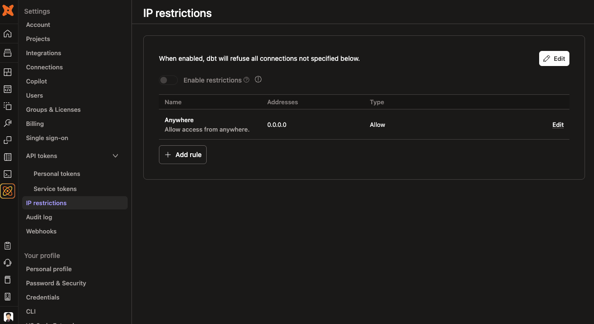
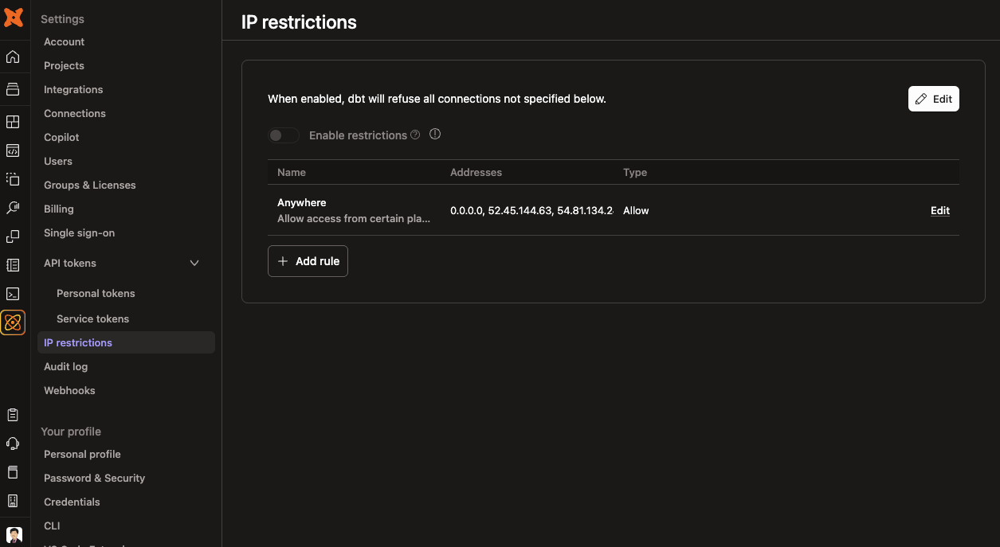
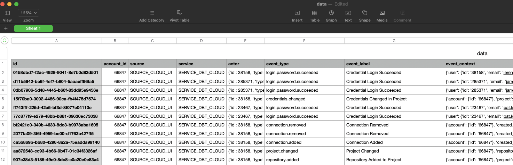

---
---

# dbt Cloud API Examples

> It is expected that you already know how to create service tokens with the right permissions for the action that you're attempting to take. All examples below will be using a service token with the "Account Admin" permission set - which effectively allows the service token unrestricted access to any operation in the dbt Cloud Account

## Creating a new IP restriction rule

https://docs.getdbt.com/dbt-cloud/api-v3#/operations/Save%20IP%20Restriction

Use for creating a brand new IP restriction rule.

```python
# create_ip_restriction_rule.py
import requests
import os

api_token = os.environ["DBT_CLOUD_API_TOKEN"] # reads dbt Cloud API Token from environment variable.
base_url = "https://cloud.getdbt.com/api/v3/accounts/66847"
headers = {"Content-Type": "application/json", "Authorization": f"Token {api_token}"}
payload = {
    "state": 1,
    "description": "Allow access from anywhere.",
    "name": "Anywhere",
    "type": 1,
    "cidrs": [{"cidr": "0.0.0.0", "state": 1, "enabled": True}],
    "account_id": 66847,
}

r = requests.request(
    "POST", f"{base_url}/ip-restrictions/", json=payload, headers=headers
)
r_json = r.json()
print(r_json)
```

```sh
$ python create_ip_restriction_rule.py

{'status': {'code': 200, 'is_success': True, 'user_message': 'Success!', 'developer_message': ''}, 'data': {'id': 739, 'name': 'Anywhere', 'type': 1, 'state': 1, 'ip_restriction_rule_set_id': 10, 'rule_set_enabled': False, 'account_id': 66847, 'cidrs': [{'id': 4522, 'state': 1, 'ip_restriction_rule_id': 739, 'enabled': True, 'cidr': '0.0.0.0', 'cidr_ipv6': '::ffff:0.0.0.0/128', 'created_at': '2025-08-12 02:23:09.391280+00:00', 'updated_at': '2025-08-12 02:23:09.391294+00:00'}], 'created_by_id': None, 'created_by_service_token_id': 68602, 'enabled_for_service_tokens': True, 'description': 'Allow access from anywhere.', 'created_at': '2025-08-12 02:23:09.329125+00:00', 'updated_at': '2025-08-12 02:23:09.329138+00:00'}, 'extra': {'failed_cidrs': [], 'cidrs_already_exists': []}, 'error_code': None}
```



## Adding to an existing IP restriction rule

https://docs.getdbt.com/dbt-cloud/api-v3#/operations/Update%20IP%20Restriction

Used for adding more IPs to an existing IP restriction rule. Here we're updating IP restriction rule `739` - which is one created above. You can also use other endpoints to list all existing rules.

```python
# update_ip_restriction_rule.py
import requests
import os

api_token = os.environ["DBT_CLOUD_API_TOKEN"]
base_url = "https://cloud.getdbt.com/api/v3/accounts/66847"
headers = {"Content-Type": "application/json", "Authorization": f"Token {api_token}"}
payload = {
    "state": 1,
    "description": "Allow access from anywhere.",
    "name": "Anywhere",
    "type": 1,
    "cidrs": [
        {"cidr": "52.45.144.63", "state": 1, "enabled": True},
        {"cidr": "54.81.134.249", "state": 1, "enabled": True},
    ],
    "account_id": 66847,
}

r = requests.request(
    "PUT", f"{base_url}/ip-restrictions/739", json=payload, headers=headers
)
r_json = r.json()
print(r_json)
```

```sh
$ python update_ip_restriction_rule.py

{'status': {'code': 200, 'is_success': True, 'user_message': 'Success!', 'developer_message': ''}, 'data': {'id': 739, 'name': 'Anywhere', 'type': 1, 'state': 1, 'ip_restriction_rule_set_id': 10, 'rule_set_enabled': False, 'account_id': 66847, 'cidrs': [{'id': 4522, 'state': 1, 'ip_restriction_rule_id': 739, 'enabled': True, 'cidr': '0.0.0.0', 'cidr_ipv6': '::ffff:0.0.0.0/128', 'created_at': '2025-08-12 02:23:09.391280+00:00', 'updated_at': '2025-08-12 02:23:09.391294+00:00'}, {'id': 4523, 'state': 1, 'ip_restriction_rule_id': 739, 'enabled': True, 'cidr': '52.45.144.63', 'cidr_ipv6': '::ffff:52.45.144.63/128', 'created_at': '2025-08-12 02:24:27.875991+00:00', 'updated_at': '2025-08-12 02:24:27.876000+00:00'}, {'id': 4524, 'state': 1, 'ip_restriction_rule_id': 739, 'enabled': True, 'cidr': '54.81.134.249', 'cidr_ipv6': '::ffff:54.81.134.249/128', 'created_at': '2025-08-12 02:24:27.912413+00:00', 'updated_at': '2025-08-12 02:24:27.912423+00:00'}], 'created_by_id': None, 'created_by_service_token_id': 68602, 'enabled_for_service_tokens': True, 'description': 'Allow access from certain places.', 'created_at': '2025-08-12 02:23:09.329125+00:00', 'updated_at': '2025-08-12 02:24:27.832364+00:00'}, 'extra': {'failed_cidrs': [], 'cidrs_already_exists': []}, 'error_code': None}
```



## Retrieving audit log records

https://docs.getdbt.com/dbt-cloud/api-v3#/operations/List%20Recent%20Audit%20Log%20Events

Used for retrieving audit log records (last 90 days) and then writing the result to a csv.

```python
# retrieve_audit_log_records.py
import requests
import os
import csv

api_token = os.environ["DBT_CLOUD_API_TOKEN"]
base_url = "https://cloud.getdbt.com/api/v3/accounts/66847"
headers = {"Content-Type": "application/json", "Authorization": f"Token {api_token}"}

# Set EVENT_FILTER to a specific event if interested - an example is shown below.
# EVENT_FILTER = "v1.events.job_definition.changed"
EVENT_FILTER = None
if EVENT_FILTER:
    full_url = base_url + f"/audit-logs?routing_key__in=['{EVENT_FILTER}']"
else:
    full_url = base_url + "/audit-logs"

r = requests.request(
    "GET",
    f"{full_url}",
    headers=headers,
)
r_json = r.json()
all_records = r.json()["data"]
extra_pagination = r.json()["extra"]["pagination"]
total_count = extra_pagination["total_count"]
print(f'Retrieved {extra_pagination["count"]} records of total {total_count}.')

while len(all_records) < total_count:
    """dbt Cloud API returns 100 records at a time so we need to paginate."""
    print(f"Fetching again with offset {len(all_records)}.")
    paged_url = full_url + ("&" if EVENT_FILTER else "?") + f"offset={len(all_records)}"
    paged_request = requests.request("GET", paged_url, headers=headers)
    paged_records = paged_request.json()["data"]
    all_records = all_records + paged_records

print(f"Retrieved a total of {len(all_records)} records.")

# Write to csv.
if all_records:
    with open("data.csv", "w", newline="") as csv_file:
        writer = csv.DictWriter(csv_file, fieldnames=all_records[0].keys())
        writer.writeheader()
        for r in all_records:
            writer.writerow(r)

print(f"Audit log records written to file data.csv.")
```

```sh
$ python retrieve_audit_log_records.py

Retrieved 100 records of total 164.
Fetching again with offset 100.
Retrieved a total of 164 records.
Audit log records written to file data.csv.
```


