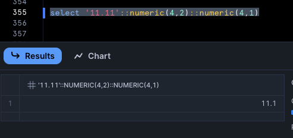

---
---

# dbt Contracts

Testing of dbt Contracts https://docs.getdbt.com/docs/mesh/govern/model-contracts with various scenarios on Snowflake.

## Table materialization

```yaml
# dbt_project.yml
name: analytics
profile: all
version: "1.0.0"

models:
  analytics:
    +materialized: table
```

### (1) Incoming data type primitive is different to the defined data type primitive


This is when the incoming data is of a type like `text` but we have defined in the model's yaml that the type should be `number`.

```sql
-- models/foo.sql
select 'a'::text as c
```

```yml
# models/schema.yml
models:
  - name: foo
    config:
      contract: { enforced: true }
    columns:
      - name: c
        data_type: number
```

```sh
$ dbt run

01:28:00  1 of 1 START sql table model sch.foo ........................................... [RUN]
01:28:00  Re-using an available connection from the pool (formerly list_db_sch, now model.analytics.foo)
01:28:00  Began compiling node model.analytics.foo
01:28:00  Writing injected SQL for node "model.analytics.foo"
01:28:00  Began executing node model.analytics.foo
01:28:00  Using snowflake connection "model.analytics.foo"
01:28:00  On model.analytics.foo: select * from (
        -- models/foo.sql
select 'a'::text as c
    ) as __dbt_sbq
    where false
    limit 0
/* {"app": "dbt", "dbt_version": "1.10.4", "profile_name": "all", "target_name": "sf", "node_id": "model.analytics.foo"} */
/* {"app": "dbt", "dbt_version": "1.10.4", "profile_name": "all", "target_name": "sf", "node_id": "model.analytics.foo"} */
01:28:00  SQL status: SUCCESS 0 in 0.332 seconds
01:28:01  Detected columns with numeric type and unspecified precision/scale, this can lead to unintended rounding: ['c']`
01:28:01  Using snowflake connection "model.analytics.foo"
01:28:01  On model.analytics.foo: select * from (
        select
    cast(null as number)
     as c
    ) as __dbt_sbq
    where false
    limit 0
/* {"app": "dbt", "dbt_version": "1.10.4", "profile_name": "all", "target_name": "sf", "node_id": "model.analytics.foo"} */
/* {"app": "dbt", "dbt_version": "1.10.4", "profile_name": "all", "target_name": "sf", "node_id": "model.analytics.foo"} */
01:28:01  SQL status: SUCCESS 0 in 0.337 seconds
01:28:01  Compilation Error in model foo (models/foo.sql)
  This model has an enforced contract that failed.
  Please ensure the name, data_type, and number of columns in your contract match the columns in your model's definition.

  | column_name | definition_type | contract_type | mismatch_reason    |
  | ----------- | --------------- | ------------- | ------------------ |
  | C           | TEXT            | FIXED         | data type mismatch |


  > in macro assert_columns_equivalent (macros/relations/column/columns_spec_ddl.sql)
  > called by macro default__get_assert_columns_equivalent (macros/relations/column/columns_spec_ddl.sql)
  > called by macro get_assert_columns_equivalent (macros/relations/column/columns_spec_ddl.sql)
  > called by macro snowflake__create_table_info_schema_sql (macros/relations/table/create.sql)
  > called by macro snowflake__create_table_as (macros/relations/table/create.sql)
  > called by macro create_table_as (macros/relations/table/create.sql)
  > called by macro statement (macros/etc/statement.sql)
  > called by macro materialization_table_snowflake (macros/materializations/table.sql)
  > called by model foo (models/foo.sql)
01:28:01  1 of 1 ERROR creating sql table model sch.foo .................................. [ERROR in 0.73s]
```

This is the most straightforward behaviour of contract violation. We declared that column `c` must be a primitive type of `number` but the incoming data was of primitive type `text`.

### (2) Incoming data type primitive is the same to the defined data type primitive but differ in length, scale or precision

This is when the incoming data is of similar primitive to the definition but differ in length (`char(n)` vs `char(n+x)`). There's some additional nuance depending on the scenario however, all of these will NOT violate the dbt data type contract and therefore, dbt will not emit a contract violation error. As per the docs(https://docs.getdbt.com/reference/resource-configs/contract#size-precision-and-scale):

> When dbt compares data types, it will not compare granular details such as size, precision, or scale. We don't think you should sweat the difference between varchar(256) and varchar(257), because it doesn't really affect the experience of downstream queriers.

In general, only scenario (1), described above where the primitive type is different (`text` vs `number`) will cause dbt to throw a contract violation. A difference in "size" itself will not

#### (2.1) Incoming data size is smaller than the defined data size


E.g. `char(2) < char(4)`, `numeric(2) < numeric(4)`

```sql
-- models/foo.sql
select 'aa'::char(2) as c1, 'aa'::varchar(2) as c2, '1.11'::numeric(3,2) as c3
```

```yml
# models/schema.yml
models:
  - name: foo
    config:
      contract: { enforced: true }
    columns:
      - name: c1
        data_type: char(4)
      - name: c2
        data_type: varchar(4)
      - name: c3
        data_type: numeric(4,3)
```

```sh
$ dbt run

01:33:34  1 of 1 START sql table model sch.foo ........................................... [RUN]
01:33:34  Re-using an available connection from the pool (formerly list_db_sch, now model.analytics.foo)
01:33:34  Began compiling node model.analytics.foo
01:33:34  Writing injected SQL for node "model.analytics.foo"
01:33:34  Began executing node model.analytics.foo
01:33:35  Using snowflake connection "model.analytics.foo"
01:33:35  On model.analytics.foo: select * from (
        -- models/foo.sql
select 'aa'::char(2) as c1, 'aa'::varchar(2) as c2, '1.11'::numeric(3,2) as c3
    ) as __dbt_sbq
    where false
    limit 0
/* {"app": "dbt", "dbt_version": "1.10.4", "profile_name": "all", "target_name": "sf", "node_id": "model.analytics.foo"} */
/* {"app": "dbt", "dbt_version": "1.10.4", "profile_name": "all", "target_name": "sf", "node_id": "model.analytics.foo"} */
01:33:35  SQL status: SUCCESS 0 in 0.777 seconds
01:33:35  Using snowflake connection "model.analytics.foo"
01:33:35  On model.analytics.foo: select * from (
        select
    cast(null as char(4))
     as c1,
    cast(null as varchar(4))
     as c2,
    cast(null as numeric(4,3))
     as c3
    ) as __dbt_sbq
    where false
    limit 0
/* {"app": "dbt", "dbt_version": "1.10.4", "profile_name": "all", "target_name": "sf", "node_id": "model.analytics.foo"} */
/* {"app": "dbt", "dbt_version": "1.10.4", "profile_name": "all", "target_name": "sf", "node_id": "model.analytics.foo"} */
01:33:36  SQL status: SUCCESS 0 in 0.618 seconds
01:33:36  Writing runtime sql for node "model.analytics.foo"
01:33:36  Using snowflake connection "model.analytics.foo"
01:33:36  On model.analytics.foo: create or replace transient table db.sch.foo
  (
    c1 char(4),
    c2 varchar(4),
    c3 numeric(4,3)
    )
    as (
    select c1, c2, c3
    from (
        -- models/foo.sql
select 'aa'::char(2) as c1, 'aa'::varchar(2) as c2, '1.11'::numeric(3,2) as c3
    ) as model_subq
    )
/* {"app": "dbt", "dbt_version": "1.10.4", "profile_name": "all", "target_name": "sf", "node_id": "model.analytics.foo"} */;
01:33:37  SQL status: SUCCESS 1 in 1.197 seconds
01:33:37  1 of 1 OK created sql table model sch.foo ...................................... [SUCCESS 1 in 2.69s]
```

dbt does not emit a contract violation - and the relation was created without any issues as all the incoming data type will fit without issues into the lenght/precision/scale specified on the column spec.

#### (2.2) Incoming data size is bigger than the defined data length

Here, there's additional nuance depending on if the primitive type is string/chararacter or numeric.

##### (2.2.1) String / character type


E.g. `char(4) > char(2)`

```sql
-- models/foo.sql
select 'aa'::char(2) as c1
```

```yml
# models/schema.yml
models:
  - name: foo
    config:
      contract: { enforced: true }
    columns:
      - name: c1
        data_type: char(1)
```

```sh
$ dbt run

01:46:23  1 of 1 START sql table model sch.foo ........................................... [RUN]
01:46:23  Re-using an available connection from the pool (formerly list_db_sch, now model.analytics.foo)
01:46:23  Began compiling node model.analytics.foo
01:46:23  Writing injected SQL for node "model.analytics.foo"
01:46:23  Began executing node model.analytics.foo
01:46:23  Using snowflake connection "model.analytics.foo"
01:46:23  On model.analytics.foo: select * from (
        -- models/foo.sql
select 'aa'::char(2) as c1
    ) as __dbt_sbq
    where false
    limit 0
/* {"app": "dbt", "dbt_version": "1.10.4", "profile_name": "all", "target_name": "sf", "node_id": "model.analytics.foo"} */
/* {"app": "dbt", "dbt_version": "1.10.4", "profile_name": "all", "target_name": "sf", "node_id": "model.analytics.foo"} */
01:46:23  SQL status: SUCCESS 0 in 0.336 seconds
01:46:23  Using snowflake connection "model.analytics.foo"
01:46:23  On model.analytics.foo: select * from (
        select
    cast(null as char(1))
     as c1
    ) as __dbt_sbq
    where false
    limit 0
/* {"app": "dbt", "dbt_version": "1.10.4", "profile_name": "all", "target_name": "sf", "node_id": "model.analytics.foo"} */
/* {"app": "dbt", "dbt_version": "1.10.4", "profile_name": "all", "target_name": "sf", "node_id": "model.analytics.foo"} */
01:46:24  SQL status: SUCCESS 0 in 0.329 seconds
01:46:24  Writing runtime sql for node "model.analytics.foo"
01:46:24  Using snowflake connection "model.analytics.foo"
01:46:24  On model.analytics.foo: create or replace transient table db.sch.foo
  (
    c1 char(1)
    )
    as (
    select c1
    from (
        -- models/foo.sql
select 'aa'::char(2) as c1
    ) as model_subq
    )
/* {"app": "dbt", "dbt_version": "1.10.4", "profile_name": "all", "target_name": "sf", "node_id": "model.analytics.foo"} */;
01:46:25  Snowflake adapter: Snowflake query id: 01bddeea-0608-f310-000d-3783502a20fa
01:46:25  Snowflake adapter: Snowflake error: 100078 (22000): DML operation to table SKA67070.DB.SCH.FOO failed on column C1 with error: String 'aa' is too long and would be truncated
01:46:25  Database Error in model foo (models/foo.sql)
  100078 (22000): DML operation to table SKA67070.DB.SCH.FOO failed on column C1 with error: String 'aa' is too long and would be truncated
  compiled code at target/run/analytics/models/foo.sql
01:46:25  1 of 1 ERROR creating sql table model sch.foo .................................. [ERROR in 1.63s]
```

dbt does not emit a contract violation - and the relation failed to be created. This is because `'aa'::char(2)` cannot be coerced (or fit) into `char(1)`:


```sql
-- models/foo.sql
select 'aaaa'::varchar(4) as c1
```

```yml
# models/schema.yml
models:
  - name: foo
    config:
      contract: { enforced: true }
    columns:
      - name: c1
        data_type: varchar(2)
```

```sh
$ dbt run

01:54:25  1 of 1 START sql table model sch.foo ........................................... [RUN]
01:54:25  Re-using an available connection from the pool (formerly list_db_sch, now model.analytics.foo)
01:54:25  Began compiling node model.analytics.foo
01:54:25  Writing injected SQL for node "model.analytics.foo"
01:54:25  Began executing node model.analytics.foo
01:54:25  Using snowflake connection "model.analytics.foo"
01:54:25  On model.analytics.foo: select * from (
        -- models/foo.sql
select 'aaaa'::varchar(4) as c1
    ) as __dbt_sbq
    where false
    limit 0
/* {"app": "dbt", "dbt_version": "1.10.4", "profile_name": "all", "target_name": "sf", "node_id": "model.analytics.foo"} */
/* {"app": "dbt", "dbt_version": "1.10.4", "profile_name": "all", "target_name": "sf", "node_id": "model.analytics.foo"} */
01:54:26  SQL status: SUCCESS 0 in 0.319 seconds
01:54:26  Using snowflake connection "model.analytics.foo"
01:54:26  On model.analytics.foo: select * from (
        select
    cast(null as varchar(2))
     as c1
    ) as __dbt_sbq
    where false
    limit 0
/* {"app": "dbt", "dbt_version": "1.10.4", "profile_name": "all", "target_name": "sf", "node_id": "model.analytics.foo"} */
/* {"app": "dbt", "dbt_version": "1.10.4", "profile_name": "all", "target_name": "sf", "node_id": "model.analytics.foo"} */
01:54:26  SQL status: SUCCESS 0 in 0.329 seconds
01:54:26  Writing runtime sql for node "model.analytics.foo"
01:54:26  Using snowflake connection "model.analytics.foo"
01:54:26  On model.analytics.foo: create or replace transient table db.sch.foo
  (
    c1 varchar(2)
    )
    as (
    select c1
    from (
        -- models/foo.sql
select 'aaaa'::varchar(4) as c1
    ) as model_subq
    )
/* {"app": "dbt", "dbt_version": "1.10.4", "profile_name": "all", "target_name": "sf", "node_id": "model.analytics.foo"} */;
01:54:27  Snowflake adapter: Snowflake query id: 01bddef2-0608-f97c-000d-37835029d6ea
01:54:27  Snowflake adapter: Snowflake error: 100078 (22000): DML operation to table SKA67070.DB.SCH.FOO failed on column C1 with error: String 'aaaa' is too long and would be truncated
01:54:27  Database Error in model foo (models/foo.sql)
  100078 (22000): DML operation to table SKA67070.DB.SCH.FOO failed on column C1 with error: String 'aaaa' is too long and would be truncated
  compiled code at target/run/analytics/models/foo.sql
01:54:27  1 of 1 ERROR creating sql table model sch.foo .................................. [ERROR in 1.41s]
```

Same behaviour and reason as previously mentioned for `char`:


##### (2.2.2) Numeric type (with specified precision and scale)

Again, additional nuance depending on if the difference is in the precision (number of digits) or scale (number of digits after the decimal point).

###### (2.2.2.1) Incoming precision is larger than defined precision


```sql
-- models/foo.sql
select '11.11'::numeric(4,2) as c
```

```yml
# models/schema.yml
models:
  - name: foo
    config:
      contract: { enforced: true }
    columns:
      - name: c1
        data_type: numeric(3,2) # e.g. '1.11'
```

```sh
$ dbt run
02:02:13  1 of 1 START sql table model sch.foo ........................................... [RUN]
02:02:13  Re-using an available connection from the pool (formerly list_db_sch, now model.analytics.foo)
02:02:13  Began compiling node model.analytics.foo
02:02:13  Writing injected SQL for node "model.analytics.foo"
02:02:13  Began executing node model.analytics.foo
02:02:13  Using snowflake connection "model.analytics.foo"
02:02:13  On model.analytics.foo: select * from (
        -- models/foo.sql
select '11.11'::numeric(4,2) as c1
    ) as __dbt_sbq
    where false
    limit 0
/* {"app": "dbt", "dbt_version": "1.10.4", "profile_name": "all", "target_name": "sf", "node_id": "model.analytics.foo"} */
/* {"app": "dbt", "dbt_version": "1.10.4", "profile_name": "all", "target_name": "sf", "node_id": "model.analytics.foo"} */
02:02:13  SQL status: SUCCESS 0 in 0.475 seconds
02:02:13  Using snowflake connection "model.analytics.foo"
02:02:13  On model.analytics.foo: select * from (
        select
    cast(null as numeric(3,2))
     as c1
    ) as __dbt_sbq
    where false
    limit 0
/* {"app": "dbt", "dbt_version": "1.10.4", "profile_name": "all", "target_name": "sf", "node_id": "model.analytics.foo"} */
/* {"app": "dbt", "dbt_version": "1.10.4", "profile_name": "all", "target_name": "sf", "node_id": "model.analytics.foo"} */
02:02:14  SQL status: SUCCESS 0 in 0.606 seconds
02:02:14  Writing runtime sql for node "model.analytics.foo"
02:02:14  Using snowflake connection "model.analytics.foo"
02:02:14  On model.analytics.foo: create or replace transient table db.sch.foo
  (
    c1 numeric(3,2)
    )
    as (
    select c1
    from (
        -- models/foo.sql
select '11.11'::numeric(4,2) as c1
    ) as model_subq
    )
/* {"app": "dbt", "dbt_version": "1.10.4", "profile_name": "all", "target_name": "sf", "node_id": "model.analytics.foo"} */;
02:02:15  Snowflake adapter: Snowflake query id: 01bddefa-0608-faaa-000d-3783502a09ae
02:02:15  Snowflake adapter: Snowflake error: 100046 (22003): DML operation to table SKA67070.DB.SCH.FOO failed on column C1 with error: Number out of representable range: type FIXED[SB2](3,2){nullable}, value 11.11
02:02:15  Database Error in model foo (models/foo.sql)
  100046 (22003): DML operation to table SKA67070.DB.SCH.FOO failed on column C1 with error: Number out of representable range: type FIXED[SB2](3,2){nullable}, value 11.11
  compiled code at target/run/analytics/models/foo.sql
02:02:15  1 of 1 ERROR creating sql table model sch.foo .................................. [ERROR in 2.34s]
```

dbt did not emit a contract violation but the table failed to be created because the precision of the incoming data (`11.11`) (4 digits) is larger than the defined precision (3 digits) and Snowflake does not allow this:


###### (2.2.2.2) Incoming scale is larger than defined scale


```sql
-- models/foo.sql
select '11.11'::numeric(4,2) as c
```

```yml
# models/schema.yml
models:
  - name: foo
    config:
      contract: { enforced: true }
    columns:
      - name: c1
        data_type: numeric(4,1) # e.g. '111.1'
```

```sh
$ dbt run

02:10:40  1 of 1 START sql table model sch.foo ........................................... [RUN]
02:10:40  Re-using an available connection from the pool (formerly list_db_sch, now model.analytics.foo)
02:10:40  Began compiling node model.analytics.foo
02:10:40  Writing injected SQL for node "model.analytics.foo"
02:10:40  Began executing node model.analytics.foo
02:10:40  Using snowflake connection "model.analytics.foo"
02:10:40  On model.analytics.foo: select * from (
        -- models/foo.sql
select '11.11'::numeric(4,2) as c1
    ) as __dbt_sbq
    where false
    limit 0
/* {"app": "dbt", "dbt_version": "1.10.4", "profile_name": "all", "target_name": "sf", "node_id": "model.analytics.foo"} */
/* {"app": "dbt", "dbt_version": "1.10.4", "profile_name": "all", "target_name": "sf", "node_id": "model.analytics.foo"} */
02:10:40  SQL status: SUCCESS 0 in 0.532 seconds
02:10:40  Using snowflake connection "model.analytics.foo"
02:10:40  On model.analytics.foo: select * from (
        select
    cast(null as numeric(4,1))
     as c1
    ) as __dbt_sbq
    where false
    limit 0
/* {"app": "dbt", "dbt_version": "1.10.4", "profile_name": "all", "target_name": "sf", "node_id": "model.analytics.foo"} */
/* {"app": "dbt", "dbt_version": "1.10.4", "profile_name": "all", "target_name": "sf", "node_id": "model.analytics.foo"} */
02:10:41  SQL status: SUCCESS 0 in 0.325 seconds
02:10:41  Writing runtime sql for node "model.analytics.foo"
02:10:41  Using snowflake connection "model.analytics.foo"
02:10:41  On model.analytics.foo: create or replace transient table db.sch.foo
  (
    c1 numeric(4,1)
    )
    as (
    select c1
    from (
        -- models/foo.sql
select '11.11'::numeric(4,2) as c1
    ) as model_subq
    )
/* {"app": "dbt", "dbt_version": "1.10.4", "profile_name": "all", "target_name": "sf", "node_id": "model.analytics.foo"} */;
02:10:42  SQL status: SUCCESS 1 in 1.627 seconds
02:10:42  1 of 1 OK created sql table model sch.foo ...................................... [SUCCESS 1 in 2.58s]
```

dbt did not emit a contract violation and the table was created successfully. This is because Snowflake allows (truncates) additional scales automatically without errors:


