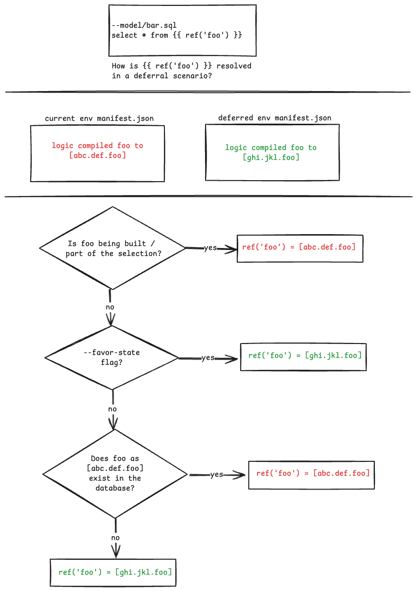
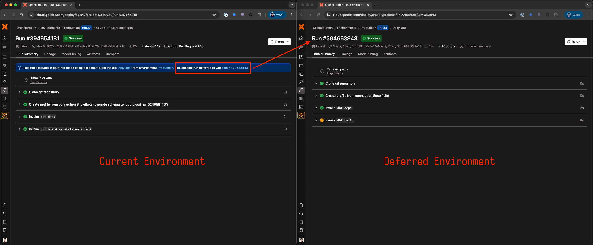
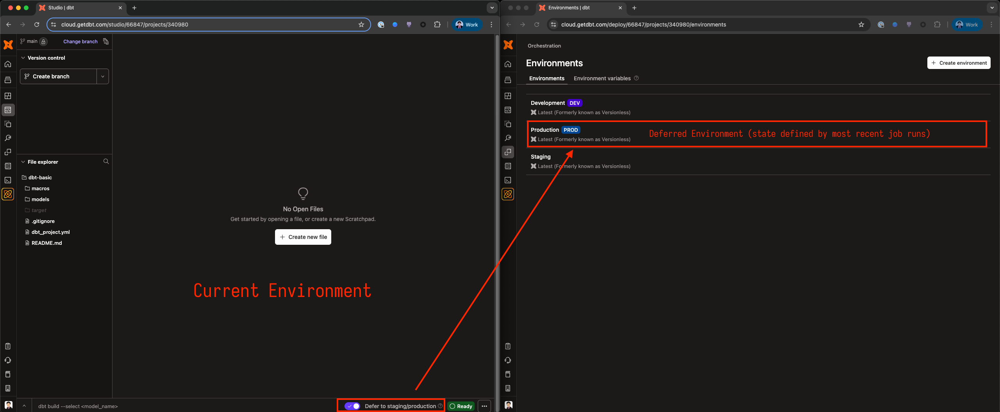
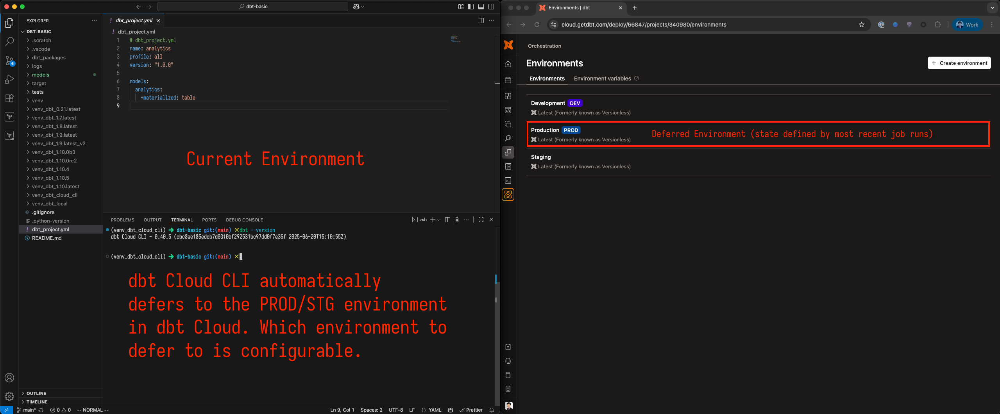

---
---

## dbt deferral cheat sheet



1. Deferral in dbt always involves 2 states / environments.
2. States are defined in their respective `manifest.json` files.

### The current state

This refers to the current state that you are working in - e.g. the current `manifest.json`.

### The deferred state

The state `manifest.json` that was generated previously - that we're _deferring to_ whilst working in the current environment.

A quick example of a "deferral situation": let's assume there is a production dbt job running somewhere and we're developing locally (the current environment), we can defer to the production job's state by copying the `manifest.json` file to our local machine and then with the dbt CLI, defer to it by telling dbt to defer to it:

```sh
$ dbt build --defer --state path/to/downloaded/manifest.json
```

^ Here dbt will build the state of the current environment (i.e. the dbt project we're working with currently) (`target/manifest.json`) and then defer to the deffered state (`path/to/downloaded/manifest.json`).

> In dbt Cloud, the deferred state is resolved automatically - users do not have to use flags like `--defer --state` to tell dbt to defer to a specific `manifest.json` file.

Other examples of "current environment / state" vs "deferred environment / state":

<details>
<summary>In dbt Platform jobs</summary>



</details>

<details>
<summary>In dbt Studio / Cloud IDE</summary>



</details>

<details>
<summary>Using dbt Cloud CLI</summary>



</details>

---

For this cheat sheet, we will be working with just 2 models to drive home the idea:

```sql
-- models/foo.sql
select 1 c

-- models/bar.sql
select * from {{ ref('foo') }}
```

Additionally, here are the fqn's of `foo` and `bar` for the respective environments:

| Model / Environment | Current            | Deferred (e.g. Production) |
| ------------------- | ------------------ | -------------------------- |
| foo                 | `dev.dbt_jyeo.foo` | `prod.analytics.foo`       |
| bar                 | `dev.dbt_jyeo.bar` | `prod.analytics.bar`       |

I.e. if you inspect the `manifest.json` for the deferred environment, we'd see something like:

```json
{
  "foo": { "database": "prod", "schema": "analytics", "identifier": "foo" },
  "bar": { "database": "prod", "schema": "analytics", "identifier": "bar" }
}
```

And of course - for the current environment, we'd see a manifest like so:

```json
{
  "foo": { "database": "dev", "schema": "dbt_jyeo", "identifier": "foo" },
  "bar": { "database": "dev", "schema": "dbt_jyeo", "identifier": "bar" }
}
```

Now, there is zero ambiguity as to where dbt will build model `foo.sql`. If we're in the current environment, then `dbt build -s foo` will build `foo` as `dev.dbt_jyeo.foo` and in the "production" environment, `foo` will be built as `prod.analytics.foo`. The confusion normally stems from how `{{ ref('foo') }}` is resolved as `bar.sql` is being built - therefore, this cheat sheet will be exactly that - how `{{ ref('foo') }}` is exactly resolved, when `bar.sql` is being built:

```sh
$ dbt build -s bar --defer --state prod/manifest.json
```

> Recall again that there is no need to use `--defer --state` with dbt Cloud - just with dbt Core CLI.

The resolution of `foo` depends on a few scenarios:

### (A) `foo` does not exist in the current environment - meaning `dev.dbt_jyeo.foo` does not exist

`bar` will be built like so:

```sql
create or replace table dev.dbt_jyeo.bar as (
    select * from prod.analytics.foo
)
```

### (B) `foo` exist in the current environment - meaning `dev.dbt_jyeo.foo` exist

`foo` may exist in the currrent environment, perhaps because it was built by a previous dbt command. `bar` will be built like so:

```sql
create or replace table dev.dbt_jyeo.bar as (
    select * from dev.dbt_jyeo.foo
)
```

### (C) `foo` exist in the current environment - meaning `dev.dbt_jyeo.foo` exist and we're using `--favor-state`

```sh
$ dbt build -s bar --defer --state prod/manifest.json --favor-state
```

Whenever we use the `--favor-state` flag, then `{{ ref('foo') }}` will always resolve to the deferred `manifest.json` (even IF `foo` already exist in the current environment like (B) above).

```sql
create or replace table dev.dbt_jyeo.bar as (
    select * from prod.analytics.foo
)
```

### (D) `foo` is part of the current selection / build command

```sh
# These are all equivalent and will build both `foo` and `bar`.
$ dbt build -s +bar --defer --state prod/manifest.json
$ dbt build -s foo bar --defer --state prod/manifest.json
$ dbt build --defer --state prod/manifest.json
```

If `foo` has been included as part of the dbt invocation, then dbt will build `foo` into the current environment `dev.dbt_jyeo.foo` and `{{ ref('foo') }}` will simply resolve to it. `bar` will be built like so:

```sql
create or replace table dev.dbt_jyeo.bar as (
    select * from dev.dbt_jyeo.foo
)
```

## Cheatsheet

And here's a summary table of how `{{ ref('foo') }}` will be resolved:

| Scenario                                                                                   | `ref('foo')` in `bar.sql` resolves to |
| ------------------------------------------------------------------------------------------ | ------------------------------------- |
| (A) Model `foo` does not exist in the current environment and is not part of the selection | `prod.analytics.foo`                  |
| (B) Model `foo` exist in the current environment                                           | `dev.dbt_jyeo.foo`                    |
| (B) Model `foo` exist in the current environment but `--favor-state` is passed             | `prod.analytics.foo`                  |
| (D) Model `foo` is part of the selection and is being built into the current environment   | `dev.dbt_jyeo.foo`                    |
