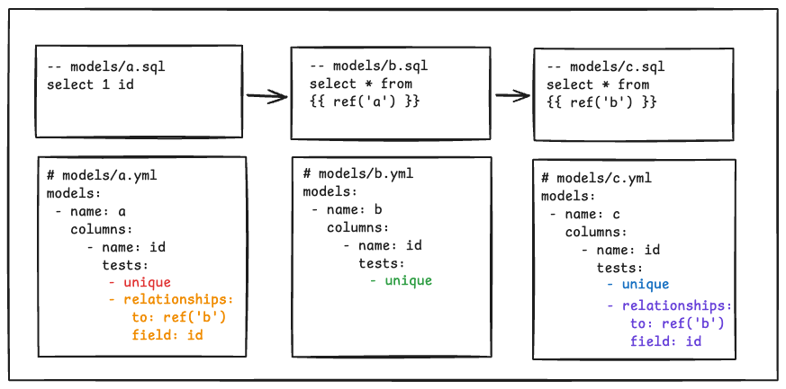
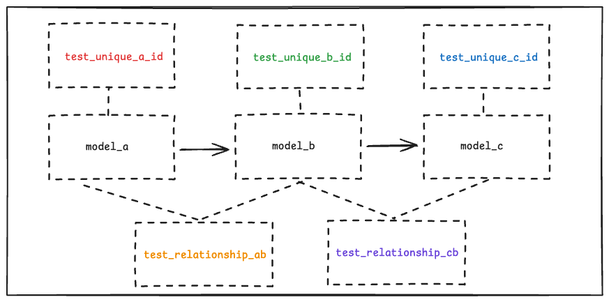
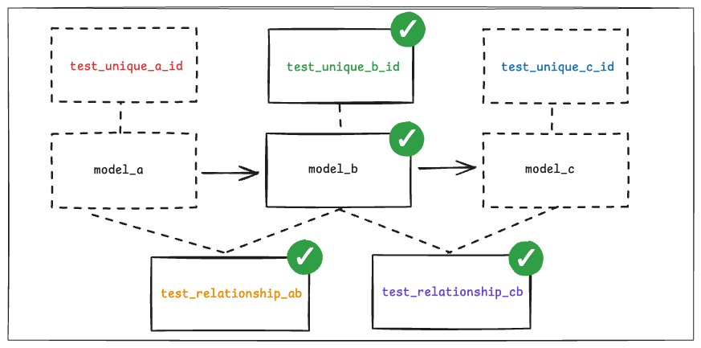
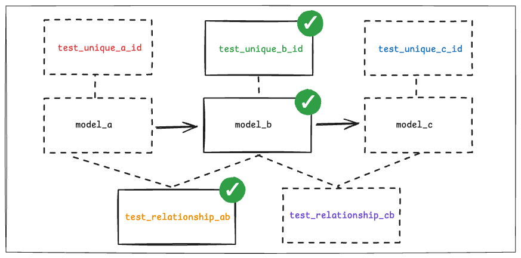
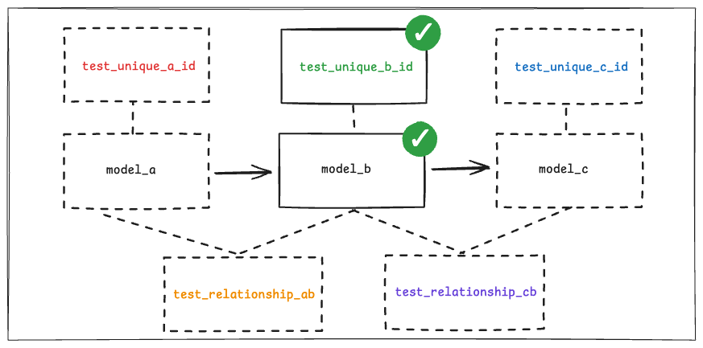

---
---

# Indirect test selection

https://docs.getdbt.com/reference/node-selection/test-selection-examples?indirect-selection-mode=cautious#indirect-selection

More examples.

## Project setup



## Resulting DAG



## Eager mode (default)

```sh
$ dbt build -s b
$ dbt build -s b --indirect-selection=eager
```



## Buildable mode

```sh
$ dbt build -s b --indirect-selection=buildable
```



## Cautious mode

```sh
$ dbt build -s b --indirect-selection=cautious
```


