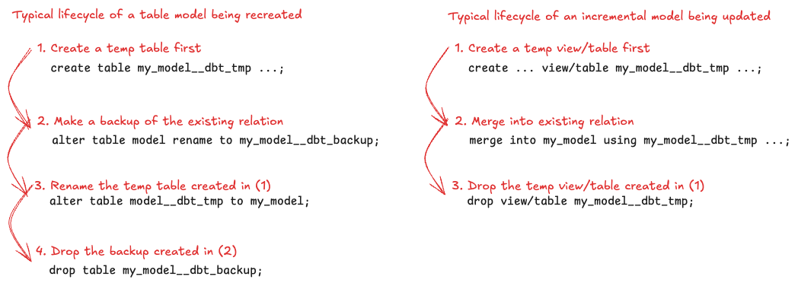

---
---

## The dbt model lifecycle

When dbt executes a model - more often than not, it is not a single SQL statement that it sends to your datawarehouse - it is frequently multiple SQL statements. It differs based on the adapter type, the materialization type and the dbt version as well as changes are made to how different materializations are "executed". If you want to understand exactly all of the SQL statements involved for updating a model - you can trawl around the materialization code - for example:
* [Postgres - table](https://github.com/dbt-labs/dbt-adapters/blob/main/dbt/include/global_project/macros/materializations/models/table.sql)
* [Snowflake - incremental](https://github.com/dbt-labs/dbt-snowflake/blob/main/dbt/include/snowflake/macros/materializations/incremental.sql)



Let's look at a quick example on Postgres:

```sql
-- models/my_table.sql
{{ config(materialized='table') }}
select 1 id

-- models/my_view.sql
{{ config(materialized='view') }}
select 1 id
```

First we make sure we don't have any tables or views called `my_table` or `my_view` and we do a dbt run:

```sh
$ dbt --debug run
01:40:43  1 of 2 START sql table model public.my_table ................................... [RUN]
01:40:43  On model.my_dbt_project.my_table: /* {"app": "dbt", "dbt_version": "1.9.1", "profile_name": "all", "target_name": "pg", "node_id": "model.my_dbt_project.my_table"} */
  create  table "postgres"."public"."my_table__dbt_tmp"
    as
  (
    -- models/my_table.sql
select 1 id
  );
01:40:43  On model.my_dbt_project.my_table: /* {"app": "dbt", "dbt_version": "1.9.1", "profile_name": "all", "target_name": "pg", "node_id": "model.my_dbt_project.my_table"} */
alter table "postgres"."public"."my_table__dbt_tmp" rename to "my_table"
01:40:43  On model.my_dbt_project.my_table: /* {"app": "dbt", "dbt_version": "1.9.1", "profile_name": "all", "target_name": "pg", "node_id": "model.my_dbt_project.my_table"} */
drop table if exists "postgres"."public"."my_table__dbt_backup" cascade
01:40:43  1 of 2 OK created sql table model public.my_table .............................. [SELECT 1 in 0.06s]
...
1:40:43  2 of 2 START sql view model public.my_view ..................................... [RUN]
01:40:43  On model.my_dbt_project.my_view: /* {"app": "dbt", "dbt_version": "1.9.1", "profile_name": "all", "target_name": "pg", "node_id": "model.my_dbt_project.my_view"} */
  create view "postgres"."public"."my_view__dbt_tmp"
  as (
    -- models/my_view.sql
select 1 id
  );
01:40:43  On model.my_dbt_project.my_view: /* {"app": "dbt", "dbt_version": "1.9.1", "profile_name": "all", "target_name": "pg", "node_id": "model.my_dbt_project.my_view"} */
alter table "postgres"."public"."my_view__dbt_tmp" rename to "my_view"
01:40:43  On model.my_dbt_project.my_view: /* {"app": "dbt", "dbt_version": "1.9.1", "profile_name": "all", "target_name": "pg", "node_id": "model.my_dbt_project.my_view"} */
drop view if exists "postgres"."public"."my_view__dbt_backup" cascade
01:40:43  2 of 2 OK created sql view model public.my_view ................................ [CREATE VIEW in 0.03s]
...
```

What is the lifecycle of a dbt table/view materialization as it is created for the **first time**?

1. A `table/view` is created with the name `<model>__dbt_tmp`.
2. Rename `<model>__dbt_tmp` to `<model_name>`.
3. Drop `<model>__dbt_backup` if one exists.

That completes the lifecycle and our model now exist in our datawarehouse.

What about if it's not the first time we're building those models?

```sh
$ dbt --debug run
...
01:42:21  1 of 2 START sql table model public.my_table ................................... [RUN]
01:42:21  On model.my_dbt_project.my_table: /* {"app": "dbt", "dbt_version": "1.9.1", "profile_name": "all", "target_name": "pg", "node_id": "model.my_dbt_project.my_table"} */
  create  table "postgres"."public"."my_table__dbt_tmp"
    as
  (
    -- models/my_table.sql
select 1 id
  );
01:42:21  On model.my_dbt_project.my_table: /* {"app": "dbt", "dbt_version": "1.9.1", "profile_name": "all", "target_name": "pg", "node_id": "model.my_dbt_project.my_table"} */
alter table "postgres"."public"."my_table" rename to "my_table__dbt_backup"
01:42:21  On model.my_dbt_project.my_table: /* {"app": "dbt", "dbt_version": "1.9.1", "profile_name": "all", "target_name": "pg", "node_id": "model.my_dbt_project.my_table"} */
alter table "postgres"."public"."my_table__dbt_tmp" rename to "my_table"
01:42:21  On model.my_dbt_project.my_table: /* {"app": "dbt", "dbt_version": "1.9.1", "profile_name": "all", "target_name": "pg", "node_id": "model.my_dbt_project.my_table"} */
drop table if exists "postgres"."public"."my_table__dbt_backup" cascade
01:42:21  1 of 2 OK created sql table model public.my_table .............................. [SELECT 1 in 0.06s]
...
01:42:21  2 of 2 START sql view model public.my_view ..................................... [RUN]
01:42:21  On model.my_dbt_project.my_view: /* {"app": "dbt", "dbt_version": "1.9.1", "profile_name": "all", "target_name": "pg", "node_id": "model.my_dbt_project.my_view"} */
  create view "postgres"."public"."my_view__dbt_tmp"
  as (
    -- models/my_view.sql
select 1 id
  );
01:42:21  On model.my_dbt_project.my_view: /* {"app": "dbt", "dbt_version": "1.9.1", "profile_name": "all", "target_name": "pg", "node_id": "model.my_dbt_project.my_view"} */
alter table "postgres"."public"."my_view" rename to "my_view__dbt_backup"
01:42:21  On model.my_dbt_project.my_view: /* {"app": "dbt", "dbt_version": "1.9.1", "profile_name": "all", "target_name": "pg", "node_id": "model.my_dbt_project.my_view"} */
alter table "postgres"."public"."my_view__dbt_tmp" rename to "my_view"
01:42:21  On model.my_dbt_project.my_view: /* {"app": "dbt", "dbt_version": "1.9.1", "profile_name": "all", "target_name": "pg", "node_id": "model.my_dbt_project.my_view"} */
drop view if exists "postgres"."public"."my_view__dbt_backup" cascade
01:42:21  2 of 2 OK created sql view model public.my_view ................................ [CREATE VIEW in 0.03s]
```

It's pretty similar to previously but this time, we make a backup of `<model>` first and the lifecycle is as follows:

1. A `table/view` is created with the name `<model>__dbt_tmp`.
2. Rename `<model>` to `<model>__dbt_backup`.
3. Rename `<model>__dbt_tmp` to `<model_name>`.
4. Drop `<model>__dbt_backup` if one exists.

This completes the lifecycle and our models are ready for querying.

Now - how does this look like on Snowflake? Building for the first time:

```sh
$ dbt --debug run
01:49:57  1 of 2 START sql table model sch.my_table ...................................... [RUN]
01:49:57  On model.my_dbt_project.my_table: /* {"app": "dbt", "dbt_version": "1.9.1", "profile_name": "all", "target_name": "sf", "node_id": "model.my_dbt_project.my_table"} */
create or replace transient table db.sch.my_table
         as
        (-- models/my_table.sql
select 1 id
        );
01:50:00  1 of 2 OK created sql table model sch.my_table ................................. [SUCCESS 1 in 2.50s]
...
01:50:00  2 of 2 START sql view model sch.my_view ........................................ [RUN]
01:50:00  On model.my_dbt_project.my_view: /* {"app": "dbt", "dbt_version": "1.9.1", "profile_name": "all", "target_name": "sf", "node_id": "model.my_dbt_project.my_view"} */
create or replace   view db.sch.my_view
   as (
    -- models/my_view.sql
select 1 id
  );

01:50:01  2 of 2 OK created sql view model sch.my_view ................................... [SUCCESS 1 in 1.58s]
...
```

Building for a subsequent time:

```sh
$ dbt --debug run
01:50:38  1 of 2 START sql table model sch.my_table ...................................... [RUN]
01:50:38  On model.my_dbt_project.my_table: /* {"app": "dbt", "dbt_version": "1.9.1", "profile_name": "all", "target_name": "sf", "node_id": "model.my_dbt_project.my_table"} */
create or replace transient table db.sch.my_table
         as
        (-- models/my_table.sql
select 1 id
        );
01:50:40  1 of 2 OK created sql table model sch.my_table ................................. [SUCCESS 1 in 2.43s]
...
01:50:40  2 of 2 START sql view model sch.my_view ........................................ [RUN]
01:50:40  On model.my_dbt_project.my_view: /* {"app": "dbt", "dbt_version": "1.9.1", "profile_name": "all", "target_name": "sf", "node_id": "model.my_dbt_project.my_view"} */
create or replace   view db.sch.my_view
   as (
    -- models/my_view.sql
select 1 id
  );
01:50:42  2 of 2 OK created sql view model sch.my_view ................................... [SUCCESS 1 in 1.78s]
```

So what are our observations? Unlike Postgres above - we don't do any backups here and whether it is the first go round or second go round of a table/view model - there is only a single lifecycle step:

1. Create or replace `<model>`.

Which concludes the lifecycle of our model.

Now - what about incrementals? Let's have a quick look using Snowflake:

```sql
-- models/my_inc.sql
{{ 
   config( 
       materialized = 'incremental', 
       unique_key = 'id', 
   ) 
}}
select 1 id, 'alice' as user_name
```

```sh
$ dbt --debug run -s my_inc
02:04:30  1 of 1 START sql incremental model sch.my_inc .................................. [RUN]
02:04:30  On model.my_dbt_project.my_inc: /* {"app": "dbt", "dbt_version": "1.9.1", "profile_name": "all", "target_name": "sf", "node_id": "model.my_dbt_project.my_inc"} */
create or replace transient table db.sch.my_inc
         as
        (-- models/my_inc.sql
select 1 id, 'alice' as user_name
        );
02:04:32  On model.my_dbt_project.my_inc: /* {"app": "dbt", "dbt_version": "1.9.1", "profile_name": "all", "target_name": "sf", "node_id": "model.my_dbt_project.my_inc"} */
drop view if exists db.sch.my_inc__dbt_tmp cascade
02:04:32  1 of 1 OK created sql incremental model sch.my_inc ............................. [SUCCESS 1 in 2.47s]
```

Since the incremental model doesn't yet exist - we simply treat it as if we were building a table from scratch - if you recall from above, we would simply do a `create or replace ...`. However, it looks like in this case there is a `drop view` as well (which looks like a bug to me at this time). The same lifecycle apply if we did a `--full-refresh`.

On a subquent run:

```sh
$ dbt --debug run -s my_inc
02:07:58  1 of 1 START sql incremental model sch.my_inc .................................. [RUN]
02:07:58  On model.my_dbt_project.my_inc: /* {"app": "dbt", "dbt_version": "1.9.1", "profile_name": "all", "target_name": "sf", "node_id": "model.my_dbt_project.my_inc"} */
create or replace  temporary view db.sch.my_inc__dbt_tmp
   as (
    -- models/my_inc.sql
select 1 id, 'alice' as user_name
  );
02:08:00  On model.my_dbt_project.my_inc: /* {"app": "dbt", "dbt_version": "1.9.1", "profile_name": "all", "target_name": "sf", "node_id": "model.my_dbt_project.my_inc"} */
describe table db.sch.my_inc__dbt_tmp
02:08:00  On model.my_dbt_project.my_inc: /* {"app": "dbt", "dbt_version": "1.9.1", "profile_name": "all", "target_name": "sf", "node_id": "model.my_dbt_project.my_inc"} */
describe table db.sch.my_inc
02:08:00  On model.my_dbt_project.my_inc: /* {"app": "dbt", "dbt_version": "1.9.1", "profile_name": "all", "target_name": "sf", "node_id": "model.my_dbt_project.my_inc"} */
describe table "DB"."SCH"."MY_INC"
02:08:00  On model.my_dbt_project.my_inc: /* {"app": "dbt", "dbt_version": "1.9.1", "profile_name": "all", "target_name": "sf", "node_id": "model.my_dbt_project.my_inc"} */
-- back compat for old kwarg name
  begin;
02:08:01  On model.my_dbt_project.my_inc: /* {"app": "dbt", "dbt_version": "1.9.1", "profile_name": "all", "target_name": "sf", "node_id": "model.my_dbt_project.my_inc"} */
merge into db.sch.my_inc as DBT_INTERNAL_DEST
        using db.sch.my_inc__dbt_tmp as DBT_INTERNAL_SOURCE
        on (
                DBT_INTERNAL_SOURCE.id = DBT_INTERNAL_DEST.id
            )
    when matched then update set
        "ID" = DBT_INTERNAL_SOURCE."ID","USER_NAME" = DBT_INTERNAL_SOURCE."USER_NAME"
    when not matched then insert
        ("ID", "USER_NAME")
    values
        ("ID", "USER_NAME")
;
02:08:02  On model.my_dbt_project.my_inc: /* {"app": "dbt", "dbt_version": "1.9.1", "profile_name": "all", "target_name": "sf", "node_id": "model.my_dbt_project.my_inc"} */
COMMIT
02:08:02  On model.my_dbt_project.my_inc: /* {"app": "dbt", "dbt_version": "1.9.1", "profile_name": "all", "target_name": "sf", "node_id": "model.my_dbt_project.my_inc"} */
drop view if exists db.sch.my_inc__dbt_tmp cascade
02:08:03  1 of 1 OK created sql incremental model sch.my_inc ............................. [SUCCESS 1 in 4.59s]
```

We see that the lifecycle is as follows:

1. Create a temporary view `<model>__dbt_tmp`.
2. Merge into `<model>` selecting from `<model>__dbt_tmp`.
3. Drop the view created in (1). _Note: Technically, this is not required because in Snowflake - temporary relations cease to exist when the session ends - but is most likely a carry over from when we previously (in older dbt verions) did not create this as `temporary`_.
