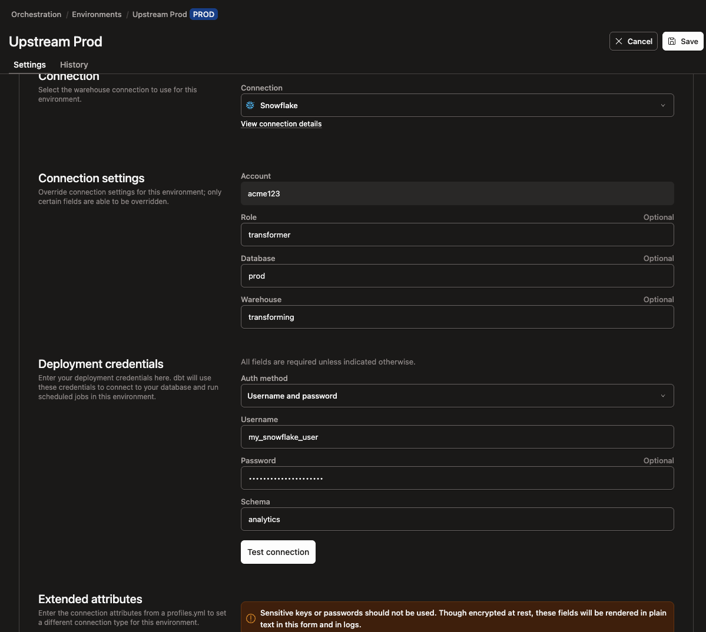
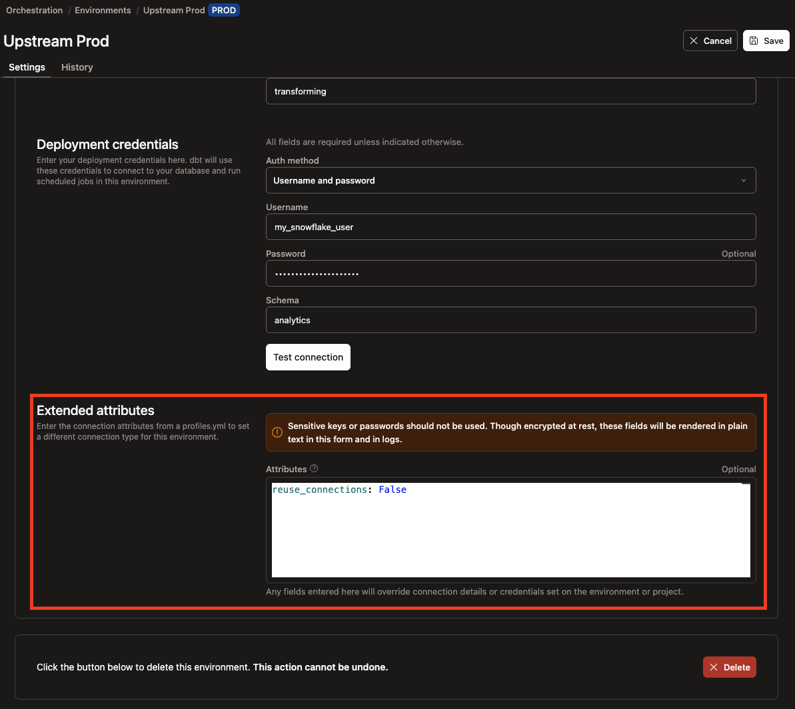
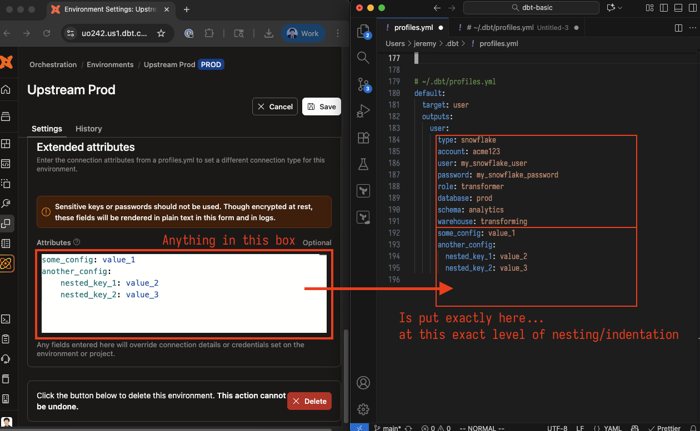

---
---

# dbt profiles in dbt Cloud

In dbt-core, users set up a `profiles.yml` file like so:

```yaml
# ~/.dbt/profiles.yml
default:
  target: user
  outputs:
    user:
      type: snowflake
      account: acme123
      user: my_snowflake_user
      password: my_snowflake_password
      role: transformer
      database: prod
      schema: analytics
      warehouse: transforming
```

In dbt Cloud, users do not set up a `profiles.yml` file but rather use the various forms and fields provided to the user - for example:



With this exact form field values, dbt Cloud will generate a `profiles.yml` behind the scenes (e.g. when dbt Cloud jobs run) that looks exactly identical to the `profiles.yml` file shown above (this includes the profile name of `default` and the default target of `user`.)

## Extended attributes

Some configurations or settings are not exposed by the dbt Cloud form fields - for example, a user may want to set a config like `reuse_connections` to `False` (https://docs.getdbt.com/docs/core/connect-data-platform/snowflake-setup#reuse_connections). From the docs, we can see that `reuse_connections` is set at the same level as all the other config (e.g. `user`, `role`):

```yaml
# ~/.dbt/profiles.yml
default:
  target: user
  outputs:
    user:
      type: snowflake
      account: acme123
      user: my_snowflake_user
      password: my_snowflake_password
      role: transformer
      database: prod
      schema: analytics
      warehouse: transforming
      reuse_connections: False # Set this at this level for dbt-core profiles.yml
```

In dbt Cloud, users will have to use the "Extended attributes" section to set that particular config:



^ With this exact extended attribute set this way (at the root level) - the dbt Cloud "behind the scenes" `profiles.yml` will be exactly identical to the one above (where `reuse_connections` was set).

Basically, we can see exactly where (which level of nesting/indentation) dbt Cloud will insert the "Extended attributes" into:



This indentation becomes important when the time calls for it - e.g. setting `compute` for Databricks (https://docs.getdbt.com/reference/resource-configs/databricks-configs#selecting-compute-per-model).
