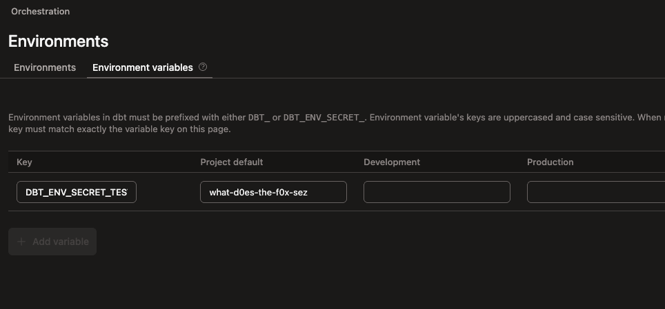
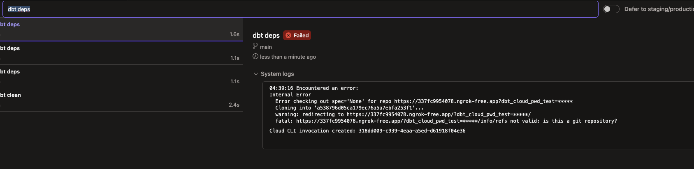

---
---

## dbt secret env var validation

WARNING: This is probably not something you want to test with legitimate secrets.

If you think that dbt is incorrectly parsing your secret env vars or something, we can test that out by running a local webserver to test.

```python
# main.py
from flask import Flask, request, Response
app = Flask(__name__)
@app.route("/", methods=["GET"])
def main():
    args = request.args
    return args.to_dict()
if __name__ == "__main__":
    app.run(debug=False)
```

Install Flask and start our webserver:

```sh
$ pip install Flask
$ python main.py
* Serving Flask app 'main'
 * Debug mode: off
WARNING: This is a development server. Do not use it in a production deployment. Use a production WSGI server instead.
 * Running on http://127.0.0.1:5000
Press CTRL+C to quit
```

Start a new terminal and curl with some params:

```sh
$ curl 'http://localhost:5000?hello=world'
{"hello":"world"}
```

The webserver window will show:

```sh
127.0.0.1 - - [04/Sep/2025 16:21:27] "GET /?hello=world HTTP/1.1" 200 -
```

^ Since we can see the param values in the browser window, we can then test that out with dbt.

```yaml
# packages.yml
packages:
  - git: "http://localhost:5000?pwd={{ env_var('DBT_ENV_SECRET_TEST_VAL') }}"
```

1. `packages.yml` is really the only legitimate place where we can use secret env vars. (`profiles.yml` too so you can test with using env vars in username perhaps).
2. We know this will fail - but that's not the point.

Set the secret then invoke `dbt deps`:

```sh
$ export DBT_ENV_SECRET_TEST_VAL=what-d0es-the-f0x-sez
$ dbt deps
04:24:48  Running with dbt=1.10.9
04:24:48  Encountered an error:
Internal Error
  Error checking out spec='None' for repo http://localhost:5000?pwd=*****
  Cloning into '8b1d014b132b5bc2d76251059219d23b'...
  warning: redirecting to http://localhost:5000/?pwd=*****/
  fatal: http://localhost:5000/?pwd=*****/info/refs not valid: is this a git repository?
```

As we can see secret env vars are always blanked out so you can't see the value - fortunately for us, the flask webserver window shows:

```
127.0.0.1 - - [04/Sep/2025 16:24:48] "GET /?pwd=what-d0es-the-f0x-sez/info/refs&service=git-upload-pack HTTP/1.1" 200 -
```

^ Therefore we know that dbt read the secret properly and passed it along to the server properly. Of course our webserver is not a full fledged git server so it `dbt deps` errors - and is expected to.

### How to test this with dbt Cloud

To do this we need to public tunnel to our local machine - we can use https://ngrok.com/.

```sh
# Setup is pretty easy - just signup and look at the instructions.
# Tunnel to our local running webserver.
$ ngrok http http://localhost:5000

Session Status                online
Account                       Jeremy Yeo (Plan: Free)
Version                       3.27.0
Region                        Australia (au)
Latency                       46ms
Web Interface                 http://127.0.0.1:4040
Forwarding                    https://337fc9954078.ngrok-free.app -> http://localhost:5000
```

Test to see if our tunnel is working:

```sh
$ curl 'https://337fc9954078.ngrok-free.app?pwd=42'
{"pwd":"42"}
```

Webserver window:

```sh
127.0.0.1 - - [04/Sep/2025 16:33:06] "GET /?pwd=42 HTTP/1.1" 200 -
```

Go to dbt Cloud and do what we just did above - setup the secret then use it.






Deps fails as expected but our flask webserver shows which would confirm a working secret env var:

```sh
127.0.0.1 - - [04/Sep/2025 16:39:16] "GET /?dbt_cloud_pwd_test=what-d0es-the-f0x-sez/info/refs&service=git-upload-pack HTTP/1.1" 200 -
```
