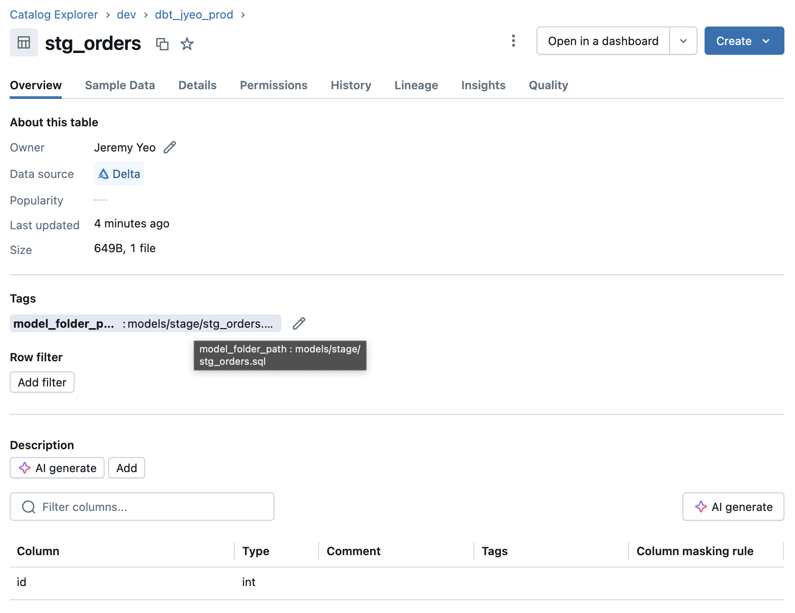
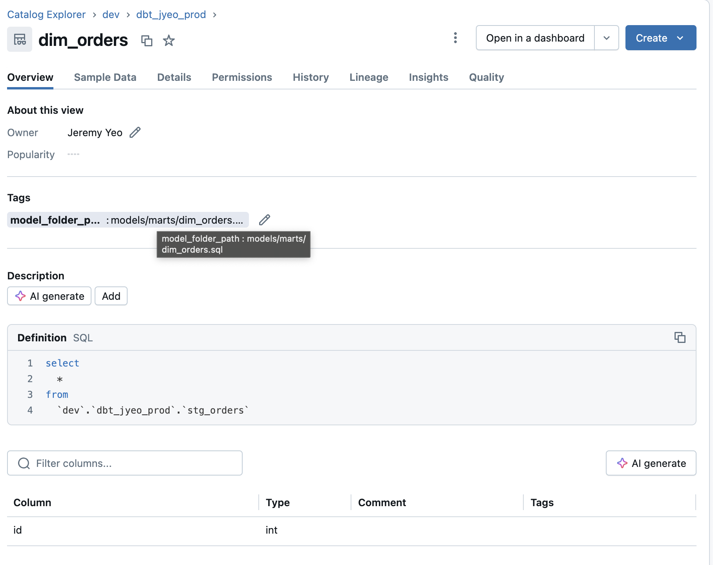

---
---

## Using the dbt graph context variable

The dbt `graph` context variable contains the information about the nodes in our project which we can use to do fun things with.

https://docs.getdbt.com/reference/dbt-jinja-functions/graph

### Checking for models that have no tests

```yaml
# dbt_project.yml
name: my_dbt_project
profile: all
config-version: 2
version: "1.0.0"

models:
  my_dbt_project:
    +materialized: table

# models/schema.yml
models:
  - name: foo
    columns:
      - name: id
        tests:
          - unique
```

```sql
-- models/foo.sql
select 1 id

-- models/bar.sql
select 1 id

-- macros/models_without_tests.sql

    
    
    
        
            
        
    

```

```sh
$ dbt run-operation models_without_tests
03:29:04  Running with dbt=1.9.0-rc2
03:29:05  Registered adapter: snowflake=1.9.0-rc1
03:29:05  Found 2 models, 1 test, 469 macros
Model model.my_dbt_project.bar has no tests defined.
```

^ As we can see, we didn't have any test on model `bar` - and that's what was printed out by our run-operation.

### Adding the full file path as Databricks object tags

In the example below, we will apply object tags that point to the folder/file path where our model.sql file is located.

```yaml
# dbt_project.yml
# dbt_project.yml
name: my_dbt_project
profile: all
version: "1.0.0"
config-version: 2

models:
  my_dbt_project:
    +materialized: table
    +post_hook: "{{ set_tag_to_file_path() }}"
```

```sql
-- macros/set_tag_to_file_path.sql

    
        
        
            alter {{ current_node[0].config.materialized }} {{ this }} set tags ('model_folder_path' = '{{ current_node[0].original_file_path }}');
        
        
    

```

```sql
-- models/stage/stg_orders.sql
{{ config(materialized='table') }}

select 1 id

-- models/marts/dim_orders.sql
{{ config(materialized='view') }}

select * from {{ ref('stg_orders') }}
```

We have 2 models here - one in folder `models/stage/` and another in folder `models/marts/`. Let's see what our macro does when we do a run:

```sh
$ dbt run
...
22:49:42  Using databricks connection "model.my_dbt_project.stg_orders"
22:49:42  On model.my_dbt_project.stg_orders: /* {"app": "dbt", "dbt_version": "1.9.2", "dbt_databricks_version": "1.9.5", "databricks_sql_connector_version": "3.7.1", "profile_name": "all", "target_name": "db", "node_id": "model.my_dbt_project.stg_orders"} */
        create or replace table `dev`.`dbt_jyeo_prod`.`stg_orders`
      using delta
      as
select 1 id
22:49:44  SQL status: OK in 2.410 seconds
...
22:49:44  On model.my_dbt_project.stg_orders: /* {"app": "dbt", "dbt_version": "1.9.2", "dbt_databricks_version": "1.9.5", "databricks_sql_connector_version": "3.7.1", "profile_name": "all", "target_name": "db", "node_id": "model.my_dbt_project.stg_orders"} */
            alter table `dev`.`dbt_jyeo_prod`.`stg_orders` set tags ('model_folder_path' = 'models/stage/stg_orders.sql');
22:49:45  SQL status: OK in 0.530 seconds
...
22:49:45  1 of 2 OK created sql table model dbt_jyeo_prod.stg_orders ..................... [OK in 3.07s]
...
22:49:45  Using databricks connection "model.my_dbt_project.dim_orders"
22:49:45  On model.my_dbt_project.dim_orders: /* {"app": "dbt", "dbt_version": "1.9.2", "dbt_databricks_version": "1.9.5", "databricks_sql_connector_version": "3.7.1", "profile_name": "all", "target_name": "db", "node_id": "model.my_dbt_project.dim_orders"} */
create or replace view `dev`.`dbt_jyeo_prod`.`dim_orders`
  as
select * from `dev`.`dbt_jyeo_prod`.`stg_orders`

22:49:46  SQL status: OK in 0.950 seconds
...
22:49:46  On model.my_dbt_project.dim_orders: /* {"app": "dbt", "dbt_version": "1.9.2", "dbt_databricks_version": "1.9.5", "databricks_sql_connector_version": "3.7.1", "profile_name": "all", "target_name": "db", "node_id": "model.my_dbt_project.dim_orders"} */
            alter view `dev`.`dbt_jyeo_prod`.`dim_orders` set tags ('model_folder_path' = 'models/marts/dim_orders.sql');
22:49:46  SQL status: OK in 0.430 seconds
...
```

We can see that after the models are created, we run a DDL `alter ... set tags (...)` and in Databricks, we can see the following tags on the objects:





Note that it's possible to add object tags via the `databricks_tags` config (https://docs.getdbt.com/reference/resource-configs/databricks-configs#configuring-tables) - however, it's not possible to call a macro in the `dbt_project.yml` file when setting that config hence the above example where we use a post-hook to do it instead (since post-hooks can call macros).

### Other examples

https://gist.github.com/jeremyyeo/83adf1f412e5e497baef60e5ada35bf8
