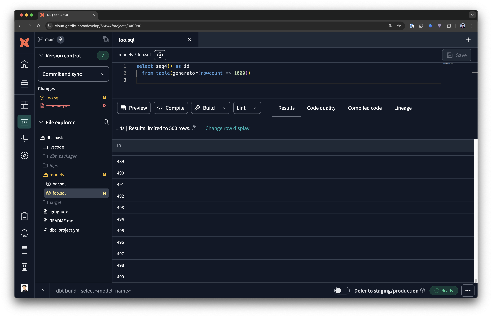
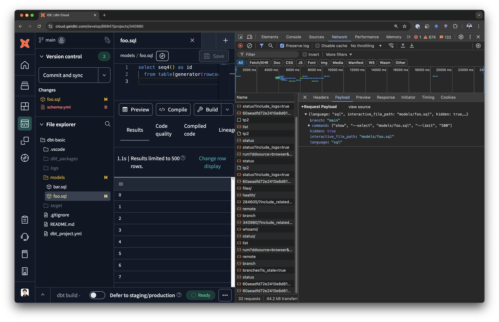
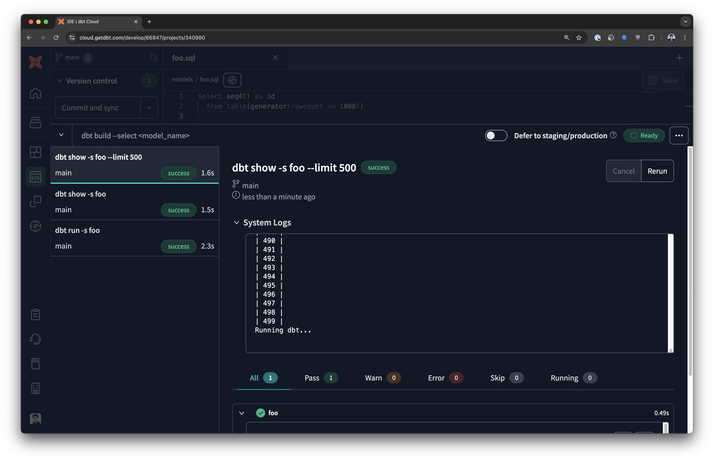
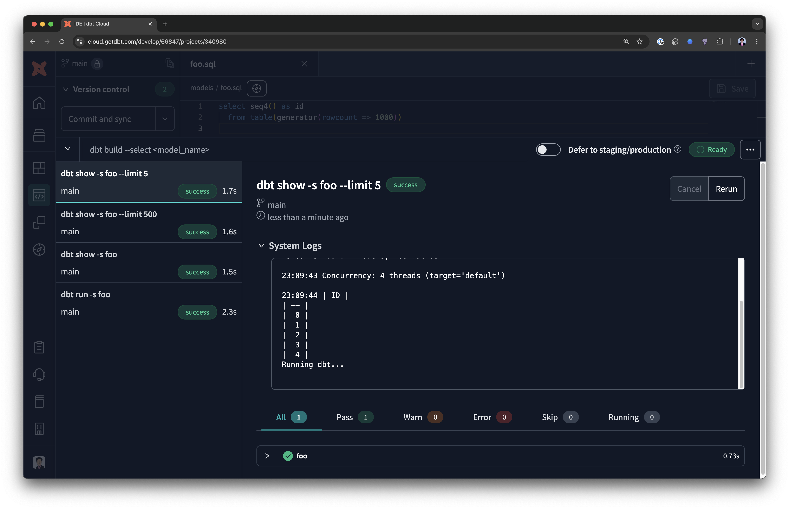
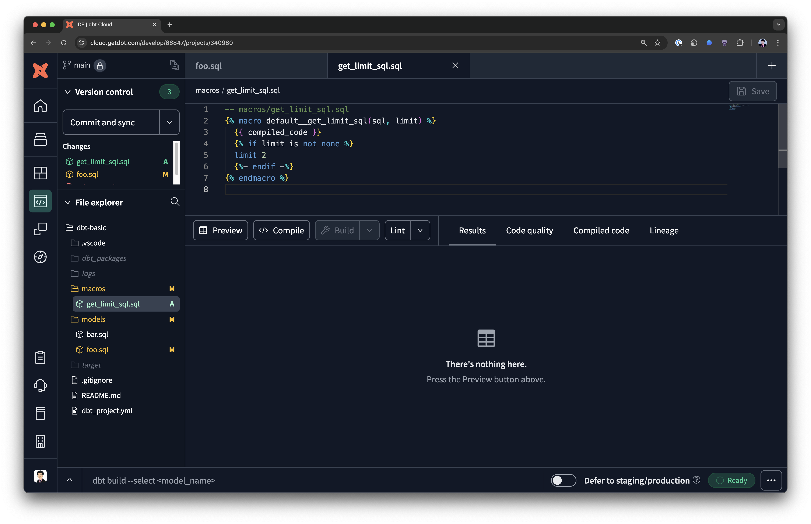
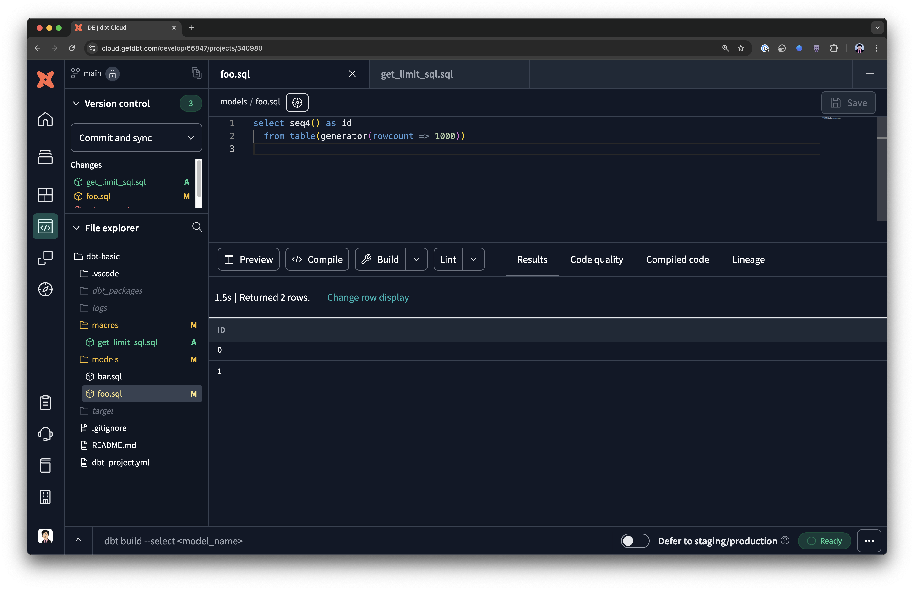

---
---

## Limiting the number of rows previewed

When previewing data in dbt Cloud, by default we retrieve 500 rows:



If you check the network tools - you can see what the exact dbt command is that was executed:



```sh
dbt show --select foo --limit 500
```

We can try to run that command in the command prompt:



And we can limit the rows by specifying a lower `--limit`:

```sh
dbt show --select foo --limit 5
```



> P.s. 5 is the default number of rows when the `--limit` flag is omitted from the `dbt show` command.

As you can tell, the "Preview" button will always invoke a `--limit 500` so what we can do to limit the number of rows when using the "Preview" button is to modify the built-in macro `default__get_limit_sql` (https://github.com/dbt-labs/dbt-adapters/blob/main/dbt/include/global_project/macros/adapters/show.sql#L21-L26).

Add a macro like so:

```sql
-- macros/get_limit_sql.sql

  {{ compiled_code }}
  
  limit 2
  

```



Then, when we press the "Preview" button again:



We get our 2 rows - as specified in our macro override.
