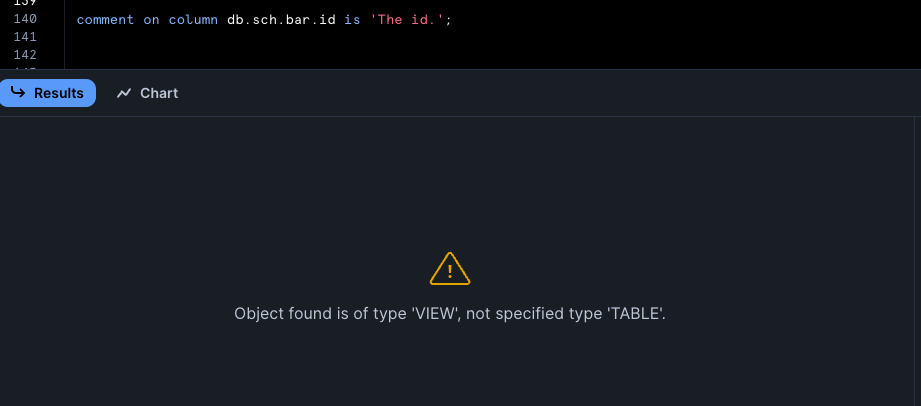

---
---

## Manually persisting docs

Examples where we persist docs in extraordinary ways.

### Persisting docs with a run-operation

Databricks example but most adapters work roughly the same way.

When enabling [persist-docs](https://docs.getdbt.com/reference/resource-configs/persist_docs) - there will be some modifications to the DDL statements run during the creation of the relation and after the creation of the relation. Let's have a look:

```sql
-- models/foo.sql
{{ config(materialized='table', persist_docs={'relation': true, 'columns': true}) }}
select 1 id, 'alice' as first_name
```

```yaml
# models/schema.yml
models:
  - name: foo
    description: The foo table.
    columns:
      - name: id
        description: The id.
      - name: first_name
        description: The first name.
```

```sh
$ dbt --debug run -s foo
23:03:50  On model.my_dbt_project.foo: /* {"app": "dbt", "dbt_version": "1.9.0b4", "dbt_databricks_version": "1.9.0b1", "databricks_sql_connector_version": "3.4.0", "profile_name": "all", "target_name": "db", "node_id": "model.my_dbt_project.foo"} */
        create or replace table `dev`.`dbt_jyeo`.`foo`
      using delta
      comment 'The foo table.'
      as
select 1 id, 'alice' as first_name

23:04:03  On model.my_dbt_project.foo: /* {"app": "dbt", "dbt_version": "1.9.0b4", "dbt_databricks_version": "1.9.0b1", "databricks_sql_connector_version": "3.4.0", "profile_name": "all", "target_name": "db", "node_id": "model.my_dbt_project.foo"} */
        alter table `dev`.`dbt_jyeo`.`foo` change column
            id
            comment 'The id.';

23:04:05  On model.my_dbt_project.foo: /* {"app": "dbt", "dbt_version": "1.9.0b4", "dbt_databricks_version": "1.9.0b1", "databricks_sql_connector_version": "3.4.0", "profile_name": "all", "target_name": "db", "node_id": "model.my_dbt_project.foo"} */
        alter table `dev`.`dbt_jyeo`.`foo` change column
            first_name
            comment 'The first name.';
```

What if we want to add those comments in a separate run-operation so we don't do it during model build time. Here's a quick demo on how we can achieve that:

```sql
-- macros/add_comments.sql

    
        
        
            /*{# The fqn of the model which we will use later. #}*/
            
            

            /*{# Add model descriptions if there's any. #}*/
            
            
                
                    comment on table {{ relation }} is '{{ model_description }}';
                
                
            

            /*{# Add column descriptions if there's any. #}*/
            
            
                
                
                    
                        alter table {{ relation }} change column {{ mc.name }} comment '{{ column_description }}';
                    
                    
                
            
            
        
    

```

```sql
-- models/foo.sql
{{ config(materialized='table') }}
select 1 id, 'alice' as first_name

-- models/bar.sql
{{ config(materialized='table') }}
select 1 id

-- models/baz.sql
{{ config(materialized='table') }}
select 1 id
```

```yaml
# models/schema.yml
models:
  - name: foo
    description: The foo table.
    columns:
      - name: id
        description: The id.
      - name: first_name
        description: The first name.
  - name: bar
    description: The bar table.
  - name: baz
    columns:
      - name: id
        description: The id.
```

Here were not making use of `persist_docs` - therefore when builing the models, those descriptions wont be added:

```sh
$ dbt --debug run
...
02:04:31  3 of 3 START sql table model dbt_jyeo.foo ...................................... [RUN]
...
02:04:31  Using databricks connection "model.my_dbt_project.foo"
02:04:31  On model.my_dbt_project.foo: /* {"app": "dbt", "dbt_version": "1.9.0b4", "dbt_databricks_version": "1.9.0b1", "databricks_sql_connector_version": "3.4.0", "profile_name": "all", "target_name": "db", "node_id": "model.my_dbt_project.foo"} */
        create or replace table `dev`.`dbt_jyeo`.`foo`
      using delta
      as
select 1 id, 'alice' as first_name
...
02:04:33  3 of 3 OK created sql table model dbt_jyeo.foo ................................. [OK in 1.99s]
...
```

Then we can make use of our macro in a run-op:

```sh
$ dbt --debug run-operation add_comments
...
>>> Adding comments to dev.dbt_jyeo.foo <<<
02:06:02  On macro_add_comments: /* {"app": "dbt", "dbt_version": "1.9.0b4", "dbt_databricks_version": "1.9.0b1", "databricks_sql_connector_version": "3.4.0", "profile_name": "all", "target_name": "db", "connection_name": "macro_add_comments"} */

    comment on table dev.dbt_jyeo.foo is 'The foo table.';
  
02:06:06  On macro_add_comments: /* {"app": "dbt", "dbt_version": "1.9.0b4", "dbt_databricks_version": "1.9.0b1", "databricks_sql_connector_version": "3.4.0", "profile_name": "all", "target_name": "db", "connection_name": "macro_add_comments"} */

    alter table dev.dbt_jyeo.foo change column id comment 'The id.';
  
02:06:07  On macro_add_comments: /* {"app": "dbt", "dbt_version": "1.9.0b4", "dbt_databricks_version": "1.9.0b1", "databricks_sql_connector_version": "3.4.0", "profile_name": "all", "target_name": "db", "connection_name": "macro_add_comments"} */

    alter table dev.dbt_jyeo.foo change column first_name comment 'The first name.';
  
02:06:08  Databricks adapter: Cursor(session-id=01efa7ad-29ab-1ad0-b114-5c1016366708, command-id=01efa7ad-2c1a-1fe4-a871-1826437d7aa0) - Closing cursor
=================================================

>>> Adding comments to dev.dbt_jyeo.bar <<<

02:06:08  On macro_add_comments: /* {"app": "dbt", "dbt_version": "1.9.0b4", "dbt_databricks_version": "1.9.0b1", "databricks_sql_connector_version": "3.4.0", "profile_name": "all", "target_name": "db", "connection_name": "macro_add_comments"} */

    comment on table dev.dbt_jyeo.bar is 'The bar table.';
  
02:06:10  Databricks adapter: Cursor(session-id=01efa7ad-29ab-1ad0-b114-5c1016366708, command-id=01efa7ad-2cd1-1942-968a-d40b0805905d) - Closing cursor
=================================================

>>> Adding comments to dev.dbt_jyeo.baz <<<
02:06:10  On macro_add_comments: /* {"app": "dbt", "dbt_version": "1.9.0b4", "dbt_databricks_version": "1.9.0b1", "databricks_sql_connector_version": "3.4.0", "profile_name": "all", "target_name": "db", "connection_name": "macro_add_comments"} */

    alter table dev.dbt_jyeo.baz change column id comment 'The id.';
  
02:06:11  Databricks adapter: Cursor(session-id=01efa7ad-29ab-1ad0-b114-5c1016366708, command-id=01efa7ad-2dc8-1ac6-83c3-3387f6ebe683) - Closing cursor
=================================================
...
```

^ As we can see, we've submitted all the necessary DDL to add the descriptions of our models and columns to the various tables and columns on Databricks. Do a quick check in the Databricks UI:


----

### Persisting docs if the object comments/descriptions were added outside of dbt

> Snowflake example. 

Let's assume we have some relations in Snowflake - and those have relation level / column level descriptions on them. Perhaps you have some fancy Codex thing that gives you auto descriptions or what have you.

How can we make sure we write those back to the object if we did not want to pull them into `schema.yml` descriptions?

First we create some sample relations and add some comments to them:

```sql
create or replace table db.sch.foo as (select 1 as id, 'alice' as first_name);
alter table db.sch.foo set comment = 'The foo table.';
comment on column db.sch.foo.id is 'The id.';
comment on column db.sch.foo.first_name is 'The first name.';

create or replace view db.sch.bar as (select 1 as id, 'alice' as first_name);
alter view db.sch.bar set comment = 'The bar view.';
-- comment on column db.sch.bar.id is 'The id.'; -- It's not possible to add column comments after the view is already created in Snowflake.
```

Then we add those models to our dbt project:

```yaml
# dbt_project.yml
name: my_dbt_project
profile: all
config-version: 2
version: "1.0.0"

models:
  my_dbt_project:
    +materialized: table
```

```sql
-- models/foo.sql
{{ config(materialized='table', pre_hook="{{ store_descriptions(this) }}", post_hook="{{ write_descriptions(this) }}") }}
select 1 as id, 'alice' as first_name

-- models/bar.sql
{{ config(materialized='view', pre_hook="{{ store_descriptions(this) }}", post_hook="{{ write_descriptions(this) }}") }}
select 1 as id, 'alice' as first_name

-- macros/store_write_descriptions.sql

  {#/* Store descriptions in temporary table. */#}
  
    
        create or replace table {{ this }}__dbt_description_relation as
        with all_relations as (
          select table_catalog as rel_database,
                 table_schema as rel_schema,
                 table_name as rel_name,
                 comment as rel_comment
            from {{ this.database }}.information_schema.tables 
           union
          select table_catalog as rel_database,
                 table_schema as rel_schema,
                 table_name as rel_name,
                 comment as rel_comment
            from {{ this.database }}.information_schema.views 
        )
        select * from all_relations 
         where lower(rel_database) = lower('{{ this.database }}')
           and lower(rel_schema) = lower('{{ this.schema }}')
           and lower(rel_name) = lower('{{ this.name }}')
        ;
    
    

    
        create or replace table {{ this }}__dbt_description_columns as
        select lower(column_name) as col_name, 
               comment as col_comment
          from {{ this.database }}.information_schema.columns
         where lower(table_catalog) = lower('{{ this.database }}')
           and lower(table_schema) = lower('{{ this.schema }}')
           and lower(table_name) = lower('{{ this.name }}')
        ;
    
    
  



  
    {#/* Write relation description. */#}
    
      select rel_comment from {{ this }}__dbt_description_relation;
    
    
    
      alter {{ model.config.materialized }} {{ this }} set comment = '{{ rel_comment }}';
    
    

    {#/* Write column descriptions. */#}
    {#/* It's not currently possible to alter the column comment on a view after the view has already been created. */#}
    {#/* Retrieve comments stored during pre_hook. */#}
    
      
      
        select col_name, col_comment from {{ this }}__dbt_description_columns where col_comment is not null;
      
      
      
        
      

      {#/* Retrieve current columns that exist on the relation after it is created - because it may have changed. */#}
      
      
        
        
          
            comment on column {{ this }}.{{ current_column_name }} is '{{ col_comment_dict[current_column_name] }}';
          
          
        
      
    
  

```

We have a macro that we run during a model's pre-hook - that will create a temporary table with:
* The relation's comment.
* The relation's column's comments.

Then after the model is built - we have our post-hook - retrieve the values from that temporary table - and execute the right `alter ... comment` / `comment on ...` DDL.

Let's see that in action:

```sh
$ dbt --debug run
23:51:06  1 of 2 START sql view model sch.bar ............................................ [RUN]
23:51:06  Re-using an available connection from the pool (formerly list_db_sch, now model.my_dbt_project.bar)
23:51:06  Began compiling node model.my_dbt_project.bar
23:51:06  Writing injected SQL for node "model.my_dbt_project.bar"
23:51:06  Began executing node model.my_dbt_project.bar
23:51:06  Using snowflake connection "model.my_dbt_project.bar"
23:51:06  On model.my_dbt_project.bar: /* {"app": "dbt", "dbt_version": "1.9.0rc2", "profile_name": "all", "target_name": "sf", "node_id": "model.my_dbt_project.bar"} */
create or replace table db.sch.bar__dbt_description_relation as
        with all_relations as (
          select table_catalog as rel_database,
                 table_schema as rel_schema,
                 table_name as rel_name,
                 comment as rel_comment
            from db.information_schema.tables 
           union
          select table_catalog as rel_database,
                 table_schema as rel_schema,
                 table_name as rel_name,
                 comment as rel_comment
            from db.information_schema.views 
        )
        select * from all_relations 
         where lower(rel_database) = lower('db')
           and lower(rel_schema) = lower('sch')
           and lower(rel_name) = lower('bar')
        ;
23:51:10  SQL status: SUCCESS 1 in 3.759 seconds
23:51:10  Using snowflake connection "model.my_dbt_project.bar"
23:51:10  On model.my_dbt_project.bar: /* {"app": "dbt", "dbt_version": "1.9.0rc2", "profile_name": "all", "target_name": "sf", "node_id": "model.my_dbt_project.bar"} */
create or replace table db.sch.bar__dbt_description_columns as
        select lower(column_name) as col_name, 
               comment as col_comment
          from db.information_schema.columns
         where lower(table_catalog) = lower('db')
           and lower(table_schema) = lower('sch')
           and lower(table_name) = lower('bar')
        ;
23:51:13  SQL status: SUCCESS 1 in 2.907 seconds
23:51:13  Writing runtime sql for node "model.my_dbt_project.bar"
23:51:13  Using snowflake connection "model.my_dbt_project.bar"
23:51:13  On model.my_dbt_project.bar: /* {"app": "dbt", "dbt_version": "1.9.0rc2", "profile_name": "all", "target_name": "sf", "node_id": "model.my_dbt_project.bar"} */
create or replace   view db.sch.bar
  
   as (
    

select 1 as id, 'alice' as first_name
  );
23:51:13  SQL status: SUCCESS 1 in 0.280 seconds
23:51:13  Using snowflake connection "model.my_dbt_project.bar"
23:51:13  On model.my_dbt_project.bar: /* {"app": "dbt", "dbt_version": "1.9.0rc2", "profile_name": "all", "target_name": "sf", "node_id": "model.my_dbt_project.bar"} */
select rel_comment from db.sch.bar__dbt_description_relation;
23:51:13  SQL status: SUCCESS 1 in 0.253 seconds
23:51:13  Using snowflake connection "model.my_dbt_project.bar"
23:51:13  On model.my_dbt_project.bar: /* {"app": "dbt", "dbt_version": "1.9.0rc2", "profile_name": "all", "target_name": "sf", "node_id": "model.my_dbt_project.bar"} */
alter view db.sch.bar set comment = 'The bar view.';
23:51:13  SQL status: SUCCESS 1 in 0.227 seconds
23:51:13  Sending event: {'category': 'dbt', 'action': 'run_model', 'label': '4ca5e7e7-3afa-4417-adb6-d72abb87c3d8', 'context': [<snowplow_tracker.self_describing_json.SelfDescribingJson object at 0x13790f950>]}
23:51:13  1 of 2 OK created sql view model sch.bar ....................................... [SUCCESS 1 in 7.52s]

23:51:13  2 of 2 START sql table model sch.foo ........................................... [RUN]
23:51:13  Re-using an available connection from the pool (formerly model.my_dbt_project.bar, now model.my_dbt_project.foo)
23:51:13  Began compiling node model.my_dbt_project.foo
23:51:13  Writing injected SQL for node "model.my_dbt_project.foo"
23:51:13  Began executing node model.my_dbt_project.foo
23:51:13  Using snowflake connection "model.my_dbt_project.foo"
23:51:13  On model.my_dbt_project.foo: /* {"app": "dbt", "dbt_version": "1.9.0rc2", "profile_name": "all", "target_name": "sf", "node_id": "model.my_dbt_project.foo"} */
create or replace table db.sch.foo__dbt_description_relation as
        with all_relations as (
          select table_catalog as rel_database,
                 table_schema as rel_schema,
                 table_name as rel_name,
                 comment as rel_comment
            from db.information_schema.tables 
           union
          select table_catalog as rel_database,
                 table_schema as rel_schema,
                 table_name as rel_name,
                 comment as rel_comment
            from db.information_schema.views 
        )
        select * from all_relations 
         where lower(rel_database) = lower('db')
           and lower(rel_schema) = lower('sch')
           and lower(rel_name) = lower('foo')
        ;
23:51:16  SQL status: SUCCESS 1 in 2.151 seconds
23:51:16  Using snowflake connection "model.my_dbt_project.foo"
23:51:16  On model.my_dbt_project.foo: /* {"app": "dbt", "dbt_version": "1.9.0rc2", "profile_name": "all", "target_name": "sf", "node_id": "model.my_dbt_project.foo"} */
create or replace table db.sch.foo__dbt_description_columns as
        select lower(column_name) as col_name, 
               comment as col_comment
          from db.information_schema.columns
         where lower(table_catalog) = lower('db')
           and lower(table_schema) = lower('sch')
           and lower(table_name) = lower('foo')
        ;
23:51:17  SQL status: SUCCESS 1 in 1.559 seconds
23:51:17  Writing runtime sql for node "model.my_dbt_project.foo"
23:51:17  Using snowflake connection "model.my_dbt_project.foo"
23:51:17  On model.my_dbt_project.foo: /* {"app": "dbt", "dbt_version": "1.9.0rc2", "profile_name": "all", "target_name": "sf", "node_id": "model.my_dbt_project.foo"} */
create or replace transient table db.sch.foo
         as
        (

select 1 as id, 'alice' as first_name
        );
23:51:18  SQL status: SUCCESS 1 in 0.682 seconds
23:51:18  Using snowflake connection "model.my_dbt_project.foo"
23:51:18  On model.my_dbt_project.foo: /* {"app": "dbt", "dbt_version": "1.9.0rc2", "profile_name": "all", "target_name": "sf", "node_id": "model.my_dbt_project.foo"} */
select rel_comment from db.sch.foo__dbt_description_relation;
23:51:18  SQL status: SUCCESS 1 in 0.255 seconds
23:51:18  Using snowflake connection "model.my_dbt_project.foo"
23:51:18  On model.my_dbt_project.foo: /* {"app": "dbt", "dbt_version": "1.9.0rc2", "profile_name": "all", "target_name": "sf", "node_id": "model.my_dbt_project.foo"} */
alter table db.sch.foo set comment = 'The foo table.';
23:51:18  SQL status: SUCCESS 1 in 0.237 seconds
23:51:18  Using snowflake connection "model.my_dbt_project.foo"
23:51:18  On model.my_dbt_project.foo: /* {"app": "dbt", "dbt_version": "1.9.0rc2", "profile_name": "all", "target_name": "sf", "node_id": "model.my_dbt_project.foo"} */
select col_name, col_comment from db.sch.foo__dbt_description_columns where col_comment is not null;
23:51:19  SQL status: SUCCESS 2 in 0.293 seconds
23:51:19  Using snowflake connection "model.my_dbt_project.foo"
23:51:19  On model.my_dbt_project.foo: /* {"app": "dbt", "dbt_version": "1.9.0rc2", "profile_name": "all", "target_name": "sf", "node_id": "model.my_dbt_project.foo"} */
describe table db.sch.foo
23:51:19  SQL status: SUCCESS 2 in 0.203 seconds
23:51:19  Using snowflake connection "model.my_dbt_project.foo"
23:51:19  On model.my_dbt_project.foo: /* {"app": "dbt", "dbt_version": "1.9.0rc2", "profile_name": "all", "target_name": "sf", "node_id": "model.my_dbt_project.foo"} */
comment on column db.sch.foo.id is 'The id.';
23:51:19  SQL status: SUCCESS 1 in 0.248 seconds
23:51:19  Using snowflake connection "model.my_dbt_project.foo"
23:51:19  On model.my_dbt_project.foo: /* {"app": "dbt", "dbt_version": "1.9.0rc2", "profile_name": "all", "target_name": "sf", "node_id": "model.my_dbt_project.foo"} */
comment on column db.sch.foo.first_name is 'The first name.';
23:51:19  SQL status: SUCCESS 1 in 0.224 seconds
23:51:19  Sending event: {'category': 'dbt', 'action': 'run_model', 'label': '4ca5e7e7-3afa-4417-adb6-d72abb87c3d8', 'context': [<snowplow_tracker.self_describing_json.SelfDescribingJson object at 0x1430b2690>]}
23:51:19  2 of 2 OK created sql table model sch.foo ...................................... [SUCCESS 1 in 5.98s]
```

Note again that it is not possible to add comments to view columns via the `comment on column ...` DDL:


