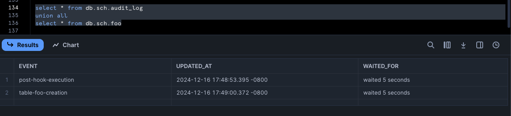
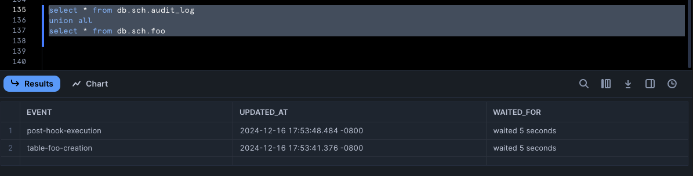

---
---

## Post-hooks running before model execution

If you ever find your post-hooks running before the model actually runs - then, that is because you most likely did not follow best practices for calling the macros. Let's take a look at a quick example:

> Example below is on Snowflake, but the same applies to other adapters too.

First let's create a table that we will insert some values into in our post hook:

```sql
create or replace table db.sch.audit_log (event text, updated_at timestamp, waited_for text);
```

Then, let's create a macro that does a run_query:

```sql
-- macros/insert_audit_log.sql

    
        insert into db.sch.audit_log values ('{{ event }}', current_timestamp, system$wait(5));
    
    

```

Our macro takes in a single argument which we will log into our `audit_log` table... call our macro in our model's post hook:

```sql
--  models/foo.sql
{{ config(post_hook = insert_audit_log('post-hook-execution')) }}
select 'table-foo-creation' as event, current_timestamp as updated_at, system$wait(5) as waited_for
```

Let's do a build:

```sh
$ dbt build
...
01:48:52  1 of 1 START sql table model sch.foo ........................................... [RUN]
01:48:52  Re-using an available connection from the pool (formerly list_db_sch, now model.my_dbt_project.foo)
01:48:52  Began compiling node model.my_dbt_project.foo
01:48:52  Using snowflake connection "model.my_dbt_project.foo"
01:48:52  On model.my_dbt_project.foo: /* {"app": "dbt", "dbt_version": "1.9.0rc2", "profile_name": "all", "target_name": "sf", "node_id": "model.my_dbt_project.foo"} */
insert into db.sch.audit_log values ('post-hook-execution', current_timestamp, system$wait(5));
01:48:59  SQL status: SUCCESS 1 in 6.942 seconds
01:48:59  Writing injected SQL for node "model.my_dbt_project.foo"
01:48:59  Began executing node model.my_dbt_project.foo
01:48:59  Writing runtime sql for node "model.my_dbt_project.foo"
01:48:59  Using snowflake connection "model.my_dbt_project.foo"
01:48:59  On model.my_dbt_project.foo: /* {"app": "dbt", "dbt_version": "1.9.0rc2", "profile_name": "all", "target_name": "sf", "node_id": "model.my_dbt_project.foo"} */
create or replace transient table db.sch.foo
         as
        (

select 'table-foo-creation' as event, current_timestamp as updated_at, system$wait(5) as waited_for
        );
01:49:06  SQL status: SUCCESS 1 in 6.942 seconds
01:49:06  Sending event: {'category': 'dbt', 'action': 'run_model', 'label': '25b9f7b8-49c2-4ae5-9a33-0ec69fcd26fc', 'context': [<snowplow_tracker.self_describing_json.SelfDescribingJson object at 0x160b27e50>]}
01:49:06  1 of 1 OK created sql table model sch.foo ...................................... [SUCCESS 1 in 13.96s]
...
```

If we pay close attention to all the SQL commands we see, in sequence:

```sql
insert into db.sch.audit_log values ('post-hook-execution', current_timestamp, system$wait(5));

create or replace transient table db.sch.foo
         as
        (

select 'table-foo-creation' as event, current_timestamp as updated_at, system$wait(5) as waited_for
        );
```

The post-hook was somehow executed prior to the creation of the model - and if we select from those 2 tables in our database:



We definitely see that the post-hook did run before the model - why is that? The simply answer is that we called our macro as a function and not as a jinja string as the [official dbt docs show](https://docs.getdbt.com/reference/resource-configs/pre-hook-post-hook#apache-spark-analyze-tables-after-creation)... so let's try to do just that:

```sql
--  models/foo.sql
{{ config(post_hook = "{{ insert_audit_log('post-hook-execution') }}") }}
select 'table-foo-creation' as event, current_timestamp as updated_at, system$wait(5) as waited_for
```

First we clear out the content of the audit_log table:

```sql
truncate table db.sch.audit_log 
```

And then we rebuild:

```sh
$ dbt build
...
01:53:40  1 of 1 START sql table model sch.foo ........................................... [RUN]
01:53:40  Re-using an available connection from the pool (formerly list_db_sch, now model.my_dbt_project.foo)
01:53:40  Began compiling node model.my_dbt_project.foo
01:53:40  Writing injected SQL for node "model.my_dbt_project.foo"
01:53:40  Began executing node model.my_dbt_project.foo
01:53:40  Writing runtime sql for node "model.my_dbt_project.foo"
01:53:40  Using snowflake connection "model.my_dbt_project.foo"
01:53:40  On model.my_dbt_project.foo: /* {"app": "dbt", "dbt_version": "1.9.0rc2", "profile_name": "all", "target_name": "sf", "node_id": "model.my_dbt_project.foo"} */
create or replace transient table db.sch.foo
         as
        (

select 'table-foo-creation' as event, current_timestamp as updated_at, system$wait(5) as waited_for
        );
01:53:47  SQL status: SUCCESS 1 in 7.100 seconds
01:53:47  Using snowflake connection "model.my_dbt_project.foo"
01:53:47  On model.my_dbt_project.foo: /* {"app": "dbt", "dbt_version": "1.9.0rc2", "profile_name": "all", "target_name": "sf", "node_id": "model.my_dbt_project.foo"} */
insert into db.sch.audit_log values ('post-hook-execution', current_timestamp, system$wait(5));
01:53:54  SQL status: SUCCESS 1 in 6.648 seconds
01:53:54  Sending event: {'category': 'dbt', 'action': 'run_model', 'label': '406fc461-3133-43eb-911a-b2d66666347e', 'context': [<snowplow_tracker.self_describing_json.SelfDescribingJson object at 0x15ddd7410>]}
01:53:54  1 of 1 OK created sql table model sch.foo ...................................... [SUCCESS 1 in 13.83s]
...
```

And just like that - the sequence of events is now as expected:



The moral of the story is that we want:

```sql
{{ config(post_hook = "{{ my_macro() }}") }}
...
```

and not:

```sql
{{ config(post_hook = my_macro()) }}
...
```