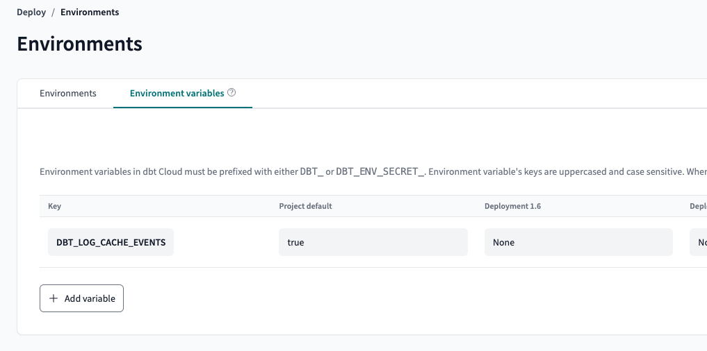

---
---

## Preventing incremental models from being recreated

The zen of dbt is that your data transformations should be idempotent (besides snapshots) - i.e. you should be able to `dbt build --full-refresh` and get all your models into the right state at any time. 

Note that an incremental model will be created from scratch if the adapter cache that populates at the start of the run does not contain the table - i.e. to dbt, the table does not exist. This may happen because:
1. The table literally does not exist / no access to the table / the dwh did not return the right information.
2. There is a bug with the adapter cache.

However, if you find yourself with incremental models with custom logic that are not idempotent - you may wish to customize the incremental materialization slightly to completely block incrementals from being ever recreated It's also possible to just create your own custom materialization instead of overriding the incremental materialization.

> The example below overrides the bigquery implementation but same logic should apply to any other adapter.

```sql
-- macros/incremental_override.sql

/*
https://github.com/dbt-labs/dbt-bigquery/blob/main/dbt/include/bigquery/macros/materializations/incremental.sql

A modification of the default incremental materialization that:
1. Allows the blocking of models from being created using a new `block_creation` config.
2. Double checks the information schema for the existence of the existing table if the adapter cache does not contain it.
*/



  
  
  

  
  
  
  -- Modify the initial existing relation check - `existing_relation` will still be set but furher down below
  /*{#- set existing_relation = load_relation(this) #}*/
  

  {#-- Validate early so we don't run SQL if the strategy is invalid --#}
  

  
  
  
  

  
  

   -- grab current tables grants config for comparison later on
  


  {{ run_hooks(pre_hooks) }}

  -- config to prevent accidentally creating incremental from scratch
  

  -- additional logic to double check if table exist by querying the information schema
  
    

    
        select count(1) as relation_exists from `{{ this.database }}`.`{{ this.schema }}`.INFORMATION_SCHEMA.TABLES where table_name = '{{ this.name }}'
    
    
    
    

    
        
            Model {{ this }} blocked from being created. Cache does not contain the relation and manual information schema check indicates the table does not exist.
        
        
    
        
        
    
  
    
  

   {#-- We can't copy partitions with merge strategy --#}
        
        The 'copy_partitions' option requires the 'incremental_strategy' option to be set to 'insert_overwrite'.
        
        

  
      
        {{ bq_create_table_as(partition_by, False, target_relation, compiled_code, language) }}
      

  
      {#-- There's no way to atomically replace a view with a table on BQ --#}
      {{ adapter.drop_relation(existing_relation) }}
      
        {{ bq_create_table_as(partition_by, False, target_relation, compiled_code, language) }}
      

  
      {#-- If the partition/cluster config has changed, then we must drop and recreate --#}
      
          
          {{ adapter.drop_relation(existing_relation) }}
      
      
        {{ bq_create_table_as(partition_by, False, target_relation, compiled_code, language) }}
      

  
    
      {#-- This lets us move forward assuming no python will be directly templated into a query --#}
      
        The 'insert_overwrite' strategy is not yet supported for python models.
      
      
    

    
    
      {#-- Check first, since otherwise we may not build a temp table --#}
      {#-- Python always needs to create a temp table --#}
      
        {{ bq_create_table_as(partition_by, True, tmp_relation, compiled_code, language) }}
      
      
      {#-- Process schema changes. Returns dict of changes if successful. Use source columns for upserting/merging --#}
      
    

    
      
    
    {#--  Add time ingestion pseudo column to destination column as not part of the 'schema' but still need it for actual data insertion --#}
    
      
    

    

    
      {{ build_sql }}
    

  

  {{ run_hooks(post_hooks) }}

  

  
  

  

  
    {{ adapter.drop_relation(tmp_relation) }}
  

  {{ return({'relations': [target_relation]}) }}


```

```sql
-- models/foo.sql
{{ config(materialized='incremental', block_creation=true) }}

select 1 id
```

Let's assume our `foo` incremental model does not exist - then when we run:

```sh
$ dbt --debug run
01:26:50  Sending event: {'category': 'dbt', 'action': 'invocation', 'label': 'start', 'context': [<snowplow_tracker.self_describing_json.SelfDescribingJson object at 0x112a81790>, <snowplow_tracker.self_describing_json.SelfDescribingJson object at 0x112ad3a10>, <snowplow_tracker.self_describing_json.SelfDescribingJson object at 0x112ad3490>]}
01:26:50  Running with dbt=1.9.0-rc2
01:26:50  running dbt with arguments {'printer_width': '80', 'indirect_selection': 'eager', 'write_json': 'True', 'log_cache_events': 'False', 'partial_parse': 'True', 'cache_selected_only': 'False', 'profiles_dir': '/Users/jeremy/.dbt', 'debug': 'True', 'warn_error': 'None', 'log_path': '/Users/jeremy/git/dbt-basic/logs', 'version_check': 'True', 'fail_fast': 'False', 'use_colors': 'True', 'use_experimental_parser': 'False', 'empty': 'False', 'quiet': 'False', 'no_print': 'None', 'warn_error_options': 'WarnErrorOptions(include=[], exclude=[])', 'static_parser': 'True', 'introspect': 'True', 'invocation_command': 'dbt --debug run -s foo', 'target_path': 'None', 'log_format': 'default', 'send_anonymous_usage_stats': 'True'}
01:26:51  Sending event: {'category': 'dbt', 'action': 'project_id', 'label': 'd4096429-ef5e-4472-b38c-7651391946cd', 'context': [<snowplow_tracker.self_describing_json.SelfDescribingJson object at 0x12278b490>]}
01:26:51  Sending event: {'category': 'dbt', 'action': 'adapter_info', 'label': 'd4096429-ef5e-4472-b38c-7651391946cd', 'context': [<snowplow_tracker.self_describing_json.SelfDescribingJson object at 0x10737f190>]}
01:26:51  Registered adapter: bigquery=1.9.0-rc1
01:26:51  checksum: cfb72516634404a3c61854d6d9543be0625a07f5ebfc68fc9626e92b77373532, vars: {}, profile: , target: , version: 1.9.0rc2
01:26:51  Partial parsing enabled: 0 files deleted, 0 files added, 1 files changed.
01:26:51  Partial parsing: updated file: my_dbt_project://macros/incremental.sql
01:26:51  Sending event: {'category': 'dbt', 'action': 'load_project', 'label': 'd4096429-ef5e-4472-b38c-7651391946cd', 'context': [<snowplow_tracker.self_describing_json.SelfDescribingJson object at 0x112a71ad0>]}
01:26:51  Wrote artifact WritableManifest to /Users/jeremy/git/dbt-basic/target/manifest.json
01:26:51  Wrote artifact SemanticManifest to /Users/jeremy/git/dbt-basic/target/semantic_manifest.json
01:26:51  Sending event: {'category': 'dbt', 'action': 'resource_counts', 'label': 'd4096429-ef5e-4472-b38c-7651391946cd', 'context': [<snowplow_tracker.self_describing_json.SelfDescribingJson object at 0x1359c0d10>]}
01:26:51  Found 2 models, 489 macros
01:26:51  Sending event: {'category': 'dbt', 'action': 'runnable_timing', 'label': 'd4096429-ef5e-4472-b38c-7651391946cd', 'context': [<snowplow_tracker.self_describing_json.SelfDescribingJson object at 0x135950310>]}
01:26:51  
01:26:51  Concurrency: 4 threads (target='bq')
01:26:51  
01:26:51  Acquiring new bigquery connection 'master'
01:26:51  Acquiring new bigquery connection 'list_cse-sandbox-319708'
01:26:51  Opening a new connection, currently in state init
01:26:54  Re-using an available connection from the pool (formerly list_cse-sandbox-319708, now list_cse-sandbox-319708_dbt_jyeo)
01:26:54  Opening a new connection, currently in state closed
01:26:55  Sending event: {'category': 'dbt', 'action': 'runnable_timing', 'label': 'd4096429-ef5e-4472-b38c-7651391946cd', 'context': [<snowplow_tracker.self_describing_json.SelfDescribingJson object at 0x1071209d0>]}
01:26:55  Opening a new connection, currently in state init
01:26:55  Began running node model.my_dbt_project.foo
01:26:55  1 of 1 START sql incremental model dbt_jyeo.foo ................................ [RUN]
01:26:55  Re-using an available connection from the pool (formerly list_cse-sandbox-319708_dbt_jyeo, now model.my_dbt_project.foo)
01:26:55  Began compiling node model.my_dbt_project.foo
01:26:55  Writing injected SQL for node "model.my_dbt_project.foo"
01:26:55  Began executing node model.my_dbt_project.foo
01:26:55  Relation `cse-sandbox-319708`.`dbt_jyeo`.`foo` not found in adapter cache and creation blocked. Checking information schema to confirm.
01:26:55  On model.my_dbt_project.foo: /* {"app": "dbt", "dbt_version": "1.9.0rc2", "profile_name": "all", "target_name": "bq", "node_id": "model.my_dbt_project.foo"} */

    select count(1) as relation_exists from `cse-sandbox-319708`.`dbt_jyeo`.INFORMATION_SCHEMA.TABLES where table_name = 'foo'
  
01:26:55  Opening a new connection, currently in state closed
01:26:58  BigQuery adapter: https://console.cloud.google.com/bigquery?project=cse-sandbox-319708&j=bq:US:82c6fe2a-060a-41fd-891a-d09c11d1ac15&page=queryresults
Relation `cse-sandbox-319708`.`dbt_jyeo`.`foo` does not exist.
01:26:59  Compilation Error in model foo (models/foo.sql)
  Model `cse-sandbox-319708`.`dbt_jyeo`.`foo` blocked from being created. Cache does not contain the relation and manual information schema check indicates the table does not exist.
  
  > in macro materialization_incremental_bigquery (macros/incremental.sql)
  > called by model foo (models/foo.sql)
01:26:59  Sending event: {'category': 'dbt', 'action': 'run_model', 'label': 'd4096429-ef5e-4472-b38c-7651391946cd', 'context': [<snowplow_tracker.self_describing_json.SelfDescribingJson object at 0x135b8d110>]}
01:26:59  1 of 1 ERROR creating sql incremental model dbt_jyeo.foo ....................... [ERROR in 3.34s]
01:26:59  Finished running node model.my_dbt_project.foo
01:26:59  Marking all children of 'model.my_dbt_project.foo' to be skipped because of status 'error'.  Reason: Compilation Error in model foo (models/foo.sql)
  Model `cse-sandbox-319708`.`dbt_jyeo`.`foo` blocked from being created. Cache does not contain the relation and manual information schema check indicates the table does not exist.
  
  > in macro materialization_incremental_bigquery (macros/incremental.sql)
  > called by model foo (models/foo.sql).
01:26:59  Opening a new connection, currently in state closed
01:26:59  Connection 'master' was properly closed.
01:26:59  Connection 'model.my_dbt_project.foo' was properly closed.
01:26:59  
01:26:59  Finished running 1 incremental model in 0 hours 0 minutes and 7.72 seconds (7.72s).
01:26:59  Command end result
01:26:59  Wrote artifact WritableManifest to /Users/jeremy/git/dbt-basic/target/manifest.json
01:26:59  Wrote artifact SemanticManifest to /Users/jeremy/git/dbt-basic/target/semantic_manifest.json
01:26:59  Wrote artifact RunExecutionResult to /Users/jeremy/git/dbt-basic/target/run_results.json
01:26:59  
01:26:59  Completed with 1 error, 0 partial successes, and 0 warnings:
01:26:59  
01:26:59    Compilation Error in model foo (models/foo.sql)
  Model `cse-sandbox-319708`.`dbt_jyeo`.`foo` blocked from being created. Cache does not contain the relation and manual information schema check indicates the table does not exist.
  
  > in macro materialization_incremental_bigquery (macros/incremental.sql)
  > called by model foo (models/foo.sql)
01:26:59  
01:26:59  Done. PASS=0 WARN=0 ERROR=1 SKIP=0 TOTAL=1
01:26:59  Resource report: {"command_name": "run", "command_success": false, "command_wall_clock_time": 8.641667, "process_in_blocks": "0", "process_kernel_time": 0.301088, "process_mem_max_rss": "211386368", "process_out_blocks": "0", "process_user_time": 1.45361}
01:26:59  Command `dbt run` failed at 14:26:59.351695 after 8.64 seconds
```

Here the adapter cache did not contain our model, so we do a manual information schema search to see if indeed the table exists or not. Given that the table does not exist in either the adapter cache and in the information schema at the time - we can be confident that the table simply did not exist at the time. We then thrown an exception so we can investigate in our dwh why the table did not exist.

If `foo` already exist and is found in either the adapter cache (or the manual information schema search) - then the incremental model should be updated incrementally (merge, etc):

```sh
$ dbt --debug run
01:37:20  Sending event: {'category': 'dbt', 'action': 'invocation', 'label': 'start', 'context': [<snowplow_tracker.self_describing_json.SelfDescribingJson object at 0x106281750>, <snowplow_tracker.self_describing_json.SelfDescribingJson object at 0x1062d3bd0>, <snowplow_tracker.self_describing_json.SelfDescribingJson object at 0x1062d37d0>]}
01:37:20  Running with dbt=1.9.0-rc2
01:37:20  running dbt with arguments {'printer_width': '80', 'indirect_selection': 'eager', 'write_json': 'True', 'log_cache_events': 'False', 'partial_parse': 'True', 'cache_selected_only': 'False', 'warn_error': 'None', 'debug': 'True', 'fail_fast': 'False', 'log_path': '/Users/jeremy/git/dbt-basic/logs', 'profiles_dir': '/Users/jeremy/.dbt', 'version_check': 'True', 'use_colors': 'True', 'use_experimental_parser': 'False', 'empty': 'False', 'quiet': 'False', 'no_print': 'None', 'warn_error_options': 'WarnErrorOptions(include=[], exclude=[])', 'invocation_command': 'dbt --debug run -s foo', 'static_parser': 'True', 'log_format': 'default', 'target_path': 'None', 'introspect': 'True', 'send_anonymous_usage_stats': 'True'}
01:37:21  Sending event: {'category': 'dbt', 'action': 'project_id', 'label': '7fad61e8-4f2c-4414-81d2-e1bf0e641514', 'context': [<snowplow_tracker.self_describing_json.SelfDescribingJson object at 0x1169bc0d0>]}
01:37:21  Sending event: {'category': 'dbt', 'action': 'adapter_info', 'label': '7fad61e8-4f2c-4414-81d2-e1bf0e641514', 'context': [<snowplow_tracker.self_describing_json.SelfDescribingJson object at 0x1235fdb50>]}
01:37:21  Registered adapter: bigquery=1.9.0-rc1
01:37:21  checksum: cfb72516634404a3c61854d6d9543be0625a07f5ebfc68fc9626e92b77373532, vars: {}, profile: , target: , version: 1.9.0rc2
01:37:21  Partial parsing enabled: 0 files deleted, 0 files added, 1 files changed.
01:37:21  Partial parsing: updated file: my_dbt_project://macros/incremental.sql
01:37:21  Sending event: {'category': 'dbt', 'action': 'load_project', 'label': '7fad61e8-4f2c-4414-81d2-e1bf0e641514', 'context': [<snowplow_tracker.self_describing_json.SelfDescribingJson object at 0x111da6890>]}
01:37:21  Wrote artifact WritableManifest to /Users/jeremy/git/dbt-basic/target/manifest.json
01:37:21  Wrote artifact SemanticManifest to /Users/jeremy/git/dbt-basic/target/semantic_manifest.json
01:37:21  Sending event: {'category': 'dbt', 'action': 'resource_counts', 'label': '7fad61e8-4f2c-4414-81d2-e1bf0e641514', 'context': [<snowplow_tracker.self_describing_json.SelfDescribingJson object at 0x123b2a190>]}
01:37:21  Found 2 models, 489 macros
01:37:21  Sending event: {'category': 'dbt', 'action': 'runnable_timing', 'label': '7fad61e8-4f2c-4414-81d2-e1bf0e641514', 'context': [<snowplow_tracker.self_describing_json.SelfDescribingJson object at 0x123a0d750>]}
01:37:21  
01:37:21  Concurrency: 4 threads (target='bq')
01:37:21  
01:37:21  Acquiring new bigquery connection 'master'
01:37:21  Acquiring new bigquery connection 'list_cse-sandbox-319708'
01:37:21  Opening a new connection, currently in state init
01:37:23  Re-using an available connection from the pool (formerly list_cse-sandbox-319708, now list_cse-sandbox-319708_dbt_jyeo)
01:37:23  Opening a new connection, currently in state closed
01:37:25  Sending event: {'category': 'dbt', 'action': 'runnable_timing', 'label': '7fad61e8-4f2c-4414-81d2-e1bf0e641514', 'context': [<snowplow_tracker.self_describing_json.SelfDescribingJson object at 0x104cf5d90>]}
01:37:25  Opening a new connection, currently in state init
01:37:25  Began running node model.my_dbt_project.foo
01:37:25  1 of 1 START sql incremental model dbt_jyeo.foo ................................ [RUN]
01:37:25  Re-using an available connection from the pool (formerly list_cse-sandbox-319708_dbt_jyeo, now model.my_dbt_project.foo)
01:37:25  Began compiling node model.my_dbt_project.foo
01:37:25  Writing injected SQL for node "model.my_dbt_project.foo"
01:37:25  Began executing node model.my_dbt_project.foo
01:37:25  Opening a new connection, currently in state closed
01:37:26  Writing runtime sql for node "model.my_dbt_project.foo"
01:37:26  On model.my_dbt_project.foo: /* {"app": "dbt", "dbt_version": "1.9.0rc2", "profile_name": "all", "target_name": "bq", "node_id": "model.my_dbt_project.foo"} */
-- back compat for old kwarg name

    merge into `cse-sandbox-319708`.`dbt_jyeo`.`foo` as DBT_INTERNAL_DEST
        using (

select 1 id
        ) as DBT_INTERNAL_SOURCE
        on (FALSE)

    when not matched then insert
        (`id`)
    values
        (`id`)
01:37:27  BigQuery adapter: https://console.cloud.google.com/bigquery?project=cse-sandbox-319708&j=bq:US:19c50ada-6c3c-4de4-85aa-ff5b44db9f83&page=queryresults
01:37:29  Sending event: {'category': 'dbt', 'action': 'run_model', 'label': '7fad61e8-4f2c-4414-81d2-e1bf0e641514', 'context': [<snowplow_tracker.self_describing_json.SelfDescribingJson object at 0x105d9d510>]}
01:37:29  1 of 1 OK created sql incremental model dbt_jyeo.foo ........................... [MERGE (1.0 rows, 0 processed) in 4.45s]
01:37:29  Finished running node model.my_dbt_project.foo
01:37:29  Opening a new connection, currently in state closed
01:37:29  Connection 'master' was properly closed.
01:37:29  Connection 'model.my_dbt_project.foo' was properly closed.
01:37:29  
01:37:29  Finished running 1 incremental model in 0 hours 0 minutes and 8.35 seconds (8.35s).
01:37:29  Command end result
01:37:29  Wrote artifact WritableManifest to /Users/jeremy/git/dbt-basic/target/manifest.json
01:37:29  Wrote artifact SemanticManifest to /Users/jeremy/git/dbt-basic/target/semantic_manifest.json
01:37:29  Wrote artifact RunExecutionResult to /Users/jeremy/git/dbt-basic/target/run_results.json
01:37:29  
01:37:29  Completed successfully
01:37:29  
01:37:29  Done. PASS=1 WARN=0 ERROR=0 SKIP=0 TOTAL=1
01:37:29  Resource report: {"command_name": "run", "command_success": true, "command_wall_clock_time": 9.022833, "process_in_blocks": "0", "process_kernel_time": 0.239499, "process_mem_max_rss": "211845120", "process_out_blocks": "0", "process_user_time": 1.458477}
01:37:29  Command `dbt run` succeeded at 14:37:29.870947 after 9.02 seconds
```

What happens if there is a "possible" bug with the adapter cache? Here we will simulate that by modify one line from our macro above:

```sql

  ...
  
  ...

```

> We're purposely setting the value to `none` - instead of retrieving the result from the adapter cache to simulate a "bug".

```sh
$ dbt --debug run
01:40:13  Sending event: {'category': 'dbt', 'action': 'invocation', 'label': 'start', 'context': [<snowplow_tracker.self_describing_json.SelfDescribingJson object at 0x1083ed790>, <snowplow_tracker.self_describing_json.SelfDescribingJson object at 0x10843bc90>, <snowplow_tracker.self_describing_json.SelfDescribingJson object at 0x10843b950>]}
01:40:13  Running with dbt=1.9.0-rc2
01:40:13  running dbt with arguments {'printer_width': '80', 'indirect_selection': 'eager', 'write_json': 'True', 'log_cache_events': 'False', 'partial_parse': 'True', 'cache_selected_only': 'False', 'profiles_dir': '/Users/jeremy/.dbt', 'fail_fast': 'False', 'debug': 'True', 'log_path': '/Users/jeremy/git/dbt-basic/logs', 'version_check': 'True', 'warn_error': 'None', 'use_colors': 'True', 'use_experimental_parser': 'False', 'no_print': 'None', 'quiet': 'False', 'empty': 'False', 'warn_error_options': 'WarnErrorOptions(include=[], exclude=[])', 'invocation_command': 'dbt --debug run -s foo', 'static_parser': 'True', 'log_format': 'default', 'target_path': 'None', 'introspect': 'True', 'send_anonymous_usage_stats': 'True'}
01:40:14  Sending event: {'category': 'dbt', 'action': 'project_id', 'label': '14b6487f-cc06-4d9b-9d1e-4574dcbeda7d', 'context': [<snowplow_tracker.self_describing_json.SelfDescribingJson object at 0x10e34c250>]}
01:40:14  Sending event: {'category': 'dbt', 'action': 'adapter_info', 'label': '14b6487f-cc06-4d9b-9d1e-4574dcbeda7d', 'context': [<snowplow_tracker.self_describing_json.SelfDescribingJson object at 0x106512dd0>]}
01:40:14  Registered adapter: bigquery=1.9.0-rc1
01:40:14  checksum: cfb72516634404a3c61854d6d9543be0625a07f5ebfc68fc9626e92b77373532, vars: {}, profile: , target: , version: 1.9.0rc2
01:40:14  Partial parsing enabled: 0 files deleted, 0 files added, 1 files changed.
01:40:14  Partial parsing: updated file: my_dbt_project://macros/incremental.sql
01:40:14  Sending event: {'category': 'dbt', 'action': 'load_project', 'label': '14b6487f-cc06-4d9b-9d1e-4574dcbeda7d', 'context': [<snowplow_tracker.self_describing_json.SelfDescribingJson object at 0x10ec8cc50>]}
01:40:14  Wrote artifact WritableManifest to /Users/jeremy/git/dbt-basic/target/manifest.json
01:40:14  Wrote artifact SemanticManifest to /Users/jeremy/git/dbt-basic/target/semantic_manifest.json
01:40:14  Sending event: {'category': 'dbt', 'action': 'resource_counts', 'label': '14b6487f-cc06-4d9b-9d1e-4574dcbeda7d', 'context': [<snowplow_tracker.self_describing_json.SelfDescribingJson object at 0x10ef96c10>]}
01:40:14  Found 2 models, 489 macros
01:40:14  Sending event: {'category': 'dbt', 'action': 'runnable_timing', 'label': '14b6487f-cc06-4d9b-9d1e-4574dcbeda7d', 'context': [<snowplow_tracker.self_describing_json.SelfDescribingJson object at 0x10ef55c90>]}
01:40:14  
01:40:14  Concurrency: 4 threads (target='bq')
01:40:14  
01:40:14  Acquiring new bigquery connection 'master'
01:40:14  Acquiring new bigquery connection 'list_cse-sandbox-319708'
01:40:14  Opening a new connection, currently in state init
01:40:16  Re-using an available connection from the pool (formerly list_cse-sandbox-319708, now list_cse-sandbox-319708_dbt_jyeo)
01:40:16  Opening a new connection, currently in state closed
01:40:19  Sending event: {'category': 'dbt', 'action': 'runnable_timing', 'label': '14b6487f-cc06-4d9b-9d1e-4574dcbeda7d', 'context': [<snowplow_tracker.self_describing_json.SelfDescribingJson object at 0x10efe0c10>]}
01:40:19  Opening a new connection, currently in state init
01:40:19  Began running node model.my_dbt_project.foo
01:40:19  1 of 1 START sql incremental model dbt_jyeo.foo ................................ [RUN]
01:40:19  Acquiring new bigquery connection 'model.my_dbt_project.foo'
01:40:19  Began compiling node model.my_dbt_project.foo
01:40:19  Writing injected SQL for node "model.my_dbt_project.foo"
01:40:19  Began executing node model.my_dbt_project.foo
01:40:19  Relation `cse-sandbox-319708`.`dbt_jyeo`.`foo` not found in adapter cache and creation blocked. Checking information schema to confirm.
01:40:19  On model.my_dbt_project.foo: /* {"app": "dbt", "dbt_version": "1.9.0rc2", "profile_name": "all", "target_name": "bq", "node_id": "model.my_dbt_project.foo"} */

    select count(1) as relation_exists from `cse-sandbox-319708`.`dbt_jyeo`.INFORMATION_SCHEMA.TABLES where table_name = 'foo'
  
01:40:19  Opening a new connection, currently in state init
01:40:22  BigQuery adapter: https://console.cloud.google.com/bigquery?project=cse-sandbox-319708&j=bq:US:a99dbe69-1a8f-44ed-962b-f5c319b4d358&page=queryresults
Relation `cse-sandbox-319708`.`dbt_jyeo`.`foo` exists.
Relation`cse-sandbox-319708`.`dbt_jyeo`.`foo` found when during manual information schema checking.
01:40:23  Writing runtime sql for node "model.my_dbt_project.foo"
01:40:23  On model.my_dbt_project.foo: /* {"app": "dbt", "dbt_version": "1.9.0rc2", "profile_name": "all", "target_name": "bq", "node_id": "model.my_dbt_project.foo"} */
-- back compat for old kwarg name

    merge into `cse-sandbox-319708`.`dbt_jyeo`.`foo` as DBT_INTERNAL_DEST
        using (

select 1 id
        ) as DBT_INTERNAL_SOURCE
        on (FALSE)

    when not matched then insert
        (`id`)
    values
        (`id`)
01:40:24  BigQuery adapter: https://console.cloud.google.com/bigquery?project=cse-sandbox-319708&j=bq:US:0fb70b4c-bc08-4523-b7da-14275fe8f3c6&page=queryresults
01:40:26  Sending event: {'category': 'dbt', 'action': 'run_model', 'label': '14b6487f-cc06-4d9b-9d1e-4574dcbeda7d', 'context': [<snowplow_tracker.self_describing_json.SelfDescribingJson object at 0x112a9bd90>]}
01:40:26  1 of 1 OK created sql incremental model dbt_jyeo.foo ........................... [MERGE (1.0 rows, 0 processed) in 6.93s]
01:40:26  Finished running node model.my_dbt_project.foo
01:40:26  Opening a new connection, currently in state closed
01:40:26  Connection 'master' was properly closed.
01:40:26  Connection 'list_cse-sandbox-319708_dbt_jyeo' was properly closed.
01:40:26  Connection 'model.my_dbt_project.foo' was properly closed.
01:40:26  
01:40:26  Finished running 1 incremental model in 0 hours 0 minutes and 11.82 seconds (11.82s).
01:40:26  Command end result
01:40:26  Wrote artifact WritableManifest to /Users/jeremy/git/dbt-basic/target/manifest.json
01:40:26  Wrote artifact SemanticManifest to /Users/jeremy/git/dbt-basic/target/semantic_manifest.json
01:40:26  Wrote artifact RunExecutionResult to /Users/jeremy/git/dbt-basic/target/run_results.json
01:40:26  
01:40:26  Completed successfully
01:40:26  
01:40:26  Done. PASS=1 WARN=0 ERROR=0 SKIP=0 TOTAL=1
01:40:26  Resource report: {"command_name": "run", "command_success": true, "command_wall_clock_time": 12.611197, "process_in_blocks": "0", "process_kernel_time": 0.225877, "process_mem_max_rss": "211943424", "process_out_blocks": "0", "process_user_time": 1.518847}
01:40:26  Command `dbt run` succeeded at 14:40:26.442602 after 12.61 seconds
```

If there is a "bug" with the adapter cache where it reports that the existing table does not exist - we do a double take and query the `information_schema` for ourselves:

```sh
01:40:19  Relation `cse-sandbox-319708`.`dbt_jyeo`.`foo` not found in adapter cache and creation blocked. Checking information schema to confirm.
01:40:19  On model.my_dbt_project.foo: /* {"app": "dbt", "dbt_version": "1.9.0rc2", "profile_name": "all", "target_name": "bq", "node_id": "model.my_dbt_project.foo"} */

    select count(1) as relation_exists from `cse-sandbox-319708`.`dbt_jyeo`.INFORMATION_SCHEMA.TABLES where table_name = 'foo'
```

If the information schema query returns a `1` - then the table does exist and so we take the incremental action (i.e. `merge`).

### Only setting this config for production runs

We may wish to control this flag depending on if we're doing a production run so that it does not prevent development or CI runs (where the model would not yet exist) - in this circumstance, we can set different `target.name`'s and then use that in our config:

```sql
-- models/foo.sql
{{ config(materialized='incremental', block_creation=(true if target.name == 'prod' else false)) }}

select 1 id
```

### Log relational caching events

Addionally, it would be useful to turn on [`LOG_CACHE_EVENTS`](https://docs.getdbt.com/reference/global-configs/logs#logging-relational-cache-events) - this would introduce more noise into the debug logs but we would be able to tell what the contents of the adapter cache were when dbt went to populate it at the start of the run - for example:

```sh
$ export DBT_LOG_CACHE_EVENTS=true
$ dbt --debug run
01:46:56  Sending event: {'category': 'dbt', 'action': 'invocation', 'label': 'start', 'context': [<snowplow_tracker.self_describing_json.SelfDescribingJson object at 0x105585850>, <snowplow_tracker.self_describing_json.SelfDescribingJson object at 0x1055ae3d0>, <snowplow_tracker.self_describing_json.SelfDescribingJson object at 0x1055d3bd0>]}
01:46:56  Running with dbt=1.9.0-rc2
01:46:56  running dbt with arguments {'printer_width': '80', 'indirect_selection': 'eager', 'write_json': 'True', 'log_cache_events': 'True', 'partial_parse': 'True', 'cache_selected_only': 'False', 'profiles_dir': '/Users/jeremy/.dbt', 'debug': 'True', 'fail_fast': 'False', 'log_path': '/Users/jeremy/git/dbt-basic/logs', 'warn_error': 'None', 'version_check': 'True', 'use_colors': 'True', 'use_experimental_parser': 'False', 'no_print': 'None', 'quiet': 'False', 'empty': 'False', 'log_format': 'default', 'introspect': 'True', 'static_parser': 'True', 'invocation_command': 'dbt --debug run -s foo', 'target_path': 'None', 'warn_error_options': 'WarnErrorOptions(include=[], exclude=[])', 'send_anonymous_usage_stats': 'True'}
01:46:57  Sending event: {'category': 'dbt', 'action': 'project_id', 'label': '2f32c9d7-0877-48cc-9c43-2bd2142bca3b', 'context': [<snowplow_tracker.self_describing_json.SelfDescribingJson object at 0x103d21310>]}
01:46:57  Sending event: {'category': 'dbt', 'action': 'adapter_info', 'label': '2f32c9d7-0877-48cc-9c43-2bd2142bca3b', 'context': [<snowplow_tracker.self_describing_json.SelfDescribingJson object at 0x10247d610>]}
01:46:57  Registered adapter: bigquery=1.9.0-rc1
01:46:57  checksum: cfb72516634404a3c61854d6d9543be0625a07f5ebfc68fc9626e92b77373532, vars: {}, profile: , target: , version: 1.9.0rc2
01:46:57  Partial parsing enabled: 0 files deleted, 0 files added, 1 files changed.
01:46:57  Partial parsing: updated file: my_dbt_project://macros/incremental.sql
01:46:57  Sending event: {'category': 'dbt', 'action': 'load_project', 'label': '2f32c9d7-0877-48cc-9c43-2bd2142bca3b', 'context': [<snowplow_tracker.self_describing_json.SelfDescribingJson object at 0x11d0ee050>]}
01:46:57  Wrote artifact WritableManifest to /Users/jeremy/git/dbt-basic/target/manifest.json
01:46:57  Wrote artifact SemanticManifest to /Users/jeremy/git/dbt-basic/target/semantic_manifest.json
01:46:57  Sending event: {'category': 'dbt', 'action': 'resource_counts', 'label': '2f32c9d7-0877-48cc-9c43-2bd2142bca3b', 'context': [<snowplow_tracker.self_describing_json.SelfDescribingJson object at 0x11d3b2ed0>]}
01:46:57  Found 2 models, 489 macros
01:46:57  Sending event: {'category': 'dbt', 'action': 'runnable_timing', 'label': '2f32c9d7-0877-48cc-9c43-2bd2142bca3b', 'context': [<snowplow_tracker.self_describing_json.SelfDescribingJson object at 0x11d350550>]}
01:46:57  
01:46:57  Concurrency: 4 threads (target='bq')
01:46:57  
01:46:57  Acquiring new bigquery connection 'master'
01:46:57  Acquiring new bigquery connection 'list_cse-sandbox-319708'
01:46:57  Opening a new connection, currently in state init
01:47:00  Re-using an available connection from the pool (formerly list_cse-sandbox-319708, now list_cse-sandbox-319708_dbt_jyeo)
01:47:00  Opening a new connection, currently in state closed
01:47:02  dump before adding : {}
01:47:02  adding relation: (database=cse-sandbox-319708, schema=dbt_jyeo, identifier=foo)
01:47:02  dump after adding : {'cse-sandbox-319708.dbt_jyeo.foo': '[]'}
01:47:02  Sending event: {'category': 'dbt', 'action': 'runnable_timing', 'label': '2f32c9d7-0877-48cc-9c43-2bd2142bca3b', 'context': [<snowplow_tracker.self_describing_json.SelfDescribingJson object at 0x11d2fbd90>]}
01:47:02  Opening a new connection, currently in state init
01:47:02  Began running node model.my_dbt_project.foo
01:47:02  1 of 1 START sql incremental model dbt_jyeo.foo ................................ [RUN]
01:47:02  Acquiring new bigquery connection 'model.my_dbt_project.foo'
01:47:02  Began compiling node model.my_dbt_project.foo
01:47:02  Writing injected SQL for node "model.my_dbt_project.foo"
01:47:02  Began executing node model.my_dbt_project.foo
01:47:02  Opening a new connection, currently in state init
01:47:03  Writing runtime sql for node "model.my_dbt_project.foo"
01:47:03  On model.my_dbt_project.foo: /* {"app": "dbt", "dbt_version": "1.9.0rc2", "profile_name": "all", "target_name": "bq", "node_id": "model.my_dbt_project.foo"} */
-- back compat for old kwarg name

    merge into `cse-sandbox-319708`.`dbt_jyeo`.`foo` as DBT_INTERNAL_DEST
        using (

select 1 id
        ) as DBT_INTERNAL_SOURCE
        on (FALSE)

    when not matched then insert
        (`id`)
    values
        (`id`)
01:47:04  BigQuery adapter: https://console.cloud.google.com/bigquery?project=cse-sandbox-319708&j=bq:US:86ef3ac2-9878-47f4-80da-289d3ce55f35&page=queryresults
01:47:06  dump before adding : {'cse-sandbox-319708.dbt_jyeo.foo': '[]'}
01:47:06  adding relation: (database=cse-sandbox-319708, schema=dbt_jyeo, identifier=foo)
01:47:06  dump after adding : {'cse-sandbox-319708.dbt_jyeo.foo': '[]'}
01:47:06  Sending event: {'category': 'dbt', 'action': 'run_model', 'label': '2f32c9d7-0877-48cc-9c43-2bd2142bca3b', 'context': [<snowplow_tracker.self_describing_json.SelfDescribingJson object at 0x11d05fcd0>]}
01:47:06  1 of 1 OK created sql incremental model dbt_jyeo.foo ........................... [MERGE (1.0 rows, 0 processed) in 4.22s]
01:47:06  Finished running node model.my_dbt_project.foo
01:47:06  Opening a new connection, currently in state closed
01:47:06  Connection 'master' was properly closed.
01:47:06  Connection 'list_cse-sandbox-319708_dbt_jyeo' was properly closed.
01:47:06  Connection 'model.my_dbt_project.foo' was properly closed.
01:47:06  
01:47:06  Finished running 1 incremental model in 0 hours 0 minutes and 8.77 seconds (8.77s).
01:47:06  Command end result
01:47:06  Wrote artifact WritableManifest to /Users/jeremy/git/dbt-basic/target/manifest.json
01:47:06  Wrote artifact SemanticManifest to /Users/jeremy/git/dbt-basic/target/semantic_manifest.json
01:47:06  Wrote artifact RunExecutionResult to /Users/jeremy/git/dbt-basic/target/run_results.json
01:47:06  
01:47:06  Completed successfully
01:47:06  
01:47:06  Done. PASS=1 WARN=0 ERROR=0 SKIP=0 TOTAL=1
01:47:06  Resource report: {"command_name": "run", "command_success": true, "command_wall_clock_time": 9.65117, "process_in_blocks": "0", "process_kernel_time": 0.286459, "process_mem_max_rss": "210419712", "process_out_blocks": "0", "process_user_time": 1.450615}
01:47:06  Command `dbt run` succeeded at 14:47:06.562078 after 9.65 seconds
```

If we compare these debug logs now to the ones above where we did not have that flag turned on - we see some new lines:

```sh
01:47:00  Re-using an available connection from the pool (formerly list_cse-sandbox-319708, now list_cse-sandbox-319708_dbt_jyeo)
01:47:00  Opening a new connection, currently in state closed
01:47:02  dump before adding : {}
01:47:02  adding relation: (database=cse-sandbox-319708, schema=dbt_jyeo, identifier=foo)
01:47:02  dump after adding : {'cse-sandbox-319708.dbt_jyeo.foo': '[]'}
```

^ At the start of the run, dbt introspected the schema `dbt_jyeo` and found table `foo`. Without logging out these cache events - it's not possible to know the contents of the adapter cache.

Note this will list all the tables in the schema - so let's say we added 2 more tables `bar` and `baz` to our schema `dbt_jyeo`:

```sql
create table dbt_jyeo.bar as select 1 id;
create table dbt_jyeo.baz as select 1 id;
```

```sh
$ dbt --debug run
01:50:40  Sending event: {'category': 'dbt', 'action': 'invocation', 'label': 'start', 'context': [<snowplow_tracker.self_describing_json.SelfDescribingJson object at 0x111385bd0>, <snowplow_tracker.self_describing_json.SelfDescribingJson object at 0x1113d3ad0>, <snowplow_tracker.self_describing_json.SelfDescribingJson object at 0x1113d0f50>]}
01:50:40  Running with dbt=1.9.0-rc2
01:50:40  running dbt with arguments {'printer_width': '80', 'indirect_selection': 'eager', 'log_cache_events': 'True', 'write_json': 'True', 'partial_parse': 'True', 'cache_selected_only': 'False', 'profiles_dir': '/Users/jeremy/.dbt', 'debug': 'True', 'version_check': 'True', 'log_path': '/Users/jeremy/git/dbt-basic/logs', 'warn_error': 'None', 'fail_fast': 'False', 'use_colors': 'True', 'use_experimental_parser': 'False', 'empty': 'False', 'quiet': 'False', 'no_print': 'None', 'log_format': 'default', 'static_parser': 'True', 'introspect': 'True', 'warn_error_options': 'WarnErrorOptions(include=[], exclude=[])', 'target_path': 'None', 'invocation_command': 'dbt --debug run -s foo', 'send_anonymous_usage_stats': 'True'}
01:50:41  Sending event: {'category': 'dbt', 'action': 'project_id', 'label': 'fbfa4cf6-92ca-459f-aefa-9684394881eb', 'context': [<snowplow_tracker.self_describing_json.SelfDescribingJson object at 0x111420310>]}
01:50:41  Sending event: {'category': 'dbt', 'action': 'adapter_info', 'label': 'fbfa4cf6-92ca-459f-aefa-9684394881eb', 'context': [<snowplow_tracker.self_describing_json.SelfDescribingJson object at 0x1060c28d0>]}
01:50:41  Registered adapter: bigquery=1.9.0-rc1
01:50:41  checksum: cfb72516634404a3c61854d6d9543be0625a07f5ebfc68fc9626e92b77373532, vars: {}, profile: , target: , version: 1.9.0rc2
01:50:41  Partial parsing enabled: 0 files deleted, 0 files added, 0 files changed.
01:50:41  Partial parsing enabled, no changes found, skipping parsing
01:50:41  Sending event: {'category': 'dbt', 'action': 'load_project', 'label': 'fbfa4cf6-92ca-459f-aefa-9684394881eb', 'context': [<snowplow_tracker.self_describing_json.SelfDescribingJson object at 0x1219a1a50>]}
01:50:41  Wrote artifact WritableManifest to /Users/jeremy/git/dbt-basic/target/manifest.json
01:50:41  Wrote artifact SemanticManifest to /Users/jeremy/git/dbt-basic/target/semantic_manifest.json
01:50:41  Sending event: {'category': 'dbt', 'action': 'resource_counts', 'label': 'fbfa4cf6-92ca-459f-aefa-9684394881eb', 'context': [<snowplow_tracker.self_describing_json.SelfDescribingJson object at 0x120e74e90>]}
01:50:41  Found 2 models, 489 macros
01:50:41  Sending event: {'category': 'dbt', 'action': 'runnable_timing', 'label': 'fbfa4cf6-92ca-459f-aefa-9684394881eb', 'context': [<snowplow_tracker.self_describing_json.SelfDescribingJson object at 0x120e97890>]}
01:50:41  
01:50:41  Concurrency: 4 threads (target='bq')
01:50:41  
01:50:41  Acquiring new bigquery connection 'master'
01:50:41  Acquiring new bigquery connection 'list_cse-sandbox-319708'
01:50:41  Opening a new connection, currently in state init
01:50:43  Re-using an available connection from the pool (formerly list_cse-sandbox-319708, now list_cse-sandbox-319708_dbt_jyeo)
01:50:43  Opening a new connection, currently in state closed
01:50:45  dump before adding : {}
01:50:45  adding relation: (database=cse-sandbox-319708, schema=dbt_jyeo, identifier=bar)
01:50:45  dump after adding : {'cse-sandbox-319708.dbt_jyeo.bar': '[]'}
01:50:45  dump before adding : {'cse-sandbox-319708.dbt_jyeo.bar': '[]'}
01:50:45  adding relation: (database=cse-sandbox-319708, schema=dbt_jyeo, identifier=baz)
01:50:45  dump after adding : {'cse-sandbox-319708.dbt_jyeo.bar': '[]', 'cse-sandbox-319708.dbt_jyeo.baz': '[]'}
01:50:45  dump before adding : {'cse-sandbox-319708.dbt_jyeo.bar': '[]', 'cse-sandbox-319708.dbt_jyeo.baz': '[]'}
01:50:45  adding relation: (database=cse-sandbox-319708, schema=dbt_jyeo, identifier=foo)
01:50:45  dump after adding : {'cse-sandbox-319708.dbt_jyeo.bar': '[]', 'cse-sandbox-319708.dbt_jyeo.foo': '[]', 'cse-sandbox-319708.dbt_jyeo.baz': '[]'}
01:50:45  Sending event: {'category': 'dbt', 'action': 'runnable_timing', 'label': 'fbfa4cf6-92ca-459f-aefa-9684394881eb', 'context': [<snowplow_tracker.self_describing_json.SelfDescribingJson object at 0x1168f0050>]}
01:50:45  Opening a new connection, currently in state init
01:50:45  Began running node model.my_dbt_project.foo
01:50:45  1 of 1 START sql incremental model dbt_jyeo.foo ................................ [RUN]
01:50:45  Re-using an available connection from the pool (formerly list_cse-sandbox-319708_dbt_jyeo, now model.my_dbt_project.foo)
01:50:45  Began compiling node model.my_dbt_project.foo
01:50:45  Writing injected SQL for node "model.my_dbt_project.foo"
01:50:45  Began executing node model.my_dbt_project.foo
01:50:45  Opening a new connection, currently in state closed
01:50:47  Writing runtime sql for node "model.my_dbt_project.foo"
01:50:47  On model.my_dbt_project.foo: /* {"app": "dbt", "dbt_version": "1.9.0rc2", "profile_name": "all", "target_name": "bq", "node_id": "model.my_dbt_project.foo"} */
-- back compat for old kwarg name

    merge into `cse-sandbox-319708`.`dbt_jyeo`.`foo` as DBT_INTERNAL_DEST
        using (

select 1 id
        ) as DBT_INTERNAL_SOURCE
        on (FALSE)

    when not matched then insert
        (`id`)
    values
        (`id`)
01:50:47  BigQuery adapter: https://console.cloud.google.com/bigquery?project=cse-sandbox-319708&j=bq:US:fe3f957a-11ea-490e-a1c9-937880c45726&page=queryresults
01:50:49  dump before adding : {'cse-sandbox-319708.dbt_jyeo.bar': '[]', 'cse-sandbox-319708.dbt_jyeo.foo': '[]', 'cse-sandbox-319708.dbt_jyeo.baz': '[]'}
01:50:49  adding relation: (database=cse-sandbox-319708, schema=dbt_jyeo, identifier=foo)
01:50:49  dump after adding : {'cse-sandbox-319708.dbt_jyeo.bar': '[]', 'cse-sandbox-319708.dbt_jyeo.foo': '[]', 'cse-sandbox-319708.dbt_jyeo.baz': '[]'}
01:50:49  Sending event: {'category': 'dbt', 'action': 'run_model', 'label': 'fbfa4cf6-92ca-459f-aefa-9684394881eb', 'context': [<snowplow_tracker.self_describing_json.SelfDescribingJson object at 0x116865210>]}
01:50:49  1 of 1 OK created sql incremental model dbt_jyeo.foo ........................... [MERGE (1.0 rows, 0 processed) in 4.47s]
01:50:49  Finished running node model.my_dbt_project.foo
01:50:49  Opening a new connection, currently in state closed
01:50:49  Connection 'master' was properly closed.
01:50:49  Connection 'model.my_dbt_project.foo' was properly closed.
01:50:49  
01:50:49  Finished running 1 incremental model in 0 hours 0 minutes and 8.37 seconds (8.37s).
01:50:49  Command end result
01:50:49  Wrote artifact WritableManifest to /Users/jeremy/git/dbt-basic/target/manifest.json
01:50:49  Wrote artifact SemanticManifest to /Users/jeremy/git/dbt-basic/target/semantic_manifest.json
01:50:49  Wrote artifact RunExecutionResult to /Users/jeremy/git/dbt-basic/target/run_results.json
01:50:49  
01:50:49  Completed successfully
01:50:49  
01:50:49  Done. PASS=1 WARN=0 ERROR=0 SKIP=0 TOTAL=1
01:50:49  Resource report: {"command_name": "run", "command_success": true, "command_wall_clock_time": 9.177701, "process_in_blocks": "0", "process_kernel_time": 0.275816, "process_mem_max_rss": "210944000", "process_out_blocks": "0", "process_user_time": 1.432152}
01:50:49  Command `dbt run` succeeded at 14:50:49.706337 after 9.18 seconds
```

```sh
01:50:43  Re-using an available connection from the pool (formerly list_cse-sandbox-319708, now list_cse-sandbox-319708_dbt_jyeo)
01:50:43  Opening a new connection, currently in state closed
01:50:45  dump before adding : {}
01:50:45  adding relation: (database=cse-sandbox-319708, schema=dbt_jyeo, identifier=bar)
01:50:45  dump after adding : {'cse-sandbox-319708.dbt_jyeo.bar': '[]'}
01:50:45  dump before adding : {'cse-sandbox-319708.dbt_jyeo.bar': '[]'}
01:50:45  adding relation: (database=cse-sandbox-319708, schema=dbt_jyeo, identifier=baz)
01:50:45  dump after adding : {'cse-sandbox-319708.dbt_jyeo.bar': '[]', 'cse-sandbox-319708.dbt_jyeo.baz': '[]'}
01:50:45  dump before adding : {'cse-sandbox-319708.dbt_jyeo.bar': '[]', 'cse-sandbox-319708.dbt_jyeo.baz': '[]'}
01:50:45  adding relation: (database=cse-sandbox-319708, schema=dbt_jyeo, identifier=foo)
01:50:45  dump after adding : {'cse-sandbox-319708.dbt_jyeo.bar': '[]', 'cse-sandbox-319708.dbt_jyeo.foo': '[]', 'cse-sandbox-319708.dbt_jyeo.baz': '[]'}
```

So the logs may get noisy if you have many tables in your schema - but it would be useful to turn on if you'd like to get a sense of what are the contents in the adapter cache and if there are any possible bugs.

In dbt Cloud, we can add that environment variable like so to enable these verbose adapter caching logs:


