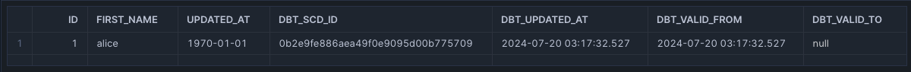
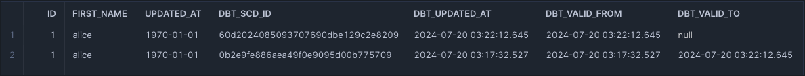
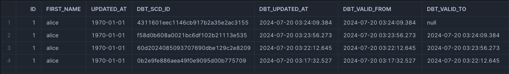
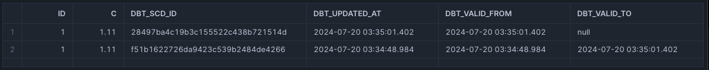

---
---

## Snapshot duplicates

* https://docs.getdbt.com/docs/build/snapshots
* https://docs.getdbt.com/docs/build/snapshots#snapshot-query-best-practices
* https://noahlk.medium.com/debug-diaries-duplicate-records-in-dbt-snapshots-2f1d961e3fd2
* https://gist.github.com/jeremyyeo/7282a2e25d86fe8b449ed70e8cdf10ff

Example scenarios of how dbt snapshots come to have duplicates.

> Following examples are on Snowflake but same concept should apply across different datawarehouses/databases.

### The unique key is not unique

https://docs.getdbt.com/docs/build/snapshots#ensure-your-unique-key-is-really-unique

The unique key in the data we are snapshotting is actually not unique - there is just an assumption that it would always be unique. Keep in mind that just because there is a specified `unique_key` config - this doesn't mean that our raw data will automatically (by the configured `unique_key`) be made unique by dbt.

Additionally the source data we are snapshotting could have been unique at one time but not at another. For example - our raw data looks like:

```
id,name
1,alice
1,alice
2,bob
```

There is an obvious duplicate. Our snapshot runs and it introduces a duplicate into our snapshot table OR it runs into an error like `UPDATE/MERGE must match at most one source row for each target row`. Before we manage to check the raw data (i.e. come into the office for the day to start our work), our EL tool has come along and updated the raw data to be:

```
id,name
2,bob
3,eve
```

We check our raw data and we see that it is really unique now and we wonder why the night before our snapshot had run into errors. That's because it indeed was not unique the night before - just that the EL tool has come along and tidied this up before we arrived into the office for the day - and therefore we make the assumption that the raw data is always unique all the time. This will be difficult to track because the nature of snapshots is that raw data is always changing so our best bet is to make a backup of the raw data prior to snapshotting it - so that as we come into the office the next day, we can double check the condition of your raw data without it being affected by the nightly EL run.

### The snapshot is running in parallel / concurrently

If we are running multiple jobs that have the snapshot in them, there is a chance that both jobs coincide with one another and they both attempt to run the snapshot at the exact same time - or close to the exact same time. Because of this, there will be two `merge into <your snapshot table> using ...` statements that run in close proximity to another inserting the same data twice. If we have many dbt jobs, it can be difficult to easily identify which two (or more) job runs may be responsible for running our snapshots in parallel - in those cases, the query history logs provided by our datawarehouse could come in handy.

### There is a data type mismatch between the existing snapshot and the incoming raw data

This is a really tricky one but essentially you have a column that exist in the snapshot that is say of a `DATE` type but the incoming data is of a `TIMESTAMP` type - lets have a look at an example.

First we create our "raw" data:

```sql
create or replace table development_jyeo.dbt_jyeo.raw as 
select 1 id, 'alice' as first_name, '1970-01-01 01:01:01'::timestamp as updated_at
```

Then we create a snapshot that uses that raw data:

```sql

{{ config(target_schema='dbt_jyeo', unique_key='id', strategy='check', check_cols='all') }}
select id, first_name, updated_at::date as updated_at
  from development_jyeo.dbt_jyeo.raw 

```

We run our snapshot for the first time:

```sh
$ dbt --debug snapshot
03:09:26  1 of 1 START snapshot dbt_jyeo.snappy .......................................... [RUN]
03:09:26  Re-using an available connection from the pool (formerly list_development_jyeo_dbt_jyeo, now snapshot.my_dbt_project.snappy)
03:09:26  Began compiling node snapshot.my_dbt_project.snappy
03:09:26  Began executing node snapshot.my_dbt_project.snappy
03:09:26  Writing runtime sql for node "snapshot.my_dbt_project.snappy"
03:09:26  Using snowflake connection "snapshot.my_dbt_project.snappy"
03:09:26  On snapshot.my_dbt_project.snappy: /* {"app": "dbt", "dbt_version": "1.8.3", "profile_name": "all", "target_name": "sf", "node_id": "snapshot.my_dbt_project.snappy"} */
create or replace transient table development_jyeo.dbt_jyeo.snappy
         as
        (

    select *,
        md5(coalesce(cast(id as varchar ), '')
         || '|' || coalesce(cast(to_timestamp_ntz(convert_timezone('UTC', current_timestamp())) as varchar ), '')
        ) as dbt_scd_id,
        to_timestamp_ntz(convert_timezone('UTC', current_timestamp())) as dbt_updated_at,
        to_timestamp_ntz(convert_timezone('UTC', current_timestamp())) as dbt_valid_from,
        nullif(to_timestamp_ntz(convert_timezone('UTC', current_timestamp())), to_timestamp_ntz(convert_timezone('UTC', current_timestamp()))) as dbt_valid_to
    from (

select id, first_name, updated_at::date as updated_at
  from development_jyeo.dbt_jyeo.raw 

    ) sbq

        );
03:09:26  Opening a new connection, currently in state closed
03:09:28  SQL status: SUCCESS 1 in 2.0 seconds
03:09:28  On snapshot.my_dbt_project.snappy: Close
03:09:29  Sending event: {'category': 'dbt', 'action': 'run_model', 'label': '748bc67e-f903-468a-926c-8d2b775fd7e5', 'context': [<snowplow_tracker.self_describing_json.SelfDescribingJson object at 0x16236f710>]}
03:09:29  1 of 1 OK snapshotted dbt_jyeo.snappy .......................................... [SUCCESS 1 in 2.31s]
```

Our snapshot is created successfully and when we query our snapshot - things look good:



Now, we don't change our raw data but now we change our snapshot code slightly:

```sql

{{ config(target_schema='dbt_jyeo', unique_key='id', strategy='check', check_cols='all') }}
select id, first_name, updated_at
  from development_jyeo.dbt_jyeo.raw 

```

Here we removed the casting of the `updated_at` column to `date` - perhaps because we saw that snapshot had already contained a `date` type or some other reason.

We then resnapshot:

```sh
$ dbt --debug snapshot
03:22:10  1 of 1 START snapshot dbt_jyeo.snappy .......................................... [RUN]
03:22:10  Re-using an available connection from the pool (formerly list_development_jyeo_dbt_jyeo, now snapshot.my_dbt_project.snappy)
03:22:10  Began compiling node snapshot.my_dbt_project.snappy
03:22:10  Began executing node snapshot.my_dbt_project.snappy
03:22:10  Using snowflake connection "snapshot.my_dbt_project.snappy"
03:22:10  On snapshot.my_dbt_project.snappy: /* {"app": "dbt", "dbt_version": "1.8.3", "profile_name": "all", "target_name": "sf", "node_id": "snapshot.my_dbt_project.snappy"} */
select * from (

select id, first_name, updated_at
  from development_jyeo.dbt_jyeo.raw 

    ) as __dbt_sbq
    where false
    limit 0
03:22:10  Opening a new connection, currently in state closed
03:22:12  SQL status: SUCCESS 0 in 1.0 seconds
03:22:12  Using snowflake connection "snapshot.my_dbt_project.snappy"
03:22:12  On snapshot.my_dbt_project.snappy: /* {"app": "dbt", "dbt_version": "1.8.3", "profile_name": "all", "target_name": "sf", "node_id": "snapshot.my_dbt_project.snappy"} */
describe table "DEVELOPMENT_JYEO"."DBT_JYEO"."SNAPPY"
03:22:12  SQL status: SUCCESS 7 in 0.0 seconds
03:22:12  Using snowflake connection "snapshot.my_dbt_project.snappy"
03:22:12  On snapshot.my_dbt_project.snappy: /* {"app": "dbt", "dbt_version": "1.8.3", "profile_name": "all", "target_name": "sf", "node_id": "snapshot.my_dbt_project.snappy"} */
describe table "DEVELOPMENT_JYEO"."DBT_JYEO"."SNAPPY"
03:22:12  SQL status: SUCCESS 7 in 0.0 seconds
03:22:12  Using snowflake connection "snapshot.my_dbt_project.snappy"
03:22:12  On snapshot.my_dbt_project.snappy: /* {"app": "dbt", "dbt_version": "1.8.3", "profile_name": "all", "target_name": "sf", "node_id": "snapshot.my_dbt_project.snappy"} */
create or replace temporary table "DEVELOPMENT_JYEO"."DBT_JYEO"."SNAPPY__dbt_tmp"
         as
        (with snapshot_query as (

select id, first_name, updated_at
  from development_jyeo.dbt_jyeo.raw 

    ),

    snapshotted_data as (

        select *,
            id as dbt_unique_key

        from "DEVELOPMENT_JYEO"."DBT_JYEO"."SNAPPY"
        where dbt_valid_to is null

    ),

    insertions_source_data as (

        select
            *,
            id as dbt_unique_key,
            to_timestamp_ntz(convert_timezone('UTC', current_timestamp())) as dbt_updated_at,
            to_timestamp_ntz(convert_timezone('UTC', current_timestamp())) as dbt_valid_from,
            nullif(to_timestamp_ntz(convert_timezone('UTC', current_timestamp())), to_timestamp_ntz(convert_timezone('UTC', current_timestamp()))) as dbt_valid_to,
            md5(coalesce(cast(id as varchar ), '')
         || '|' || coalesce(cast(to_timestamp_ntz(convert_timezone('UTC', current_timestamp())) as varchar ), '')
        ) as dbt_scd_id

        from snapshot_query
    ),

    updates_source_data as (

        select
            *,
            id as dbt_unique_key,
            to_timestamp_ntz(convert_timezone('UTC', current_timestamp())) as dbt_updated_at,
            to_timestamp_ntz(convert_timezone('UTC', current_timestamp())) as dbt_valid_from,
            to_timestamp_ntz(convert_timezone('UTC', current_timestamp())) as dbt_valid_to

        from snapshot_query
    ),

    insertions as (

        select
            'insert' as dbt_change_type,
            source_data.*

        from insertions_source_data as source_data
        left outer join snapshotted_data on snapshotted_data.dbt_unique_key = source_data.dbt_unique_key
        where snapshotted_data.dbt_unique_key is null
           or (
                snapshotted_data.dbt_unique_key is not null
            and (
                (snapshotted_data."ID" != source_data."ID"
        or
        (
            ((snapshotted_data."ID" is null) and not (source_data."ID" is null))
            or
            ((not snapshotted_data."ID" is null) and (source_data."ID" is null))
        ) or snapshotted_data."FIRST_NAME" != source_data."FIRST_NAME"
        or
        (
            ((snapshotted_data."FIRST_NAME" is null) and not (source_data."FIRST_NAME" is null))
            or
            ((not snapshotted_data."FIRST_NAME" is null) and (source_data."FIRST_NAME" is null))
        ) or snapshotted_data."UPDATED_AT" != source_data."UPDATED_AT"
        or
        (
            ((snapshotted_data."UPDATED_AT" is null) and not (source_data."UPDATED_AT" is null))
            or
            ((not snapshotted_data."UPDATED_AT" is null) and (source_data."UPDATED_AT" is null))
        ))
            )
        )

    ),

    updates as (

        select
            'update' as dbt_change_type,
            source_data.*,
            snapshotted_data.dbt_scd_id

        from updates_source_data as source_data
        join snapshotted_data on snapshotted_data.dbt_unique_key = source_data.dbt_unique_key
        where (
            (snapshotted_data."ID" != source_data."ID"
        or
        (
            ((snapshotted_data."ID" is null) and not (source_data."ID" is null))
            or
            ((not snapshotted_data."ID" is null) and (source_data."ID" is null))
        ) or snapshotted_data."FIRST_NAME" != source_data."FIRST_NAME"
        or
        (
            ((snapshotted_data."FIRST_NAME" is null) and not (source_data."FIRST_NAME" is null))
            or
            ((not snapshotted_data."FIRST_NAME" is null) and (source_data."FIRST_NAME" is null))
        ) or snapshotted_data."UPDATED_AT" != source_data."UPDATED_AT"
        or
        (
            ((snapshotted_data."UPDATED_AT" is null) and not (source_data."UPDATED_AT" is null))
            or
            ((not snapshotted_data."UPDATED_AT" is null) and (source_data."UPDATED_AT" is null))
        ))
        )
    )

    select * from insertions
    union all
    select * from updates

        );
03:22:13  SQL status: SUCCESS 1 in 1.0 seconds
03:22:13  Using snowflake connection "snapshot.my_dbt_project.snappy"
03:22:13  On snapshot.my_dbt_project.snappy: /* {"app": "dbt", "dbt_version": "1.8.3", "profile_name": "all", "target_name": "sf", "node_id": "snapshot.my_dbt_project.snappy"} */
describe table "DEVELOPMENT_JYEO"."DBT_JYEO"."SNAPPY__dbt_tmp"
03:22:13  SQL status: SUCCESS 9 in 0.0 seconds
03:22:13  Using snowflake connection "snapshot.my_dbt_project.snappy"
03:22:13  On snapshot.my_dbt_project.snappy: /* {"app": "dbt", "dbt_version": "1.8.3", "profile_name": "all", "target_name": "sf", "node_id": "snapshot.my_dbt_project.snappy"} */
describe table "DEVELOPMENT_JYEO"."DBT_JYEO"."SNAPPY"
03:22:14  SQL status: SUCCESS 7 in 0.0 seconds
03:22:14  Using snowflake connection "snapshot.my_dbt_project.snappy"
03:22:14  On snapshot.my_dbt_project.snappy: /* {"app": "dbt", "dbt_version": "1.8.3", "profile_name": "all", "target_name": "sf", "node_id": "snapshot.my_dbt_project.snappy"} */
describe table "DEVELOPMENT_JYEO"."DBT_JYEO"."SNAPPY__dbt_tmp"
03:22:14  SQL status: SUCCESS 9 in 0.0 seconds
03:22:14  Using snowflake connection "snapshot.my_dbt_project.snappy"
03:22:14  On snapshot.my_dbt_project.snappy: /* {"app": "dbt", "dbt_version": "1.8.3", "profile_name": "all", "target_name": "sf", "node_id": "snapshot.my_dbt_project.snappy"} */
describe table "DEVELOPMENT_JYEO"."DBT_JYEO"."SNAPPY"
03:22:14  SQL status: SUCCESS 7 in 0.0 seconds
03:22:14  Using snowflake connection "snapshot.my_dbt_project.snappy"
03:22:14  On snapshot.my_dbt_project.snappy: /* {"app": "dbt", "dbt_version": "1.8.3", "profile_name": "all", "target_name": "sf", "node_id": "snapshot.my_dbt_project.snappy"} */
describe table "DEVELOPMENT_JYEO"."DBT_JYEO"."SNAPPY__dbt_tmp"
03:22:14  SQL status: SUCCESS 9 in 0.0 seconds
03:22:14  Writing runtime sql for node "snapshot.my_dbt_project.snappy"
03:22:14  Using snowflake connection "snapshot.my_dbt_project.snappy"
03:22:14  On snapshot.my_dbt_project.snappy: /* {"app": "dbt", "dbt_version": "1.8.3", "profile_name": "all", "target_name": "sf", "node_id": "snapshot.my_dbt_project.snappy"} */
BEGIN
03:22:15  SQL status: SUCCESS 1 in 0.0 seconds
03:22:15  Using snowflake connection "snapshot.my_dbt_project.snappy"
03:22:15  On snapshot.my_dbt_project.snappy: /* {"app": "dbt", "dbt_version": "1.8.3", "profile_name": "all", "target_name": "sf", "node_id": "snapshot.my_dbt_project.snappy"} */
merge into "DEVELOPMENT_JYEO"."DBT_JYEO"."SNAPPY" as DBT_INTERNAL_DEST
    using "DEVELOPMENT_JYEO"."DBT_JYEO"."SNAPPY__dbt_tmp" as DBT_INTERNAL_SOURCE
    on DBT_INTERNAL_SOURCE.dbt_scd_id = DBT_INTERNAL_DEST.dbt_scd_id

    when matched
     and DBT_INTERNAL_DEST.dbt_valid_to is null
     and DBT_INTERNAL_SOURCE.dbt_change_type in ('update', 'delete')
        then update
        set dbt_valid_to = DBT_INTERNAL_SOURCE.dbt_valid_to

    when not matched
     and DBT_INTERNAL_SOURCE.dbt_change_type = 'insert'
        then insert ("ID", "FIRST_NAME", "UPDATED_AT", "DBT_UPDATED_AT", "DBT_VALID_FROM", "DBT_VALID_TO", "DBT_SCD_ID")
        values ("ID", "FIRST_NAME", "UPDATED_AT", "DBT_UPDATED_AT", "DBT_VALID_FROM", "DBT_VALID_TO", "DBT_SCD_ID")

;
03:22:15  SQL status: SUCCESS 2 in 1.0 seconds
03:22:15  Using snowflake connection "snapshot.my_dbt_project.snappy"
03:22:15  On snapshot.my_dbt_project.snappy: /* {"app": "dbt", "dbt_version": "1.8.3", "profile_name": "all", "target_name": "sf", "node_id": "snapshot.my_dbt_project.snappy"} */
COMMIT
03:22:16  SQL status: SUCCESS 1 in 1.0 seconds
03:22:16  On snapshot.my_dbt_project.snappy: Close
03:22:16  Sending event: {'category': 'dbt', 'action': 'run_model', 'label': '2186ba81-1dde-4ef5-a6ba-0335d4cd78cd', 'context': [<snowplow_tracker.self_describing_json.SelfDescribingJson object at 0x126c93c10>]}
03:22:16  1 of 1 OK snapshotted dbt_jyeo.snappy .......................................... [SUCCESS 2 in 5.80s]
```

Now when we query our snapshot:



We can see we have added a row that is pretty much identical in their dimensions (`first_name`, `updated_at`). In fact, everytime we snapshot, we will be introducing a new row of the exact same data - for example, after 2 more snapshot operations:



The reason for this is the query that compares the columns:

```sql
snapshotted_data."UPDATED_AT" != source_data."UPDATED_AT"
```

We're comparing the `updated_at` columns of the selection in the snapshot code (raw data) to the column that already exist currently in the snapshot and as we can see from this simple query:

```sql
select '1970-01-01 01:01:01'::timestamp = '1970-01-01 01:01:01'::date is_identical
-- FALSE
```

That they are not equivalent. Because they are not equivalent, the incoming data appear to be new and distinct from the old record. And during the merge, the `timestamp` data type was neatly truncated into a `date` data type - resulting in a brand new record in the snapshot table that looks identical to all those before it.

> The `timestamp` > `date` truncation can be seen in this very quick example:
> ```sql
> create table test_insert as select '1970-01-01'::date as c;
> insert into test_insert values ('1970-01-01 01:01:01'::timestamp);
> select * from test_insert;
> -- 1970-01-01, 1970-01-01
> ```

Note that this example isn't exclusive to `date/timestamp` types but also for other data types like `float/decimal` types. Try snapshotting this for the first time:

```sql

{{ config(target_schema='dbt_jyeo', unique_key='id', strategy='check', check_cols='all') }}
select 1 as id, 1.11 as c

```

Modify the snapshot to be:

```sql

{{ config(target_schema='dbt_jyeo', unique_key='id', strategy='check', check_cols='all') }}
select 1 as id, 1.111 as c

```

And then snapshot again. The outcome will be similar to the above - a seemingly new row with the exact same data:


