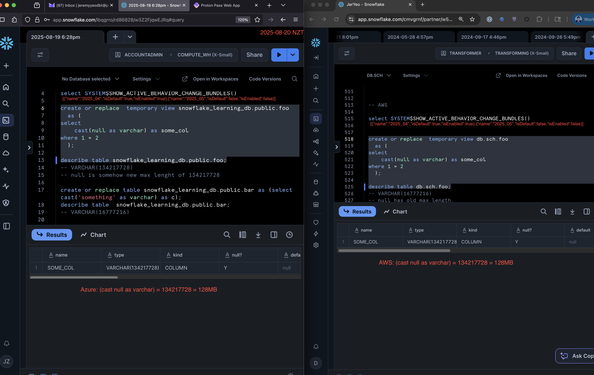

---
---

# Snowflake bundle change

## 2025_03

1. The 2025_03 Bundle has been made Generally Enabled (cannot be disabled) as of August 4th 2025 - https://docs.snowflake.com/en/release-notes/bcr-bundles/2025_03_bundle
2. Along with that is a new maximum size (`134217728`) for `varchar` columns - https://docs.snowflake.com/en/release-notes/bcr-bundles/2025_03/bcr-1942
3. A column created without specification - i.e. `varchar` should be of the old size (`16777216`).
4. Any column that already exist that are `varchar(16777216)` will not be automatically resized to `134217728`.

Let's see the implications from a dbt incremental model perspective.

By default, dbt will expand an existing columns data type to accomodate a larger varchar size... let's see this in action.

First, we create an existing table:

```sql
create or replace table db.sch.foo as (
    select 1 id, 'bob'::varchar(3) as first_name
);
```

Then we build a model like so:

```sql
-- models/foo.sql
{{ config(materialized='incremental', unique_key='id') }}
select 2 id, 'alice'::varchar(5) as first_name
```

```sh
$ dbt run
00:00:43  1 of 1 START sql incremental model sch.foo ..................................... [RUN]

00:00:43  On model.analytics.foo: create or replace  temporary view db.sch.foo__dbt_tmp
  as (
select 2 id, 'alice'::varchar(5) as first_name
  )
/* {"app": "dbt", "dbt_version": "1.10.9", "profile_name": "sf", "target_name": "ci", "node_id": "model.analytics.foo"} */;
00:00:44  SQL status: SUCCESS 1 in 1.668 seconds

00:00:45  On model.analytics.foo: describe table db.sch.foo__dbt_tmp
/* {"app": "dbt", "dbt_version": "1.10.9", "profile_name": "sf", "target_name": "ci", "node_id": "model.analytics.foo"} */
00:00:45  SQL status: SUCCESS 2 in 0.739 seconds

00:00:45  On model.analytics.foo: describe table db.sch.foo
/* {"app": "dbt", "dbt_version": "1.10.9", "profile_name": "sf", "target_name": "ci", "node_id": "model.analytics.foo"} */
00:00:46  SQL status: SUCCESS 2 in 0.941 seconds

00:00:46  Changing col type from character varying(3) to character varying(5) in table database: "db"
schema: "sch"
identifier: "foo"
00:00:46  On model.analytics.foo: alter  table db.sch.foo alter "FIRST_NAME" set data type character varying(5)
/* {"app": "dbt", "dbt_version": "1.10.9", "profile_name": "sf", "target_name": "ci", "node_id": "model.analytics.foo"} */;
00:00:47  SQL status: SUCCESS 1 in 1.284 seconds

00:00:48  On model.analytics.foo: describe table "DB"."SCH"."FOO"
/* {"app": "dbt", "dbt_version": "1.10.9", "profile_name": "sf", "target_name": "ci", "node_id": "model.analytics.foo"} */
00:00:49  SQL status: SUCCESS 2 in 1.186 seconds

00:00:49  On model.analytics.foo: -- back compat for old kwarg name
  begin
/* {"app": "dbt", "dbt_version": "1.10.9", "profile_name": "sf", "target_name": "ci", "node_id": "model.analytics.foo"} */;
00:00:49  SQL status: SUCCESS 1 in 0.665 seconds
00:00:49  Using snowflake connection "model.analytics.foo"
00:00:49  On model.analytics.foo: merge into db.sch.foo as DBT_INTERNAL_DEST
        using db.sch.foo__dbt_tmp as DBT_INTERNAL_SOURCE
        on ((DBT_INTERNAL_SOURCE.id = DBT_INTERNAL_DEST.id))
    when matched then update set
        "ID" = DBT_INTERNAL_SOURCE."ID","FIRST_NAME" = DBT_INTERNAL_SOURCE."FIRST_NAME"
    when not matched then insert
        ("ID", "FIRST_NAME")
    values
        ("ID", "FIRST_NAME")
/* {"app": "dbt", "dbt_version": "1.10.9", "profile_name": "sf", "target_name": "ci", "node_id": "model.analytics.foo"} */;
00:00:52  SQL status: SUCCESS 1 in 2.369 seconds

00:00:54  On model.analytics.foo: drop view if exists db.sch.foo__dbt_tmp cascade
/* {"app": "dbt", "dbt_version": "1.10.9", "profile_name": "sf", "target_name": "ci", "node_id": "model.analytics.foo"} */
00:00:56  SQL status: SUCCESS 1 in 1.512 seconds

00:00:56  1 of 1 OK created sql incremental model sch.foo ................................ [SUCCESS 1 in 13.20s]
```

What is the sequence of operations of incremental models out of the box?

1. We create a temp table.
2. We check the data type of the columns in the temp table and the target table by running `describe table` statements.
3. We detect that (2) returns the fact that:
   1. The temp tables `first_name` column has a varchar size of (`5`).
   2. The target tables `first_name` column has a varchar size of (`3`).
4. Since `5` > `3`, we expand the existing tables varchar size `alter table db.sch.foo alter "FIRST_NAME" set data type character varying(5)`.

How could the bundle being enabled affect this behaviour?

Depending on how the incremental model has been configured, the temp view may be created with a statement that looks somewhat similar to:

```sql
create or replace temporary view db.sch.foo__dbt_tmp
  as (
select
    cast(null as int) as id,
    cast(null as varchar) as first_name
) as __dbt_sbq where false limit 0;
```

And when checking the datatype of the `first_name` column with `null`, there appear to be a difference in the size depending on the date and platform (Azure vs AWS):




^ As we can see here there is a change to the size of `cast(null as varchar)` - even when the enabled bundles are the same (note: I believe bundle effects may not necessarily take effect immediately - which is obvious during the 2 day test shown in the above screenshots).

> There's likely other situations that we can simply sum up into a single statement: "the temp view being created has varchar columns of a size > `16777216`" and this wasn't possible before.

Edit: The bundle change was not responsible for `null as varchar` emitting the different sizes - it was an internal Snowflake change that was not visible to customers (source: https://getdbt.slack.com/archives/CJN7XRF1B/p1755762907457929?thread_ts=1755683282.578429&cid=CJN7XRF1B):


How does this impact the dbt run?

1. We create a temp table.
2. We check the data type of the columns in the temp table and the target table by running `describe table` statements.
3. We detect that (2) returns the fact that:
   1. The temp table has a varchar size of (`134217728`).
   2. The target table has a varchar size of (`16777216`).
4. Since `134217728` > `16777216`, we expand the existing tables varchar size `alter table db.sch.some_table alter "MY_COL" set data type character varying(134217728)`.

The implication here is that if the Snowflake role we're using does not have access to perform the `alter table ... alter col ...` operation - then your dbt job will start erroring with a Snowflake permission issue.

### Bonus implication

If you're using collation (https://docs.snowflake.com/en/sql-reference/collation) - you'll run into an additional issue:

Build the "existing table":

```sql
create or replace table db.sch.foo (
    id int,
    es varchar(6) collate 'es'
);
insert into db.sch.foo values (1, 'piñata');
```

Then run our incremental model:

```sql
-- models/foo.sql
{{ config(materialized='incremental', unique_key='id') }}
select 2 id, 'piña colada'::varchar(11) as es
```

```sh
$ dbt run

01:03:56  1 of 1 START sql incremental model sch.foo ..................................... [RUN]
01:03:56  Re-using an available connection from the pool (formerly list_db_sch, now model.analytics.foo)
01:03:56  Began compiling node model.analytics.foo
01:03:56  Writing injected SQL for node "model.analytics.foo"
01:03:56  Began executing node model.analytics.foo
01:03:56  Using snowflake connection "model.analytics.foo"
01:03:56  On model.analytics.foo: create or replace  temporary view db.sch.foo__dbt_tmp

  as (
    -- models/foo.sql

select 2 id, 'piña colada'::varchar(11) as es
  )
/* {"app": "dbt", "dbt_version": "1.10.9", "profile_name": "sf", "target_name": "ci", "node_id": "model.analytics.foo"} */;
01:03:56  SQL status: SUCCESS 1 in 0.360 seconds
01:03:56  Using snowflake connection "model.analytics.foo"
01:03:56  On model.analytics.foo: describe table db.sch.foo__dbt_tmp
/* {"app": "dbt", "dbt_version": "1.10.9", "profile_name": "sf", "target_name": "ci", "node_id": "model.analytics.foo"} */
01:03:57  SQL status: SUCCESS 2 in 0.342 seconds
01:03:57  Using snowflake connection "model.analytics.foo"
01:03:57  On model.analytics.foo: describe table db.sch.foo
/* {"app": "dbt", "dbt_version": "1.10.9", "profile_name": "sf", "target_name": "ci", "node_id": "model.analytics.foo"} */
01:03:57  SQL status: SUCCESS 2 in 0.299 seconds
01:03:57  Changing col type from character varying(6) to character varying(11) in table database: "db"
schema: "sch"
identifier: "foo"

01:03:57  Using snowflake connection "model.analytics.foo"
01:03:57  On model.analytics.foo: alter  table db.sch.foo alter "ES" set data type character varying(11)
/* {"app": "dbt", "dbt_version": "1.10.9", "profile_name": "sf", "target_name": "ci", "node_id": "model.analytics.foo"} */;
01:03:57  Snowflake adapter: Snowflake query id: 01be769f-0709-3903-000d-378351d13c9e
01:03:57  Snowflake adapter: Snowflake error: 040053 (22000): SQL compilation error: cannot change column ES from type "VARCHAR(6) COLLATE 'es'" to "VARCHAR(11)" because they have incompatible collations.
01:03:57  Snowflake adapter: Error running SQL: macro alter_column_type
01:03:57  Snowflake adapter: Rolling back transaction.
01:03:57  Database Error in model foo (models/foo.sql)
  040053 (22000): SQL compilation error: cannot change column ES from type "VARCHAR(6) COLLATE 'es'" to "VARCHAR(11)" because they have incompatible collations.
01:03:57  1 of 1 ERROR creating sql incremental model sch.foo ............................ [ERROR in 1.37s]
```

We run through the same sequence of operations as before... dbt emits `alter  table db.sch.foo alter "ES" set data type character varying(11)` but it errors because it needs extra collate keywords:

```sql
alter  table db.sch.foo alter "ES" set data type character varying(11) collate 'es';
```

dbt currently does not go beyond the data type (i.e. `varchar`) and it's size (i.e. `11`). The `collate 'es'` spec is transparent to dbt. We can demonstrate this very quickly:

```sql
-- macros/check.sql

    
    

```

```sh
$ dbt --debug run-operation check

01:10:52  On macro_check: describe table db.sch.foo
/* {"app": "dbt", "dbt_version": "1.10.9", "profile_name": "sf", "target_name": "ci", "connection_name": "macro_check"} */
01:10:53  SQL status: SUCCESS 2 in 1.593 seconds

[SnowflakeColumn(column='ID', dtype='NUMBER', char_size=None, numeric_precision=38, numeric_scale=0), SnowflakeColumn(column='ES', dtype='VARCHAR', char_size=11, numeric_precision=None, numeric_scale=None)]
```

^ As we can see, we didn't retrieve the `COLLATE 'es'` option on the `es` column.

### What can we do about this?

We can try and force all our columns to have the old size:

```sql
-- models/foo.sql
select some_text_col::varchar(16777216) as c from {{ source('raw', 'customers') }}
```

However, based on the number of models and columns we have in our project - it can be too tedious. Let's try to write a macro that will:

1. Go through each incremental model in the project.
2. Check each column and it's data type and size.
3. Update each column that has the old max size to the new max size.
4. Maintain any column collate spec at the same time.

```sql
-- macros/update_varchar.sql

    /*{#
        dbt run-operation update_varchar
        dbt run-operation update_varchar --args 'dry_run: 0'
    #}*/

    
    
    

    
    

    /*{# Only do this for incrementals in this dbt project. #}*/
    
        
            
            
                describe table {{ node.database }}.{{ node.schema }}.{{ node.alias }};
            
            
            
            
                /*{# Only for varchar columns that have the OLD MAX. #}*/
                
                    
                    
                    
                        
                        
                            alter table {{ node.database }}.{{ node.schema }}.{{ node.alias }} alter "{{ ct[0] }}" set data type {{ full_type_spec }};
                        
                        
                            
                            
                        
                            
                            
                            
                        
                    
                
            
            
        
    

```

The macro above will default to a "dry run" so you can double check if things will get compiled properly:


```sh
$ dbt run-operation update_varchar
02:37:48  Running with dbt=1.10.9
02:37:49  Registered adapter: snowflake=1.10.0
02:37:49  Found 1 model, 478 macros
Processing model: model.analytics.foo
Column "ES" has a varchar type of: VARCHAR(16777216) COLLATE 'es'
This is a dry run - no actual alter query will be executed. Set dry run to 0 to actually execute:
====================
alter table db.sch.foo alter "ES" set data type VARCHAR(134217728) COLLATE 'es';
====================
Finished processing model: model.analytics.foo
```

Then we can execute for real:

```sh
$ dbt run-operation update_varchar --args 'dry_run: 0'
02:39:49  Running with dbt=1.10.9
02:39:50  Registered adapter: snowflake=1.10.0
02:39:50  Found 1 model, 478 macros
Processing model: model.analytics.foo
Column "ES" has a varchar type of: VARCHAR(16777216) COLLATE 'es'
Running alter query:
====================
alter table db.sch.foo alter "ES" set data type VARCHAR(134217728) COLLATE 'es';
====================
Finished alter query.
Finished processing model: model.analytics.foo
```

We can run a describe to see that the column has the new size:


### Appendix

Other situations:

```sql
create or replace table db.sch.new (
 c1 varchar(134217728),
 c2 varchar(134217728),
 c3 varchar, -- 16777216
 c4 varchar  -- 16777216
);
insert into db.sch.new values ('a', 'b', 'c', 'd');
desc table db.sch.new;
-- c_1: VARCHAR(134217728)
-- c_2: VARCHAR(134217728)
-- c_3: VARCHAR(16777216)
-- c_4: VARCHAR(16777216)

create or replace temp view db.sch.new__dbt_tmp as (select c1 || c2 as c_new_max, c3 || c4 as c_old_max from db.sch.new);
desc table db.sch.new__dbt_tmp;
-- c_new_max: VARCHAR(134217728)
-- c_old_max: VARCHAR(33554432)
```

Looks like the concatenating of 2 MAX sized varchars always equal MAX. So, previously, `c_old_max` would have been `VARCHAR(16777216)` but is now `VARCHAR(33554432)` since `33554432` < `134217728`.
