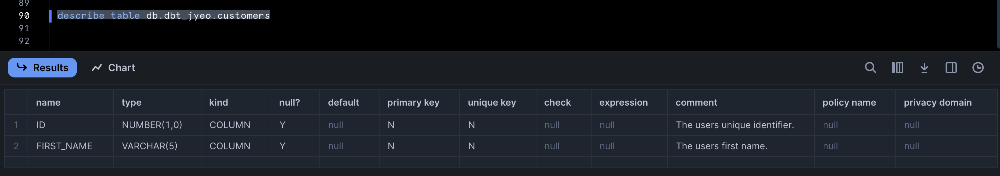
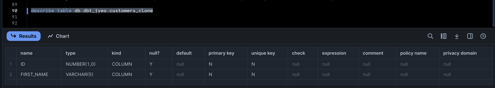
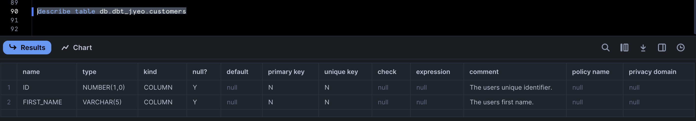
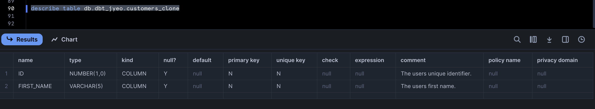

---
---

## Copying model descriptions to a clone created with a post-hook

Recently, someone had a query about copying model/column descriptions (comments) to a clone that is being created during the model's post-hook. This doesn't work out of the box due to the sequence of events - let's have a look:

```yaml
# dbt_project.yml
name: my_dbt_project
profile: all
config-version: 2
version: "1.0.0"

models:
  my_dbt_project:
    +materialized: table

# models/schema.yml
models:
  - name: customers
    columns:
      - name: id
        description: The users unique identifier.
      - name: first_name
        description: The users first name.
```

```sql
-- models/customers.sql
{{ 
    config(
        transient=false,
        persist_docs={"columns": true},
        post_hook="create or replace table db.dbt_jyeo.customers_clone clone {{ this }};"
    )
}}

select 1 id, 'alice' as first_name
```

Here we're creating a clone of `customers` in the post-hook and also using the [`persist_docs`](https://docs.getdbt.com/reference/resource-configs/persist_docs) config to add the column description into the column comment.

```sh
$ dbt --debug run
...
21:19:09  1 of 1 START sql table model dbt_jyeo.customers ................................ [RUN]
21:19:09  Re-using an available connection from the pool (formerly list_db_dbt_jyeo, now model.my_dbt_project.customers)
21:19:09  Began compiling node model.my_dbt_project.customers
21:19:09  Writing injected SQL for node "model.my_dbt_project.customers"
21:19:09  Began executing node model.my_dbt_project.customers
21:19:09  Writing runtime sql for node "model.my_dbt_project.customers"
21:19:09  Using snowflake connection "model.my_dbt_project.customers"
21:19:09  On model.my_dbt_project.customers: /* {"app": "dbt", "dbt_version": "1.9.0b2", "profile_name": "all", "target_name": "sf", "node_id": "model.my_dbt_project.customers"} */
create or replace  table db.dbt_jyeo.customers
         as
        (

select 1 id, 'alice' as first_name
        );
21:19:11  SQL status: SUCCESS 1 in 1.254 seconds
21:19:11  Using snowflake connection "model.my_dbt_project.customers"
21:19:11  On model.my_dbt_project.customers: /* {"app": "dbt", "dbt_version": "1.9.0b2", "profile_name": "all", "target_name": "sf", "node_id": "model.my_dbt_project.customers"} */
create or replace table db.dbt_jyeo.customers_clone clone db.dbt_jyeo.customers;
21:19:12  SQL status: SUCCESS 1 in 1.283 seconds
21:19:12  Using snowflake connection "model.my_dbt_project.customers"
21:19:12  On model.my_dbt_project.customers: /* {"app": "dbt", "dbt_version": "1.9.0b2", "profile_name": "all", "target_name": "sf", "node_id": "model.my_dbt_project.customers"} */
describe table db.dbt_jyeo.customers
21:19:12  SQL status: SUCCESS 2 in 0.339 seconds
21:19:12  Using snowflake connection "model.my_dbt_project.customers"
21:19:12  On model.my_dbt_project.customers: /* {"app": "dbt", "dbt_version": "1.9.0b2", "profile_name": "all", "target_name": "sf", "node_id": "model.my_dbt_project.customers"} */
alter  table db.dbt_jyeo.customers alter
    
        "ID" COMMENT $$The users unique identifier.$$,
    
        "FIRST_NAME" COMMENT $$The users first name.$$;
21:19:13  SQL status: SUCCESS 1 in 0.399 seconds
21:19:13  Sending event: {'category': 'dbt', 'action': 'run_model', 'label': 'e0b5dd29-da89-42fe-b9ad-f419e3c9a349', 'context': [<snowplow_tracker.self_describing_json.SelfDescribingJson object at 0x1482e8c10>]}
21:19:13  1 of 1 OK created sql table model dbt_jyeo.customers ........................... [SUCCESS 1 in 3.36s]
```

1. We created the model itself.
2. The post-hook runs and does a clone of `customers` into `customers_clone`.
3. Column descriptions are added to the column comments via the `alter table` DDL.

Because (3) happens after (2) - the clone will not have the column descriptions... let's have a look:





What we can do is edit the built in macro `alter_column_comment()` (https://github.com/dbt-labs/dbt-snowflake/blob/main/dbt/include/snowflake/macros/adapters.sql#L212-L223) slightly:

```sql
-- macros/alter_column_comment.sql

    
    
        
    
        
    

     
        alter {{ relation.get_ddl_prefix_for_alter() }} {{ relation_type }} {{ relation.render() }} alter
        
            {{ get_column_comment_sql(column_name, column_dict) }} {{- ',' if not loop.last else ';' }}
        

        alter {{ relation.get_ddl_prefix_for_alter() }} {{ relation_type }} {{ relation.render() }}_clone alter
        
            {{ get_column_comment_sql(column_name, column_dict) }} {{- ',' if not loop.last else ';' }}
        
    
        alter {{ relation.get_ddl_prefix_for_alter() }} {{ relation_type }} {{ relation.render() }} alter
        
            {{ get_column_comment_sql(column_name, column_dict) }} {{- ',' if not loop.last else ';' }}
        
    

```

Add a new config to our model:

```sql
-- models/customers.sql
{{ 
    config(
        transient=false,
        persist_docs={"columns": true},
        post_hook="create or replace table db.dbt_jyeo.customers_clone clone {{ this }};",
        persist_docs_to_clone=true
    )
}}

select 1 id, 'alice' as first_name
```

Because we have modified the macro - if the `persist_docs_to_clone` config is `true` then we will have 2 `alter table` DDL statements during step (3).

```sh
$ dbt --debug run
21:29:32  1 of 1 START sql table model dbt_jyeo.customers ................................ [RUN]
21:29:32  Re-using an available connection from the pool (formerly list_db_dbt_jyeo, now model.my_dbt_project.customers)
21:29:32  Began compiling node model.my_dbt_project.customers
21:29:32  Writing injected SQL for node "model.my_dbt_project.customers"
21:29:32  Began executing node model.my_dbt_project.customers
21:29:32  Writing runtime sql for node "model.my_dbt_project.customers"
21:29:32  Using snowflake connection "model.my_dbt_project.customers"
21:29:32  On model.my_dbt_project.customers: /* {"app": "dbt", "dbt_version": "1.9.0b2", "profile_name": "all", "target_name": "sf", "node_id": "model.my_dbt_project.customers"} */
create or replace  table db.dbt_jyeo.customers
         as
        (

select 1 id, 'alice' as first_name
        );
21:29:34  SQL status: SUCCESS 1 in 1.134 seconds
21:29:34  Using snowflake connection "model.my_dbt_project.customers"
21:29:34  On model.my_dbt_project.customers: /* {"app": "dbt", "dbt_version": "1.9.0b2", "profile_name": "all", "target_name": "sf", "node_id": "model.my_dbt_project.customers"} */
create or replace table db.dbt_jyeo.customers_clone clone db.dbt_jyeo.customers;
21:29:35  SQL status: SUCCESS 1 in 1.324 seconds
21:29:35  Using snowflake connection "model.my_dbt_project.customers"
21:29:35  On model.my_dbt_project.customers: /* {"app": "dbt", "dbt_version": "1.9.0b2", "profile_name": "all", "target_name": "sf", "node_id": "model.my_dbt_project.customers"} */
describe table db.dbt_jyeo.customers
21:29:35  SQL status: SUCCESS 2 in 0.404 seconds
21:29:35  Using snowflake connection "model.my_dbt_project.customers"
21:29:35  On model.my_dbt_project.customers: /* {"app": "dbt", "dbt_version": "1.9.0b2", "profile_name": "all", "target_name": "sf", "node_id": "model.my_dbt_project.customers"} */
alter  table db.dbt_jyeo.customers alter
        
            "ID" COMMENT $$The users unique identifier.$$,
        
            "FIRST_NAME" COMMENT $$The users first name.$$;
21:29:36  SQL status: SUCCESS 1 in 0.340 seconds
21:29:36  Using snowflake connection "model.my_dbt_project.customers"
21:29:36  On model.my_dbt_project.customers: /* {"app": "dbt", "dbt_version": "1.9.0b2", "profile_name": "all", "target_name": "sf", "node_id": "model.my_dbt_project.customers"} */
alter  table db.dbt_jyeo.customers_clone alter
        
            "ID" COMMENT $$The users unique identifier.$$,
        
            "FIRST_NAME" COMMENT $$The users first name.$$;
21:29:36  SQL status: SUCCESS 1 in 0.367 seconds
21:29:36  Sending event: {'category': 'dbt', 'action': 'run_model', 'label': '6f0a32e9-2caf-4e96-bd76-e07bd8d4aba4', 'context': [<snowplow_tracker.self_describing_json.SelfDescribingJson object at 0x13c0ae710>]}
21:29:36  1 of 1 OK created sql table model dbt_jyeo.customers ........................... [SUCCESS 1 in 3.67s]
```

And now both our original model `customers` and it's clone `customers_clone` will have those column comments:





There's many other ways you could do this - such as checking what the post_hook contains instead of adding a new config, perhaps doing this in an on-run-end hook but those will be left up to the reader.

As usual, if you override a default built in macro - such as we're doing here - then you'd need to keep track of any future changes that comes to dbt as it may break your workflow unexpectedly.
