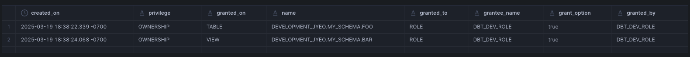
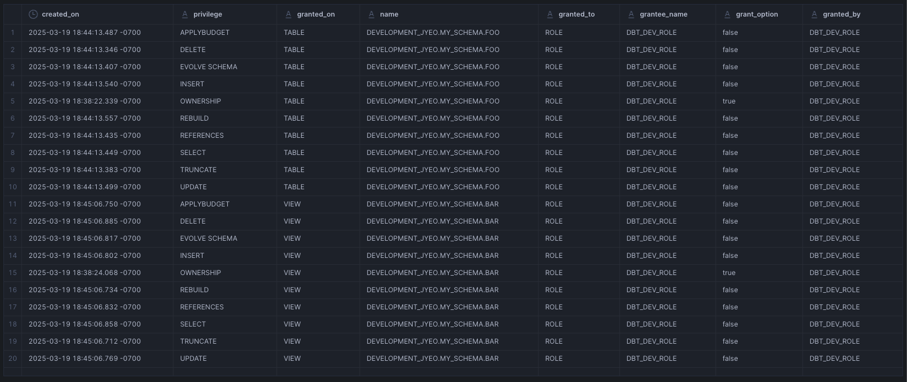
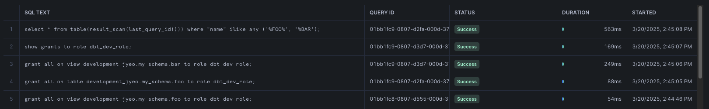
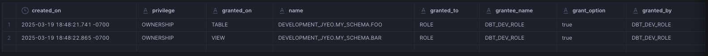
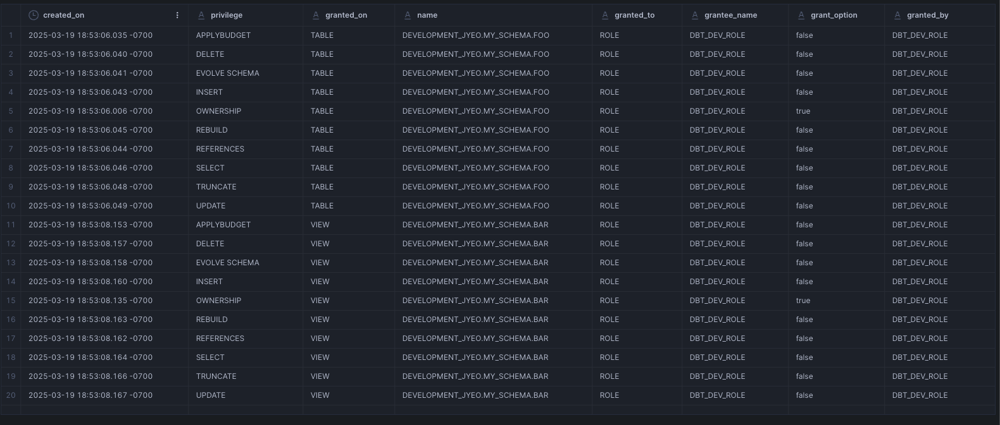
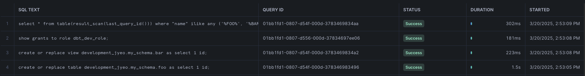

---
---

## Snowflake grants testing

Documenting things learned from testing grants.

```sql
use role accountadmin;
create or replace database development_jyeo;
grant all on database development_jyeo to role dbt_dev_role;

use role dbt_dev_role;
create schema development_jyeo.my_schema;
create or replace table development_jyeo.my_schema.foo as select 1 id;
create or replace view development_jyeo.my_schema.bar as select 1 id;

show grants to role dbt_dev_role;
select * from table(result_scan(last_query_id())) where "name" ilike any ('%FOO%', '%BAR');
```



When the role creates the object (table/view) the role itself would automatically have the privilege of `OWNERSHIP` on the object.

```sql
use role dbt_dev_role;
grant all on table development_jyeo.my_schema.foo to role dbt_dev_role;
grant all on view development_jyeo.my_schema.bar to role dbt_dev_role;

show grants to role dbt_dev_role;
select * from table(result_scan(last_query_id())) where "name" ilike any ('%FOO%', '%BAR');
```



By doing a `grant all` then we have many more priviledges granted to the object by the role that is doing the granting itself.



^ This will be obvious in the query history - that an explicit `grant all` was submitted to Snowflake for execution after the creation of the object.

Let's rebuild our objects and see what happens:

```sql
use role dbt_dev_role;
create or replace table development_jyeo.my_schema.foo as select 1 id;
create or replace view development_jyeo.my_schema.bar as select 1 id;
show grants to role dbt_dev_role;
select * from table(result_scan(last_query_id())) where "name" ilike any ('%FOO%', '%BAR');
```



When the object is recreated - we go back to not having that many privileges but just the `OWNERSHIP` priviledge - meaning to explicitly see the many different types of priviledges, we expect to have to run `grant all` like we did above - and if so, that would be very obvious from the query history.

How can we make it so that we see the many types of priviledges as shown above without then having to run `grant all`? Here's where future grants come into play:

```sql
use role dbt_dev_role;
grant all on future tables in schema development_jyeo.my_schema to role dbt_dev_role;
grant all on future views in schema development_jyeo.my_schema to role dbt_dev_role;
```

Then we recreate the objects again:

```sql
use role dbt_dev_role;
create or replace table development_jyeo.my_schema.foo as select 1 id;
create or replace view development_jyeo.my_schema.bar as select 1 id;
show grants to role dbt_dev_role;
select * from table(result_scan(last_query_id())) where "name" ilike any ('%FOO%', '%BAR');
```



^ We can see now that once the objects were rebuilt, Snowflake applied the `all` future grants automatically:



^ And we will not see any `grant all` sql statements in the Snowflake query history after the recreation of the objects.

So, if someone or something did a future grant way back in the past, you may see this behaviour - your objects keep getting ALL priviledges when they are recreated, even when no explicit `grant all on ...` appear in the query history.

Moral of the story is to be explicit (e.g. making use of dbt's `grant` functionality so that grant statements are emitted and visible in query hisotyr) rather than implicit/automagic - so don't use things like future grants which may cause you headaches in the future should you wish to understand how things have come to be.
