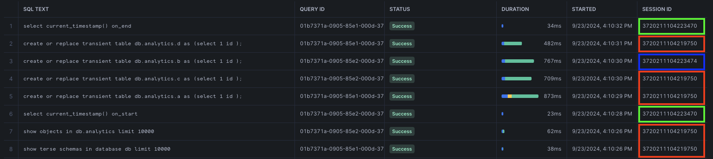
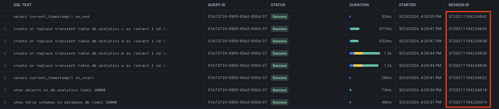

---
---

## Snowflake sessions

Testing dbt-snowflake's new (introduced in 1.8) `reuse_connections` config (https://docs.getdbt.com/docs/core/connect-data-platform/snowflake-setup#reuse_connections).

Project setup:

```yaml
# dbt_project.yml
name: my_dbt_project
profile: all
config-version: 2
version: "1.0.0"

models:
  my_dbt_project:
    +materialized: table

on-run-start: "select current_timestamp() on_start"
on-run-end: "select current_timestamp() on_end"
```

```sql
-- models/a.sql
select 1 id
-- models/b.sql
select 1 id
-- models/c.sql
select 1 id
-- models/d.sql
select 1 id
```

With `reuse_connections: True` (the default):

```sh
$ dbt run --threads 2
16:10:22.424020 [info ] [MainThread]: Running with dbt=1.8.6
16:10:22.424320 [debug] [MainThread]: running dbt with arguments {'printer_width': '80', 'indirect_selection': 'eager', 'write_json': 'True', 'log_cache_events': 'False', 'partial_parse': 'True', 'cache_selected_only': 'False', 'warn_error': 'None', 'debug': 'False', 'version_check': 'True', 'log_path': '/Users/jeremy/git/dbt-basic/logs', 'fail_fast': 'False', 'profiles_dir': '/Users/jeremy/.dbt', 'use_colors': 'False', 'use_experimental_parser': 'False', 'no_print': 'None', 'quiet': 'False', 'empty': 'False', 'warn_error_options': 'WarnErrorOptions(include=[], exclude=[])', 'introspect': 'True', 'invocation_command': 'dbt --no-use-colors run --threads 2', 'static_parser': 'True', 'target_path': 'None', 'log_format': 'default', 'send_anonymous_usage_stats': 'True'}
16:10:23.163116 [debug] [MainThread]: Sending event: {'category': 'dbt', 'action': 'project_id', 'label': '7ea9fd0c-67a5-4c6f-8450-43670d08f1b7', 'context': [<snowplow_tracker.self_describing_json.SelfDescribingJson object at 0x10e094b90>]}
16:10:23.184750 [debug] [MainThread]: Sending event: {'category': 'dbt', 'action': 'adapter_info', 'label': '7ea9fd0c-67a5-4c6f-8450-43670d08f1b7', 'context': [<snowplow_tracker.self_describing_json.SelfDescribingJson object at 0x109b0e2d0>]}
16:10:23.185907 [info ] [MainThread]: Registered adapter: snowflake=1.8.3
16:10:23.196212 [debug] [MainThread]: checksum: 2f2fb10c73cafe3e79aa104295a8244291492b32b5598ce46af770f7d0bd5194, vars: {}, profile: , target: , version: 1.8.6
16:10:23.250355 [debug] [MainThread]: Partial parsing enabled: 0 files deleted, 0 files added, 0 files changed.
16:10:23.250616 [debug] [MainThread]: Partial parsing enabled, no changes found, skipping parsing
16:10:23.265978 [debug] [MainThread]: Sending event: {'category': 'dbt', 'action': 'load_project', 'label': '7ea9fd0c-67a5-4c6f-8450-43670d08f1b7', 'context': [<snowplow_tracker.self_describing_json.SelfDescribingJson object at 0x16b807e90>]}
16:10:23.306060 [debug] [MainThread]: Sending event: {'category': 'dbt', 'action': 'resource_counts', 'label': '7ea9fd0c-67a5-4c6f-8450-43670d08f1b7', 'context': [<snowplow_tracker.self_describing_json.SelfDescribingJson object at 0x16b8b5810>]}
16:10:23.306350 [info ] [MainThread]: Found 4 models, 2 operations, 448 macros
16:10:23.306523 [debug] [MainThread]: Sending event: {'category': 'dbt', 'action': 'runnable_timing', 'label': '7ea9fd0c-67a5-4c6f-8450-43670d08f1b7', 'context': [<snowplow_tracker.self_describing_json.SelfDescribingJson object at 0x16b8564d0>]}
16:10:23.307431 [info ] [MainThread]: 
16:10:23.307705 [debug] [MainThread]: Acquiring new snowflake connection 'master'
16:10:23.309674 [debug] [ThreadPool]: Acquiring new snowflake connection 'list_db'
16:10:23.316386 [debug] [ThreadPool]: Using snowflake connection "list_db"
16:10:23.316602 [debug] [ThreadPool]: On list_db: /* {"app": "dbt", "dbt_version": "1.8.6", "profile_name": "all", "target_name": "sf", "connection_name": "list_db"} */
show terse schemas in database db
    limit 10000
16:10:23.316740 [debug] [ThreadPool]: Opening a new connection, currently in state init
16:10:25.968044 [debug] [ThreadPool]: SQL status: SUCCESS 11 in 2.651 seconds
16:10:25.972401 [debug] [ThreadPool]: Re-using an available connection from the pool (formerly list_db, now list_db_analytics)
16:10:25.982866 [debug] [ThreadPool]: Using snowflake connection "list_db_analytics"
16:10:25.983143 [debug] [ThreadPool]: On list_db_analytics: /* {"app": "dbt", "dbt_version": "1.8.6", "profile_name": "all", "target_name": "sf", "connection_name": "list_db_analytics"} */
show objects in db.analytics limit 10000
16:10:26.329600 [debug] [ThreadPool]: SQL status: SUCCESS 11 in 0.346 seconds
16:10:26.335530 [debug] [MainThread]: Sending event: {'category': 'dbt', 'action': 'runnable_timing', 'label': '7ea9fd0c-67a5-4c6f-8450-43670d08f1b7', 'context': [<snowplow_tracker.self_describing_json.SelfDescribingJson object at 0x16be76a10>]}
16:10:26.336258 [info ] [MainThread]: 
16:10:26.336827 [info ] [MainThread]: Running 1 on-run-start hook
16:10:26.344829 [debug] [MainThread]: Writing injected SQL for node "operation.my_dbt_project.my_dbt_project-on-run-start-0"
16:10:26.347582 [info ] [MainThread]: 1 of 1 START hook: my_dbt_project.on-run-start.0 ............................... [RUN]
16:10:26.347955 [debug] [MainThread]: Using snowflake connection "master"
16:10:26.348123 [debug] [MainThread]: On master: /* {"app": "dbt", "dbt_version": "1.8.6", "profile_name": "all", "target_name": "sf", "connection_name": "master"} */
select current_timestamp() on_start
16:10:26.348279 [debug] [MainThread]: Opening a new connection, currently in state init
16:10:28.103543 [debug] [MainThread]: SQL status: SUCCESS 1 in 1.755 seconds
16:10:28.104150 [info ] [MainThread]: 1 of 1 OK hook: my_dbt_project.on-run-start.0 .................................. [SUCCESS 1 in 1.76s]
16:10:28.104337 [info ] [MainThread]: 
16:10:28.104566 [info ] [MainThread]: Concurrency: 2 threads (target='sf')
16:10:28.104718 [info ] [MainThread]: 
16:10:28.106519 [debug] [Thread-1 (]: Began running node model.my_dbt_project.a
16:10:28.106737 [debug] [Thread-2 (]: Began running node model.my_dbt_project.b
16:10:28.106981 [info ] [Thread-1 (]: 1 of 4 START sql table model analytics.a ....................................... [RUN]
16:10:28.107217 [info ] [Thread-2 (]: 2 of 4 START sql table model analytics.b ....................................... [RUN]
16:10:28.107441 [debug] [Thread-1 (]: Re-using an available connection from the pool (formerly list_db_analytics, now model.my_dbt_project.a)
16:10:28.107652 [debug] [Thread-2 (]: Acquiring new snowflake connection 'model.my_dbt_project.b'
16:10:28.107811 [debug] [Thread-1 (]: Began compiling node model.my_dbt_project.a
16:10:28.107961 [debug] [Thread-2 (]: Began compiling node model.my_dbt_project.b
16:10:28.108918 [debug] [Thread-1 (]: Writing injected SQL for node "model.my_dbt_project.a"
16:10:28.109701 [debug] [Thread-2 (]: Writing injected SQL for node "model.my_dbt_project.b"
16:10:28.110218 [debug] [Thread-2 (]: Began executing node model.my_dbt_project.b
16:10:28.110411 [debug] [Thread-1 (]: Began executing node model.my_dbt_project.a
16:10:28.128516 [debug] [Thread-2 (]: Writing runtime sql for node "model.my_dbt_project.b"
16:10:28.128406 [debug] [Thread-1 (]: Writing runtime sql for node "model.my_dbt_project.a"
16:10:28.129123 [debug] [Thread-2 (]: Using snowflake connection "model.my_dbt_project.b"
16:10:28.129366 [debug] [Thread-1 (]: Using snowflake connection "model.my_dbt_project.a"
16:10:28.129517 [debug] [Thread-2 (]: On model.my_dbt_project.b: /* {"app": "dbt", "dbt_version": "1.8.6", "profile_name": "all", "target_name": "sf", "node_id": "model.my_dbt_project.b"} */
create or replace transient table db.analytics.b
         as
        (select 1 id
        );
16:10:28.129681 [debug] [Thread-1 (]: On model.my_dbt_project.a: /* {"app": "dbt", "dbt_version": "1.8.6", "profile_name": "all", "target_name": "sf", "node_id": "model.my_dbt_project.a"} */
create or replace transient table db.analytics.a
         as
        (select 1 id
        );
16:10:28.129838 [debug] [Thread-2 (]: Opening a new connection, currently in state init
16:10:29.307073 [debug] [Thread-1 (]: SQL status: SUCCESS 1 in 1.177 seconds
16:10:29.329171 [debug] [Thread-1 (]: Sending event: {'category': 'dbt', 'action': 'run_model', 'label': '7ea9fd0c-67a5-4c6f-8450-43670d08f1b7', 'context': [<snowplow_tracker.self_describing_json.SelfDescribingJson object at 0x16aece310>]}
16:10:29.330300 [info ] [Thread-1 (]: 1 of 4 OK created sql table model analytics.a .................................. [SUCCESS 1 in 1.22s]
16:10:29.330950 [debug] [Thread-1 (]: Finished running node model.my_dbt_project.a
16:10:29.331234 [debug] [Thread-1 (]: Began running node model.my_dbt_project.c
16:10:29.331669 [info ] [Thread-1 (]: 3 of 4 START sql table model analytics.c ....................................... [RUN]
16:10:29.331967 [debug] [Thread-1 (]: Re-using an available connection from the pool (formerly model.my_dbt_project.a, now model.my_dbt_project.c)
16:10:29.332140 [debug] [Thread-1 (]: Began compiling node model.my_dbt_project.c
16:10:29.332951 [debug] [Thread-1 (]: Writing injected SQL for node "model.my_dbt_project.c"
16:10:29.333285 [debug] [Thread-1 (]: Began executing node model.my_dbt_project.c
16:10:29.334445 [debug] [Thread-1 (]: Writing runtime sql for node "model.my_dbt_project.c"
16:10:29.334776 [debug] [Thread-1 (]: Using snowflake connection "model.my_dbt_project.c"
16:10:29.334929 [debug] [Thread-1 (]: On model.my_dbt_project.c: /* {"app": "dbt", "dbt_version": "1.8.6", "profile_name": "all", "target_name": "sf", "node_id": "model.my_dbt_project.c"} */
create or replace transient table db.analytics.c
         as
        (select 1 id
        );
16:10:30.326463 [debug] [Thread-1 (]: SQL status: SUCCESS 1 in 0.991 seconds
16:10:30.330248 [debug] [Thread-1 (]: Sending event: {'category': 'dbt', 'action': 'run_model', 'label': '7ea9fd0c-67a5-4c6f-8450-43670d08f1b7', 'context': [<snowplow_tracker.self_describing_json.SelfDescribingJson object at 0x16be8b090>]}
16:10:30.331156 [info ] [Thread-1 (]: 3 of 4 OK created sql table model analytics.c .................................. [SUCCESS 1 in 1.00s]
16:10:30.332058 [debug] [Thread-1 (]: Finished running node model.my_dbt_project.c
16:10:30.332708 [debug] [Thread-1 (]: Began running node model.my_dbt_project.d
16:10:30.333503 [info ] [Thread-1 (]: 4 of 4 START sql table model analytics.d ....................................... [RUN]
16:10:30.334223 [debug] [Thread-1 (]: Re-using an available connection from the pool (formerly model.my_dbt_project.c, now model.my_dbt_project.d)
16:10:30.334657 [debug] [Thread-1 (]: Began compiling node model.my_dbt_project.d
16:10:30.338799 [debug] [Thread-1 (]: Writing injected SQL for node "model.my_dbt_project.d"
16:10:30.339590 [debug] [Thread-1 (]: Began executing node model.my_dbt_project.d
16:10:30.374288 [debug] [Thread-1 (]: Writing runtime sql for node "model.my_dbt_project.d"
16:10:30.374899 [debug] [Thread-1 (]: Using snowflake connection "model.my_dbt_project.d"
16:10:30.375080 [debug] [Thread-1 (]: On model.my_dbt_project.d: /* {"app": "dbt", "dbt_version": "1.8.6", "profile_name": "all", "target_name": "sf", "node_id": "model.my_dbt_project.d"} */
create or replace transient table db.analytics.d
         as
        (select 1 id
        );
16:10:30.376231 [debug] [Thread-2 (]: SQL status: SUCCESS 1 in 2.246 seconds
16:10:30.377339 [debug] [Thread-2 (]: Sending event: {'category': 'dbt', 'action': 'run_model', 'label': '7ea9fd0c-67a5-4c6f-8450-43670d08f1b7', 'context': [<snowplow_tracker.self_describing_json.SelfDescribingJson object at 0x16ba6a9d0>]}
16:10:30.377672 [info ] [Thread-2 (]: 2 of 4 OK created sql table model analytics.b .................................. [SUCCESS 1 in 2.27s]
16:10:30.377950 [debug] [Thread-2 (]: Finished running node model.my_dbt_project.b
16:10:31.162596 [debug] [Thread-1 (]: SQL status: SUCCESS 1 in 0.787 seconds
16:10:31.166725 [debug] [Thread-1 (]: Sending event: {'category': 'dbt', 'action': 'run_model', 'label': '7ea9fd0c-67a5-4c6f-8450-43670d08f1b7', 'context': [<snowplow_tracker.self_describing_json.SelfDescribingJson object at 0x16b822550>]}
16:10:31.167661 [info ] [Thread-1 (]: 4 of 4 OK created sql table model analytics.d .................................. [SUCCESS 1 in 0.83s]
16:10:31.168564 [debug] [Thread-1 (]: Finished running node model.my_dbt_project.d
16:10:31.170169 [info ] [MainThread]: 
16:10:31.170780 [info ] [MainThread]: Running 1 on-run-end hook
16:10:31.173701 [debug] [MainThread]: Writing injected SQL for node "operation.my_dbt_project.my_dbt_project-on-run-end-0"
16:10:31.174852 [info ] [MainThread]: 1 of 1 START hook: my_dbt_project.on-run-end.0 ................................. [RUN]
16:10:31.175462 [debug] [MainThread]: Using snowflake connection "master"
16:10:31.175831 [debug] [MainThread]: On master: /* {"app": "dbt", "dbt_version": "1.8.6", "profile_name": "all", "target_name": "sf", "connection_name": "master"} */
select current_timestamp() on_end
16:10:31.492472 [debug] [MainThread]: SQL status: SUCCESS 1 in 0.316 seconds
16:10:31.494666 [info ] [MainThread]: 1 of 1 OK hook: my_dbt_project.on-run-end.0 .................................... [SUCCESS 1 in 0.32s]
16:10:31.495269 [info ] [MainThread]: 
16:10:31.495977 [debug] [MainThread]: Connection 'master' was left open.
16:10:31.496479 [debug] [MainThread]: On master: Close
16:10:32.124270 [debug] [MainThread]: Connection 'model.my_dbt_project.d' was left open.
16:10:32.125044 [debug] [MainThread]: On model.my_dbt_project.d: Close
16:10:32.814929 [debug] [MainThread]: Connection 'model.my_dbt_project.b' was left open.
16:10:32.815684 [debug] [MainThread]: On model.my_dbt_project.b: Close
16:10:33.405205 [info ] [MainThread]: 
16:10:33.405969 [info ] [MainThread]: Finished running 4 table models, 2 project hooks in 0 hours 0 minutes and 10.10 seconds (10.10s).
16:10:33.407302 [debug] [MainThread]: Command end result
16:10:33.423135 [info ] [MainThread]: 
16:10:33.423420 [info ] [MainThread]: Completed successfully
16:10:33.423591 [info ] [MainThread]: 
16:10:33.423753 [info ] [MainThread]: Done. PASS=4 WARN=0 ERROR=0 SKIP=0 TOTAL=4
16:10:33.424945 [debug] [MainThread]: Resource report: {"command_name": "run", "command_success": true, "command_wall_clock_time": 11.032866, "process_user_time": 2.265146, "process_kernel_time": 1.984888, "process_mem_max_rss": "200556544", "process_in_blocks": "0", "process_out_blocks": "0"}
16:10:33.425202 [debug] [MainThread]: Command `dbt run` succeeded at 16:10:33.425162 after 11.03 seconds
16:10:33.425381 [debug] [MainThread]: Sending event: {'category': 'dbt', 'action': 'invocation', 'label': 'end', 'context': [<snowplow_tracker.self_describing_json.SelfDescribingJson object at 0x102953990>, <snowplow_tracker.self_describing_json.SelfDescribingJson object at 0x102953090>, <snowplow_tracker.self_describing_json.SelfDescribingJson object at 0x1029530d0>]}
16:10:33.425541 [debug] [MainThread]: Flushing usage events
```



As we can see, with `reuse_connections`, sessions are reused when they have finished their operations and new ones are created when something needs to run in parallel (model `b`). Looks like hooks also spawn their own session though not 100% sure that this happens all the time. This will impact things configured on a session level - like timezones, etc.

With `reuse_connections: False` (behaviour `dbt-snowflake<1.8`):

```sh
$ dbt run --threads 2
16:20:32.825286 [info ] [MainThread]: Running with dbt=1.8.6
16:20:32.825577 [debug] [MainThread]: running dbt with arguments {'printer_width': '80', 'indirect_selection': 'eager', 'write_json': 'True', 'log_cache_events': 'False', 'partial_parse': 'True', 'cache_selected_only': 'False', 'warn_error': 'None', 'version_check': 'True', 'profiles_dir': '/Users/jeremy/.dbt', 'log_path': '/Users/jeremy/git/dbt-basic/logs', 'fail_fast': 'False', 'debug': 'False', 'use_colors': 'False', 'use_experimental_parser': 'False', 'no_print': 'None', 'quiet': 'False', 'empty': 'False', 'warn_error_options': 'WarnErrorOptions(include=[], exclude=[])', 'invocation_command': 'dbt --no-use-colors run --threads 2', 'introspect': 'True', 'static_parser': 'True', 'target_path': 'None', 'log_format': 'default', 'send_anonymous_usage_stats': 'True'}
16:20:33.549888 [debug] [MainThread]: Sending event: {'category': 'dbt', 'action': 'project_id', 'label': 'e4cf93da-6d7c-4eeb-b9cb-718e289b9ed9', 'context': [<snowplow_tracker.self_describing_json.SelfDescribingJson object at 0x106af4290>]}
16:20:33.572178 [debug] [MainThread]: Sending event: {'category': 'dbt', 'action': 'adapter_info', 'label': 'e4cf93da-6d7c-4eeb-b9cb-718e289b9ed9', 'context': [<snowplow_tracker.self_describing_json.SelfDescribingJson object at 0x10640a490>]}
16:20:33.572779 [info ] [MainThread]: Registered adapter: snowflake=1.8.3
16:20:33.582873 [debug] [MainThread]: checksum: 2f2fb10c73cafe3e79aa104295a8244291492b32b5598ce46af770f7d0bd5194, vars: {}, profile: , target: , version: 1.8.6
16:20:33.617982 [info ] [MainThread]: Unable to do partial parsing because profile has changed
16:20:33.618302 [debug] [MainThread]: Sending event: {'category': 'dbt', 'action': 'partial_parser', 'label': 'e4cf93da-6d7c-4eeb-b9cb-718e289b9ed9', 'context': [<snowplow_tracker.self_describing_json.SelfDescribingJson object at 0x10526c410>]}
16:20:34.136578 [debug] [MainThread]: Sending event: {'category': 'dbt', 'action': 'load_project', 'label': 'e4cf93da-6d7c-4eeb-b9cb-718e289b9ed9', 'context': [<snowplow_tracker.self_describing_json.SelfDescribingJson object at 0x15d352250>]}
16:20:34.173689 [debug] [MainThread]: Sending event: {'category': 'dbt', 'action': 'resource_counts', 'label': 'e4cf93da-6d7c-4eeb-b9cb-718e289b9ed9', 'context': [<snowplow_tracker.self_describing_json.SelfDescribingJson object at 0x159f01d90>]}
16:20:34.173962 [info ] [MainThread]: Found 4 models, 2 operations, 448 macros
16:20:34.174127 [debug] [MainThread]: Sending event: {'category': 'dbt', 'action': 'runnable_timing', 'label': 'e4cf93da-6d7c-4eeb-b9cb-718e289b9ed9', 'context': [<snowplow_tracker.self_describing_json.SelfDescribingJson object at 0x15d7d8d50>]}
16:20:34.174950 [info ] [MainThread]: 
16:20:34.175193 [debug] [MainThread]: Acquiring new snowflake connection 'master'
16:20:34.177047 [debug] [ThreadPool]: Acquiring new snowflake connection 'list_db'
16:20:34.183277 [debug] [ThreadPool]: Using snowflake connection "list_db"
16:20:34.183501 [debug] [ThreadPool]: On list_db: /* {"app": "dbt", "dbt_version": "1.8.6", "profile_name": "all", "target_name": "sf", "connection_name": "list_db"} */
show terse schemas in database db
    limit 10000
16:20:34.183637 [debug] [ThreadPool]: Opening a new connection, currently in state init
16:20:36.706572 [debug] [ThreadPool]: SQL status: SUCCESS 11 in 2.523 seconds
16:20:36.709400 [debug] [ThreadPool]: On list_db: Close
16:20:37.288996 [debug] [ThreadPool]: Re-using an available connection from the pool (formerly list_db, now list_db_analytics)
16:20:37.300491 [debug] [ThreadPool]: Using snowflake connection "list_db_analytics"
16:20:37.300878 [debug] [ThreadPool]: On list_db_analytics: /* {"app": "dbt", "dbt_version": "1.8.6", "profile_name": "all", "target_name": "sf", "connection_name": "list_db_analytics"} */
show objects in db.analytics limit 10000
16:20:37.301162 [debug] [ThreadPool]: Opening a new connection, currently in state closed
16:20:38.980770 [debug] [ThreadPool]: SQL status: SUCCESS 11 in 1.680 seconds
16:20:38.981830 [debug] [ThreadPool]: On list_db_analytics: Close
16:20:39.568368 [debug] [MainThread]: Sending event: {'category': 'dbt', 'action': 'runnable_timing', 'label': 'e4cf93da-6d7c-4eeb-b9cb-718e289b9ed9', 'context': [<snowplow_tracker.self_describing_json.SelfDescribingJson object at 0x159f02d10>]}
16:20:39.569014 [info ] [MainThread]: 
16:20:39.569454 [info ] [MainThread]: Running 1 on-run-start hook
16:20:39.575441 [debug] [MainThread]: Writing injected SQL for node "operation.my_dbt_project.my_dbt_project-on-run-start-0"
16:20:39.578131 [info ] [MainThread]: 1 of 1 START hook: my_dbt_project.on-run-start.0 ............................... [RUN]
16:20:39.578487 [debug] [MainThread]: Using snowflake connection "master"
16:20:39.578661 [debug] [MainThread]: On master: /* {"app": "dbt", "dbt_version": "1.8.6", "profile_name": "all", "target_name": "sf", "connection_name": "master"} */
select current_timestamp() on_start
16:20:39.578827 [debug] [MainThread]: Opening a new connection, currently in state init
16:20:41.155208 [debug] [MainThread]: SQL status: SUCCESS 1 in 1.576 seconds
16:20:41.157261 [info ] [MainThread]: 1 of 1 OK hook: my_dbt_project.on-run-start.0 .................................. [SUCCESS 1 in 1.58s]
16:20:41.157917 [info ] [MainThread]: 
16:20:41.158521 [debug] [MainThread]: On master: Close
16:20:41.753073 [info ] [MainThread]: Concurrency: 2 threads (target='sf')
16:20:41.753829 [info ] [MainThread]: 
16:20:41.757555 [debug] [Thread-1 (]: Began running node model.my_dbt_project.a
16:20:41.758116 [debug] [Thread-2 (]: Began running node model.my_dbt_project.b
16:20:41.758738 [info ] [Thread-1 (]: 1 of 4 START sql table model analytics.a ....................................... [RUN]
16:20:41.759337 [info ] [Thread-2 (]: 2 of 4 START sql table model analytics.b ....................................... [RUN]
16:20:41.759994 [debug] [Thread-1 (]: Re-using an available connection from the pool (formerly list_db_analytics, now model.my_dbt_project.a)
16:20:41.760620 [debug] [Thread-2 (]: Acquiring new snowflake connection 'model.my_dbt_project.b'
16:20:41.761088 [debug] [Thread-1 (]: Began compiling node model.my_dbt_project.a
16:20:41.761530 [debug] [Thread-2 (]: Began compiling node model.my_dbt_project.b
16:20:41.764102 [debug] [Thread-1 (]: Writing injected SQL for node "model.my_dbt_project.a"
16:20:41.766000 [debug] [Thread-2 (]: Writing injected SQL for node "model.my_dbt_project.b"
16:20:41.766714 [debug] [Thread-1 (]: Began executing node model.my_dbt_project.a
16:20:41.766923 [debug] [Thread-2 (]: Began executing node model.my_dbt_project.b
16:20:41.779748 [debug] [Thread-1 (]: Writing runtime sql for node "model.my_dbt_project.a"
16:20:41.781235 [debug] [Thread-2 (]: Writing runtime sql for node "model.my_dbt_project.b"
16:20:41.781784 [debug] [Thread-2 (]: Using snowflake connection "model.my_dbt_project.b"
16:20:41.782043 [debug] [Thread-1 (]: Using snowflake connection "model.my_dbt_project.a"
16:20:41.782214 [debug] [Thread-2 (]: On model.my_dbt_project.b: /* {"app": "dbt", "dbt_version": "1.8.6", "profile_name": "all", "target_name": "sf", "node_id": "model.my_dbt_project.b"} */
create or replace transient table db.analytics.b
         as
        (select 1 id
        );
16:20:41.782393 [debug] [Thread-1 (]: On model.my_dbt_project.a: /* {"app": "dbt", "dbt_version": "1.8.6", "profile_name": "all", "target_name": "sf", "node_id": "model.my_dbt_project.a"} */
create or replace transient table db.analytics.a
         as
        (select 1 id
        );
16:20:41.782549 [debug] [Thread-2 (]: Opening a new connection, currently in state init
16:20:41.782696 [debug] [Thread-1 (]: Opening a new connection, currently in state closed
16:20:44.704657 [debug] [Thread-1 (]: SQL status: SUCCESS 1 in 2.922 seconds
16:20:44.726134 [debug] [Thread-1 (]: On model.my_dbt_project.a: Close
16:20:44.727279 [debug] [Thread-2 (]: SQL status: SUCCESS 1 in 2.945 seconds
16:20:44.728443 [debug] [Thread-2 (]: On model.my_dbt_project.b: Close
16:20:45.318219 [debug] [Thread-1 (]: Sending event: {'category': 'dbt', 'action': 'run_model', 'label': 'e4cf93da-6d7c-4eeb-b9cb-718e289b9ed9', 'context': [<snowplow_tracker.self_describing_json.SelfDescribingJson object at 0x15e703ed0>]}
16:20:45.319103 [debug] [Thread-2 (]: Sending event: {'category': 'dbt', 'action': 'run_model', 'label': 'e4cf93da-6d7c-4eeb-b9cb-718e289b9ed9', 'context': [<snowplow_tracker.self_describing_json.SelfDescribingJson object at 0x15e701c10>]}
16:20:45.320145 [info ] [Thread-1 (]: 1 of 4 OK created sql table model analytics.a .................................. [SUCCESS 1 in 3.56s]
16:20:45.321048 [info ] [Thread-2 (]: 2 of 4 OK created sql table model analytics.b .................................. [SUCCESS 1 in 3.56s]
16:20:45.321745 [debug] [Thread-1 (]: Finished running node model.my_dbt_project.a
16:20:45.322343 [debug] [Thread-2 (]: Finished running node model.my_dbt_project.b
16:20:45.322863 [debug] [Thread-1 (]: Began running node model.my_dbt_project.c
16:20:45.323445 [debug] [Thread-2 (]: Began running node model.my_dbt_project.d
16:20:45.324069 [info ] [Thread-1 (]: 3 of 4 START sql table model analytics.c ....................................... [RUN]
16:20:45.324682 [info ] [Thread-2 (]: 4 of 4 START sql table model analytics.d ....................................... [RUN]
16:20:45.325204 [debug] [Thread-1 (]: Re-using an available connection from the pool (formerly model.my_dbt_project.a, now model.my_dbt_project.c)
16:20:45.325640 [debug] [Thread-2 (]: Re-using an available connection from the pool (formerly model.my_dbt_project.b, now model.my_dbt_project.d)
16:20:45.326023 [debug] [Thread-1 (]: Began compiling node model.my_dbt_project.c
16:20:45.326382 [debug] [Thread-2 (]: Began compiling node model.my_dbt_project.d
16:20:45.328355 [debug] [Thread-1 (]: Writing injected SQL for node "model.my_dbt_project.c"
16:20:45.330033 [debug] [Thread-2 (]: Writing injected SQL for node "model.my_dbt_project.d"
16:20:45.330471 [debug] [Thread-1 (]: Began executing node model.my_dbt_project.c
16:20:45.330657 [debug] [Thread-2 (]: Began executing node model.my_dbt_project.d
16:20:45.332707 [debug] [Thread-1 (]: Writing runtime sql for node "model.my_dbt_project.c"
16:20:45.333905 [debug] [Thread-2 (]: Writing runtime sql for node "model.my_dbt_project.d"
16:20:45.334351 [debug] [Thread-1 (]: Using snowflake connection "model.my_dbt_project.c"
16:20:45.334605 [debug] [Thread-2 (]: Using snowflake connection "model.my_dbt_project.d"
16:20:45.334772 [debug] [Thread-1 (]: On model.my_dbt_project.c: /* {"app": "dbt", "dbt_version": "1.8.6", "profile_name": "all", "target_name": "sf", "node_id": "model.my_dbt_project.c"} */
create or replace transient table db.analytics.c
         as
        (select 1 id
        );
16:20:45.334948 [debug] [Thread-2 (]: On model.my_dbt_project.d: /* {"app": "dbt", "dbt_version": "1.8.6", "profile_name": "all", "target_name": "sf", "node_id": "model.my_dbt_project.d"} */
create or replace transient table db.analytics.d
         as
        (select 1 id
        );
16:20:45.335111 [debug] [Thread-1 (]: Opening a new connection, currently in state closed
16:20:45.335258 [debug] [Thread-2 (]: Opening a new connection, currently in state closed
16:20:47.340646 [debug] [Thread-2 (]: SQL status: SUCCESS 1 in 2.005 seconds
16:20:47.344259 [debug] [Thread-2 (]: On model.my_dbt_project.d: Close
16:20:47.345008 [debug] [Thread-1 (]: SQL status: SUCCESS 1 in 2.010 seconds
16:20:47.348796 [debug] [Thread-1 (]: On model.my_dbt_project.c: Close
16:20:47.952603 [debug] [Thread-2 (]: Sending event: {'category': 'dbt', 'action': 'run_model', 'label': 'e4cf93da-6d7c-4eeb-b9cb-718e289b9ed9', 'context': [<snowplow_tracker.self_describing_json.SelfDescribingJson object at 0x15d6db390>]}
16:20:47.953452 [debug] [Thread-1 (]: Sending event: {'category': 'dbt', 'action': 'run_model', 'label': 'e4cf93da-6d7c-4eeb-b9cb-718e289b9ed9', 'context': [<snowplow_tracker.self_describing_json.SelfDescribingJson object at 0x15d7acb10>]}
16:20:47.954518 [info ] [Thread-2 (]: 4 of 4 OK created sql table model analytics.d .................................. [SUCCESS 1 in 2.63s]
16:20:47.955431 [info ] [Thread-1 (]: 3 of 4 OK created sql table model analytics.c .................................. [SUCCESS 1 in 2.63s]
16:20:47.956340 [debug] [Thread-2 (]: Finished running node model.my_dbt_project.d
16:20:47.957118 [debug] [Thread-1 (]: Finished running node model.my_dbt_project.c
16:20:47.958662 [info ] [MainThread]: 
16:20:47.959120 [info ] [MainThread]: Running 1 on-run-end hook
16:20:47.961659 [debug] [MainThread]: Writing injected SQL for node "operation.my_dbt_project.my_dbt_project-on-run-end-0"
16:20:47.962612 [info ] [MainThread]: 1 of 1 START hook: my_dbt_project.on-run-end.0 ................................. [RUN]
16:20:47.963132 [debug] [MainThread]: Using snowflake connection "master"
16:20:47.963498 [debug] [MainThread]: On master: /* {"app": "dbt", "dbt_version": "1.8.6", "profile_name": "all", "target_name": "sf", "connection_name": "master"} */
select current_timestamp() on_end
16:20:47.963922 [debug] [MainThread]: Opening a new connection, currently in state closed
16:20:49.675196 [debug] [MainThread]: SQL status: SUCCESS 1 in 1.711 seconds
16:20:49.676458 [info ] [MainThread]: 1 of 1 OK hook: my_dbt_project.on-run-end.0 .................................... [SUCCESS 1 in 1.71s]
16:20:49.676828 [info ] [MainThread]: 
16:20:49.677240 [debug] [MainThread]: On master: Close
16:20:50.255267 [debug] [MainThread]: Connection 'master' was properly closed.
16:20:50.256155 [debug] [MainThread]: Connection 'model.my_dbt_project.c' was properly closed.
16:20:50.256793 [debug] [MainThread]: Connection 'model.my_dbt_project.d' was properly closed.
16:20:50.257523 [info ] [MainThread]: 
16:20:50.258157 [info ] [MainThread]: Finished running 4 table models, 2 project hooks in 0 hours 0 minutes and 16.08 seconds (16.08s).
16:20:50.260017 [debug] [MainThread]: Command end result
16:20:50.278366 [info ] [MainThread]: 
16:20:50.278660 [info ] [MainThread]: Completed successfully
16:20:50.278822 [info ] [MainThread]: 
16:20:50.278975 [info ] [MainThread]: Done. PASS=4 WARN=0 ERROR=0 SKIP=0 TOTAL=4
16:20:50.280533 [debug] [MainThread]: Resource report: {"command_name": "run", "command_success": true, "command_wall_clock_time": 17.48494, "process_user_time": 3.534495, "process_kernel_time": 1.14353, "process_mem_max_rss": "208683008", "process_in_blocks": "0", "process_out_blocks": "0"}
16:20:50.280802 [debug] [MainThread]: Command `dbt run` succeeded at 16:20:50.280760 after 17.49 seconds
16:20:50.280984 [debug] [MainThread]: Sending event: {'category': 'dbt', 'action': 'invocation', 'label': 'end', 'context': [<snowplow_tracker.self_describing_json.SelfDescribingJson object at 0x106a7d350>, <snowplow_tracker.self_describing_json.SelfDescribingJson object at 0x106a7c8d0>, <snowplow_tracker.self_describing_json.SelfDescribingJson object at 0x15d76a610>]}
16:20:50.281163 [debug] [MainThread]: Flushing usage events
```



Without `reuse_connections`, a new session is created everytime - as we can see there are no duplicated sessions (id) but this causes the overall run to be slower - there are 8 times (3 times previously) where dbt:

```
Opening a new connection, currently in state closed
```

However, each session being independent, wont be affected by session level parameters.
