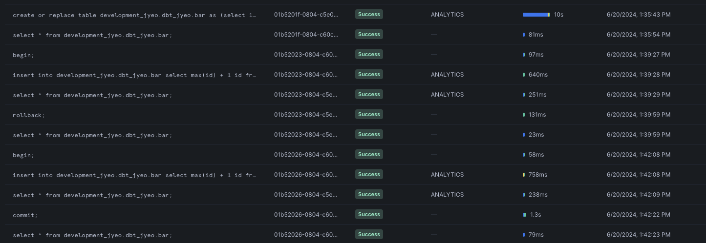
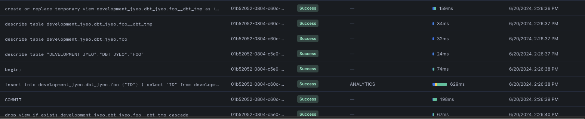

---
---

## Snowflake transactions

A small write up on [Snowflake transactions](https://docs.snowflake.com/en/sql-reference/transactions) and dbt.

At a high level, dbt wants users not to care too much about having to manage transactions and have queries be auto-commit - some relevant issues:
* https://github.com/dbt-labs/dbt-core/pull/3510
* https://github.com/dbt-labs/dbt-core/issues/2748
* https://github.com/dbt-labs/dbt-core/issues/3480 - has this nugget:

> Given the above, Snowflake strongly recommends three clear best practices:
> * Always turn on autocommit
> * Never wrap DDL in explicit transactions
> * Always wrap DML in explicit transactions

### Basics

Some basics from running queries straight in the Snowflake UI.

```sql
create or replace table development_jyeo.dbt_jyeo.bar as (select 1 id);
select * from development_jyeo.dbt_jyeo.bar;
```

```
╔════╗
║ id ║
╠════╣
║ 1  ║
╚════╝
```

Inserting then rolling back in an explicit transaction:

```sql
-- test rollback.
begin;
insert into development_jyeo.dbt_jyeo.bar select max(id) + 1 id from development_jyeo.dbt_jyeo.bar;
select * from development_jyeo.dbt_jyeo.bar;
```

```
╔════╗
║ id ║
╠════╣
║ 1  ║
╠════╣
║ 2  ║
╚════╝
```

```sql
rollback;
select * from development_jyeo.dbt_jyeo.bar;
```

```
╔════╗
║ id ║
╠════╣
║ 1  ║
╚════╝
```

Inserting then committing in an explicit transaction:

```sql
-- test commit.
begin;
insert into development_jyeo.dbt_jyeo.bar select max(id) + 1 id from development_jyeo.dbt_jyeo.bar;
select * from development_jyeo.dbt_jyeo.bar;
```

```
╔════╗
║ id ║
╠════╣
║ 1  ║
╠════╣
║ 2  ║
╚════╝
```

```sql
commit;
select * from development_jyeo.dbt_jyeo.bar;
```

```
╔════╗
║ id ║
╠════╣
║ 1  ║
╠════╣
║ 2  ║
╚════╝
```

> Note that all of the above statements show up in the Snowflake Query History



What happens to the `insert...` DML if there is no subsequent `commit;`? If the transaction (that started via `begin;`) is not committed (via a closing `commit;`)? 

Using a Python script like so:

```py
# test_snowflake.py
import snowflake.connector
ctx = snowflake.connector.connect(connection_name="default", autocommit=True)
cs = ctx.cursor()
try:
    cs.execute("select * from development_jyeo.dbt_jyeo.bar;")
    rows = cs.fetchall()
    print(rows)
    print("-----")
    cs.execute("begin;")
    cs.execute("insert into development_jyeo.dbt_jyeo.bar select max(id) + 1 id from development_jyeo.dbt_jyeo.bar;")
    cs.execute("select * from development_jyeo.dbt_jyeo.bar;")
    rows = cs.fetchall()
    print(rows)
    print("-----")
finally:
    cs.close()
ctx.close()

ctx_2 = snowflake.connector.connect(connection_name="default", autocommit=True)
cs_2 = ctx_2.cursor()
try:
    cs_2.execute("select * from development_jyeo.dbt_jyeo.bar;")
    rows = cs_2.fetchall()
    print(rows)
    print("-----")
finally:
    cs_2.close()
ctx_2.close()
```

```sh
$ python test_snowflake.py
[(1,), (2,)]
-----
[(1,), (2,), (3,)]
-----
[(1,), (2,)]
-----
```

We can see that even with `autocommit=True`, a DML (`insert`) that is within a `begin;` is not auto-committed - an explicit `commit;` is required for that to happen. What if we run the script again but remove the `begin;` statement:

```py
# test_snowflake.py
import snowflake.connector
ctx = snowflake.connector.connect(connection_name="default", autocommit=True)
cs = ctx.cursor()
try:
    cs.execute("select * from development_jyeo.dbt_jyeo.bar;")
    rows = cs.fetchall()
    print(rows)
    print("-----")
    cs.execute("insert into development_jyeo.dbt_jyeo.bar select max(id) + 1 id from development_jyeo.dbt_jyeo.bar;")
    cs.execute("select * from development_jyeo.dbt_jyeo.bar;")
    rows = cs.fetchall()
    print(rows)
    print("-----")
finally:
    cs.close()
ctx.close()

ctx_2 = snowflake.connector.connect(connection_name="default", autocommit=True)
cs_2 = ctx_2.cursor()
try:
    cs_2.execute("select * from development_jyeo.dbt_jyeo.bar;")
    rows = cs_2.fetchall()
    print(rows)
    print("-----")
finally:
    cs_2.close()
ctx_2.close()
```

```sh
$ python test_snowflake.py
[(1,), (2,)]
-----
[(3,), (1,), (2,)]
-----
[(3,), (1,), (2,)]
```

The `insert` DML is in this case auto-committed when there is no explicit `begin;`.

----

### dbt-snowflake

Let's do some testing with dbt-snowflake. The adapter sets the `autocommit` param just like above when creating the connection here https://github.com/dbt-labs/dbt-snowflake/blob/v1.7.5/dbt/adapters/snowflake/connections.py#L354

Create a new `foo` model like above:

```sql
create or replace table development_jyeo.dbt_jyeo.foo as (select 1 id);
select * from development_jyeo.dbt_jyeo.foo;
```

```
╔════╗
║ id ║
╠════╣
║ 1  ║
╚════╝
```

Then we're going to create a `foo.sql` incremental model like so:

```sql
-- models/foo.sql
{{  config(materialized='incremental') }}
select max(id) + 1 id from {{ this }}
```

```sh
$ dbt --debug run -s foo

02:26:34  1 of 1 START sql incremental model dbt_jyeo.foo ................................ [RUN]
02:26:34  Acquiring new snowflake connection 'model.my_dbt_project.foo'
02:26:34  Began compiling node model.my_dbt_project.foo
02:26:34  Writing injected SQL for node "model.my_dbt_project.foo"
02:26:34  Timing info for model.my_dbt_project.foo (compile): 14:26:34.826619 => 14:26:34.830908
02:26:34  Began executing node model.my_dbt_project.foo
02:26:34  Using snowflake connection "model.my_dbt_project.foo"
02:26:34  On model.my_dbt_project.foo: /* {"app": "dbt", "dbt_version": "1.7.16", "profile_name": "all", "target_name": "sf", "node_id": "model.my_dbt_project.foo"} */
create or replace  temporary view development_jyeo.dbt_jyeo.foo__dbt_tmp
  
   as (
    -- models/foo.sql

select max(id) + 1 id from development_jyeo.dbt_jyeo.foo
  );
02:26:34  Opening a new connection, currently in state init
02:26:36  SQL status: SUCCESS 1 in 2.0 seconds
02:26:36  Using snowflake connection "model.my_dbt_project.foo"
02:26:36  On model.my_dbt_project.foo: /* {"app": "dbt", "dbt_version": "1.7.16", "profile_name": "all", "target_name": "sf", "node_id": "model.my_dbt_project.foo"} */
describe table development_jyeo.dbt_jyeo.foo__dbt_tmp
02:26:36  SQL status: SUCCESS 1 in 0.0 seconds
02:26:36  Using snowflake connection "model.my_dbt_project.foo"
02:26:36  On model.my_dbt_project.foo: /* {"app": "dbt", "dbt_version": "1.7.16", "profile_name": "all", "target_name": "sf", "node_id": "model.my_dbt_project.foo"} */
describe table development_jyeo.dbt_jyeo.foo
02:26:37  SQL status: SUCCESS 1 in 0.0 seconds
02:26:37  Using snowflake connection "model.my_dbt_project.foo"
02:26:37  On model.my_dbt_project.foo: /* {"app": "dbt", "dbt_version": "1.7.16", "profile_name": "all", "target_name": "sf", "node_id": "model.my_dbt_project.foo"} */
describe table "DEVELOPMENT_JYEO"."DBT_JYEO"."FOO"
02:26:37  SQL status: SUCCESS 1 in 0.0 seconds
02:26:37  Writing runtime sql for node "model.my_dbt_project.foo"
02:26:37  Using snowflake connection "model.my_dbt_project.foo"
02:26:37  On model.my_dbt_project.foo: /* {"app": "dbt", "dbt_version": "1.7.16", "profile_name": "all", "target_name": "sf", "node_id": "model.my_dbt_project.foo"} */
-- back compat for old kwarg name
  
  begin;
02:26:37  SQL status: SUCCESS 1 in 0.0 seconds
02:26:37  Using snowflake connection "model.my_dbt_project.foo"
02:26:37  On model.my_dbt_project.foo: /* {"app": "dbt", "dbt_version": "1.7.16", "profile_name": "all", "target_name": "sf", "node_id": "model.my_dbt_project.foo"} */
insert into development_jyeo.dbt_jyeo.foo ("ID")
        (
            select "ID"
            from development_jyeo.dbt_jyeo.foo__dbt_tmp
        );
02:26:38  SQL status: SUCCESS 1 in 1.0 seconds
02:26:38  Using snowflake connection "model.my_dbt_project.foo"
02:26:38  On model.my_dbt_project.foo: /* {"app": "dbt", "dbt_version": "1.7.16", "profile_name": "all", "target_name": "sf", "node_id": "model.my_dbt_project.foo"} */
COMMIT
02:26:39  SQL status: SUCCESS 1 in 0.0 seconds
02:26:39  Applying DROP to: development_jyeo.dbt_jyeo.foo__dbt_tmp
02:26:39  Using snowflake connection "model.my_dbt_project.foo"
02:26:39  On model.my_dbt_project.foo: /* {"app": "dbt", "dbt_version": "1.7.16", "profile_name": "all", "target_name": "sf", "node_id": "model.my_dbt_project.foo"} */
drop view if exists development_jyeo.dbt_jyeo.foo__dbt_tmp cascade
02:26:39  SQL status: SUCCESS 1 in 0.0 seconds
02:26:39  Timing info for model.my_dbt_project.foo (execute): 14:26:34.831650 => 14:26:39.827253
02:26:39  On model.my_dbt_project.foo: Close
02:26:40  Sending event: {'category': 'dbt', 'action': 'run_model', 'label': 'df1c63e2-dfc3-4b17-95a5-ebeef15e1222', 'context': [<snowplow_tracker.self_describing_json.SelfDescribingJson object at 0x14c200290>]}
02:26:40  1 of 1 OK created sql incremental model dbt_jyeo.foo ........................... [SUCCESS 1 in 5.58s]
02:26:40  Finished running node model.my_dbt_project.foo
```

What we see here is a sequence of SQL statements for the incremental model:
1. Create a temporary view.
2. Describe the temporary view and target table (this is so dbt knows if it should add columns to the existing target table or not).
3. Execute a `begin;` to start the transaction.
4. `insert into` the target table selecting from the temporary view in (1).
5. Execute a `commit;` to end the transaction and commit the change.
6. Drop the temporary view created in (1).

After the above, we can go back into the Snowflake UI and run:

```sql
select * from development_jyeo.dbt_jyeo.foo;
```

```
╔════╗
║ id ║
╠════╣
║ 1  ║
╠════╣
║ 2  ║
╚════╝
```

> Note, just like before, all of the queries that dbt has sent to Snowflake - is visible in the Query History 



Now, what happens if there is an error after the `insert into` DML? 

There is a macro called `snowflake_dml_explicit_transaction()` here https://github.com/dbt-labs/dbt-snowflake/blob/v1.7.5/dbt/include/snowflake/macros/adapters.sql#L276 that is responsible for wrapping the DML between `begin; commit;` so let's try and override that macro in our project.

```sql
-- macros/overrides.sql

  
    begin;
    {{ dml }};
  
  

```

As a first test, I'm simply removing the `commit;` statement from the macro.

```sh
$ dbt --debug run -s foo

02:43:32  1 of 1 START sql incremental model dbt_jyeo.foo ................................ [RUN]
02:43:32  Acquiring new snowflake connection 'model.my_dbt_project.foo'
02:43:32  Began compiling node model.my_dbt_project.foo
02:43:32  Writing injected SQL for node "model.my_dbt_project.foo"
02:43:32  Timing info for model.my_dbt_project.foo (compile): 14:43:32.432091 => 14:43:32.436250
02:43:32  Began executing node model.my_dbt_project.foo
02:43:32  Using snowflake connection "model.my_dbt_project.foo"
02:43:32  On model.my_dbt_project.foo: /* {"app": "dbt", "dbt_version": "1.7.16", "profile_name": "all", "target_name": "sf", "node_id": "model.my_dbt_project.foo"} */
create or replace  temporary view development_jyeo.dbt_jyeo.foo__dbt_tmp
  
   as (
    -- models/foo.sql

select max(id) + 1 id from development_jyeo.dbt_jyeo.foo
  );
02:43:32  Opening a new connection, currently in state init
02:43:34  SQL status: SUCCESS 1 in 2.0 seconds
02:43:34  Using snowflake connection "model.my_dbt_project.foo"
02:43:34  On model.my_dbt_project.foo: /* {"app": "dbt", "dbt_version": "1.7.16", "profile_name": "all", "target_name": "sf", "node_id": "model.my_dbt_project.foo"} */
describe table development_jyeo.dbt_jyeo.foo__dbt_tmp
02:43:34  SQL status: SUCCESS 1 in 0.0 seconds
02:43:34  Using snowflake connection "model.my_dbt_project.foo"
02:43:34  On model.my_dbt_project.foo: /* {"app": "dbt", "dbt_version": "1.7.16", "profile_name": "all", "target_name": "sf", "node_id": "model.my_dbt_project.foo"} */
describe table development_jyeo.dbt_jyeo.foo
02:43:34  SQL status: SUCCESS 1 in 0.0 seconds
02:43:34  Using snowflake connection "model.my_dbt_project.foo"
02:43:34  On model.my_dbt_project.foo: /* {"app": "dbt", "dbt_version": "1.7.16", "profile_name": "all", "target_name": "sf", "node_id": "model.my_dbt_project.foo"} */
describe table "DEVELOPMENT_JYEO"."DBT_JYEO"."FOO"
02:43:35  SQL status: SUCCESS 1 in 0.0 seconds
02:43:35  Writing runtime sql for node "model.my_dbt_project.foo"
02:43:35  Using snowflake connection "model.my_dbt_project.foo"
02:43:35  On model.my_dbt_project.foo: /* {"app": "dbt", "dbt_version": "1.7.16", "profile_name": "all", "target_name": "sf", "node_id": "model.my_dbt_project.foo"} */
-- back compat for old kwarg name
  
  begin;
02:43:35  SQL status: SUCCESS 1 in 0.0 seconds
02:43:35  Using snowflake connection "model.my_dbt_project.foo"
02:43:35  On model.my_dbt_project.foo: /* {"app": "dbt", "dbt_version": "1.7.16", "profile_name": "all", "target_name": "sf", "node_id": "model.my_dbt_project.foo"} */
insert into development_jyeo.dbt_jyeo.foo ("ID")
        (
            select "ID"
            from development_jyeo.dbt_jyeo.foo__dbt_tmp
        );
02:43:36  SQL status: SUCCESS 1 in 1.0 seconds
02:43:36  Applying DROP to: development_jyeo.dbt_jyeo.foo__dbt_tmp
02:43:36  Using snowflake connection "model.my_dbt_project.foo"
02:43:36  On model.my_dbt_project.foo: /* {"app": "dbt", "dbt_version": "1.7.16", "profile_name": "all", "target_name": "sf", "node_id": "model.my_dbt_project.foo"} */
drop view if exists development_jyeo.dbt_jyeo.foo__dbt_tmp cascade
02:43:37  SQL status: SUCCESS 1 in 1.0 seconds
02:43:37  Timing info for model.my_dbt_project.foo (execute): 14:43:32.436769 => 14:43:37.179869
02:43:37  On model.my_dbt_project.foo: Close
02:43:37  Sending event: {'category': 'dbt', 'action': 'run_model', 'label': '87ce429a-548d-4402-96fd-81a06862acf1', 'context': [<snowplow_tracker.self_describing_json.SelfDescribingJson object at 0x16bb14e90>]}
02:43:37  1 of 1 OK created sql incremental model dbt_jyeo.foo ........................... [SUCCESS 1 in 5.40s]
02:43:37  Finished running node model.my_dbt_project.foo
```

The queries are pretty much the same as before, but here there is no closing `commit;` after the `insert` DML.

However, when we run our select again:

```sql
select * from development_jyeo.dbt_jyeo.foo;
```

```
╔════╗
║ id ║
╠════╣
║ 1  ║
╠════╣
║ 2  ║
╠════╣
║ 3  ║
╚════╝
```

We see that changes to `foo` was indeed comitted. The reason for this is because of the `drop view` DDL statement. [According to Snowflake](https://docs.snowflake.com/en/sql-reference/transactions#ddl):

> Each DDL statement executes as a separate transaction.
> 
> If a DDL statement is executed while a transaction is active, the DDL statement:
> 1. Implicitly commits the active transaction.
> 2. Executes the DDL statement as a separate transaction.

We can do a quick test of this using the Python script previously:

```python
# test_snowflake.py
import snowflake.connector
ctx = snowflake.connector.connect(connection_name="default", autocommit=True)
cs = ctx.cursor()
try:
    cs.execute("create or replace table development_jyeo.dbt_jyeo.baz as (select 1 id);")
    cs.execute("create or replace table development_jyeo.dbt_jyeo.will_drop as (select 1 id);")
    cs.execute("select * from development_jyeo.dbt_jyeo.baz;")
    rows = cs.fetchall()
    print(rows)
    print("-----")
    cs.execute("begin;")
    cs.execute("insert into development_jyeo.dbt_jyeo.baz select max(id) + 1 id from development_jyeo.dbt_jyeo.baz;")
    cs.execute("drop table development_jyeo.dbt_jyeo.will_drop;")
finally:
    cs.close()
ctx.close()

ctx_2 = snowflake.connector.connect(connection_name="default", autocommit=True)
cs_2 = ctx_2.cursor()
try:
    cs_2.execute("select * from development_jyeo.dbt_jyeo.baz;")
    rows = cs_2.fetchall()
    print(rows)
    print("-----")
finally:
    cs_2.close()
ctx_2.close()
```

```sh
$ python test_snowflake.py
[(1,)]
-----
[(1,), (2,)]
-----
```

The `insert` DML that started in a `begin;` was committed without requiring a `commit;` because of the `drop` DDL.

Now, let's see what happens in dbt, if there is an error due to the `insert` DDL. 

First, reset the state of the `foo` and `bar` tables:

```sql
create or replace table development_jyeo.dbt_jyeo.bar as (select 1 id);
create or replace table development_jyeo.dbt_jyeo.foo as (select 1 id);
```

And then modify the `snowflake_dml_explicit_transaction` override:

```sql
-- macros/overrides.sql

  
    insert into development_jyeo.dbt_jyeo.bar select max(id) + 1 id from development_jyeo.dbt_jyeo.bar;
    begin;
    {{ dml }};
    insert into this_will_error_for_sure values (1);
    commit;
  
  

```

We're going to attempt to update `bar` outside of an explicit transaction, begin a transaction, have `foo` be updated, and then run a DML that will error (since `this_will_error_for_sure` is not a table that exist).

```sh
$ dbt --debug run -s foo

03:42:26  Began running node model.my_dbt_project.foo
03:42:26  1 of 1 START sql incremental model dbt_jyeo.foo ................................ [RUN]
03:42:26  Acquiring new snowflake connection 'model.my_dbt_project.foo'
03:42:26  Began compiling node model.my_dbt_project.foo
03:42:26  Writing injected SQL for node "model.my_dbt_project.foo"
03:42:26  Timing info for model.my_dbt_project.foo (compile): 15:42:26.856653 => 15:42:26.861658
03:42:26  Began executing node model.my_dbt_project.foo
03:42:26  Using snowflake connection "model.my_dbt_project.foo"
03:42:26  On model.my_dbt_project.foo: /* {"app": "dbt", "dbt_version": "1.7.16", "profile_name": "all", "target_name": "sf", "node_id": "model.my_dbt_project.foo"} */
create or replace  temporary view development_jyeo.dbt_jyeo.foo__dbt_tmp
  
   as (
    -- models/foo.sql


select max(id) + 1 id from development_jyeo.dbt_jyeo.foo
  );
03:42:26  Opening a new connection, currently in state init
03:42:28  SQL status: SUCCESS 1 in 2.0 seconds
03:42:28  Using snowflake connection "model.my_dbt_project.foo"
03:42:28  On model.my_dbt_project.foo: /* {"app": "dbt", "dbt_version": "1.7.16", "profile_name": "all", "target_name": "sf", "node_id": "model.my_dbt_project.foo"} */
describe table development_jyeo.dbt_jyeo.foo__dbt_tmp
03:42:28  SQL status: SUCCESS 1 in 0.0 seconds
03:42:29  Using snowflake connection "model.my_dbt_project.foo"
03:42:29  On model.my_dbt_project.foo: /* {"app": "dbt", "dbt_version": "1.7.16", "profile_name": "all", "target_name": "sf", "node_id": "model.my_dbt_project.foo"} */
describe table development_jyeo.dbt_jyeo.foo
03:42:29  SQL status: SUCCESS 1 in 0.0 seconds
03:42:29  Using snowflake connection "model.my_dbt_project.foo"
03:42:29  On model.my_dbt_project.foo: /* {"app": "dbt", "dbt_version": "1.7.16", "profile_name": "all", "target_name": "sf", "node_id": "model.my_dbt_project.foo"} */
describe table "DEVELOPMENT_JYEO"."DBT_JYEO"."FOO"
03:42:29  SQL status: SUCCESS 1 in 0.0 seconds
03:42:29  Writing runtime sql for node "model.my_dbt_project.foo"
03:42:29  Using snowflake connection "model.my_dbt_project.foo"
03:42:29  On model.my_dbt_project.foo: /* {"app": "dbt", "dbt_version": "1.7.16", "profile_name": "all", "target_name": "sf", "node_id": "model.my_dbt_project.foo"} */
-- back compat for old kwarg name
  
  insert into development_jyeo.dbt_jyeo.bar select max(id) + 1 id from development_jyeo.dbt_jyeo.bar;
03:42:30  SQL status: SUCCESS 1 in 1.0 seconds
03:42:30  Using snowflake connection "model.my_dbt_project.foo"
03:42:30  On model.my_dbt_project.foo: /* {"app": "dbt", "dbt_version": "1.7.16", "profile_name": "all", "target_name": "sf", "node_id": "model.my_dbt_project.foo"} */
BEGIN
03:42:30  SQL status: SUCCESS 1 in 0.0 seconds
03:42:30  Using snowflake connection "model.my_dbt_project.foo"
03:42:30  On model.my_dbt_project.foo: /* {"app": "dbt", "dbt_version": "1.7.16", "profile_name": "all", "target_name": "sf", "node_id": "model.my_dbt_project.foo"} */
insert into development_jyeo.dbt_jyeo.foo ("ID")
        (
            select "ID"
            from development_jyeo.dbt_jyeo.foo__dbt_tmp
        );
03:42:31  SQL status: SUCCESS 1 in 1.0 seconds
03:42:31  Using snowflake connection "model.my_dbt_project.foo"
03:42:31  On model.my_dbt_project.foo: /* {"app": "dbt", "dbt_version": "1.7.16", "profile_name": "all", "target_name": "sf", "node_id": "model.my_dbt_project.foo"} */
insert into this_will_error_for_sure values (1);
03:42:32  Snowflake adapter: Snowflake query id: 01b5209e-0804-c60c-000d-378338085eda
03:42:32  Snowflake adapter: Snowflake error: 002003 (42S02): SQL compilation error:
Table 'THIS_WILL_ERROR_FOR_SURE' does not exist or not authorized.
03:42:32  Timing info for model.my_dbt_project.foo (execute): 15:42:26.862433 => 15:42:32.055767
03:42:32  On model.my_dbt_project.foo: Close
03:42:32  Database Error in model foo (models/foo.sql)
  002003 (42S02): SQL compilation error:
  Table 'THIS_WILL_ERROR_FOR_SURE' does not exist or not authorized.
  compiled Code at target/run/my_dbt_project/models/foo.sql
03:42:32  Sending event: {'category': 'dbt', 'action': 'run_model', 'label': '0d565695-5f94-43ab-8c1b-7ed114e2636f', 'context': [<snowplow_tracker.self_describing_json.SelfDescribingJson object at 0x155032d10>]}
03:42:32  1 of 1 ERROR creating sql incremental model dbt_jyeo.foo ....................... [ERROR in 5.80s]
03:42:32  Finished running node model.my_dbt_project.foo
```

Here, we see:
1. There is the insert DDL that updates `bar` outside of a transaction.
2. A transaction starts with `begin;`.
3. Then there is an `insert into` DDL updating `foo`.
4. Another `insert into` DDL happens attempting to insert to a non-existant table `this_will_error_for_sure`.
5. Because of the error in (4) - dbt aborts and we never get to the `commit;`.

The outcome of this is that when we query our tables again - `foo` isn't updated but `bar` was (both of which are expected):

```sql
select * from development_jyeo.dbt_jyeo.foo;
```
```
╔════╗
║ id ║
╠════╣
║ 1  ║
╚════╝
```

```sql
select * from development_jyeo.dbt_jyeo.bar;
```
```
╔════╗
║ id ║
╠════╣
║ 1  ║
╠════╣
║ 2  ║
╚════╝
```