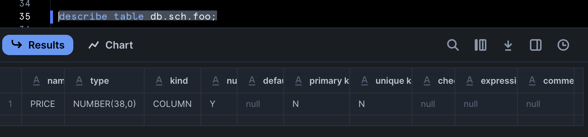

---
---

## Table schema out of sync scenarios

Schema here refers to the table's columns and their data types instead of the "location" where we write a relation to - i.e. not "schema" in `<database>.<schema>.<relation_name>`.

You have an incremental model with an `on_schema_change = 'fail'` configuration and for some reason dbt is throwing an error:

```
The source and target schemas on this incremental model are out of sync!
```

When it is clear to you that the schema of the table has not changed or perhaps you did a full-refresh and so the schema shouldn't have deviated if you didn't change any code. Let's see how this can happen with a Snowflake example.

Let's write our model like so:

```sql
-- models/foo.sql
{{ config(materialized='incremental', on_schema_change='fail') }}
select '9.99'::number(3,2) as price
```

```yaml
# models/schema.yml
models:
  - name: foo
    config:
      contract:
        enforced: true
    columns:
      - name: price
        data_type: number
```

Basically, the data from source has an exact scale and precision `number(3,2)` whilst our contract does not `number` (not setting a scale and precision results in `number(38,0)` by default). Let's build our model for the first time / full refresh:

```sh
$ dbt run --full-refresh
02:04:30  1 of 1 START sql incremental model sch.foo ..................................... [RUN]
02:04:30  Re-using an available connection from the pool (formerly list_db_sch, now model.my_dbt_project.foo)
02:04:30  Began compiling node model.my_dbt_project.foo
02:04:30  Writing injected SQL for node "model.my_dbt_project.foo"
02:04:30  Began executing node model.my_dbt_project.foo
02:04:30  Using snowflake connection "model.my_dbt_project.foo"
02:04:30  On model.my_dbt_project.foo: /* {"app": "dbt", "dbt_version": "1.9.2", "profile_name": "all", "target_name": "sf", "node_id": "model.my_dbt_project.foo"} */
/* {"app": "dbt", "dbt_version": "1.9.2", "profile_name": "all", "target_name": "sf", "node_id": "model.my_dbt_project.foo"} */
select * from (
select '9.99'::number(3,2) as price
    ) as __dbt_sbq
    where false
    limit 0
02:04:30  SQL status: SUCCESS 0 in 0.302 seconds
02:04:30  Detected columns with numeric type and unspecified precision/scale, this can lead to unintended rounding: ['price']`
02:04:30  Using snowflake connection "model.my_dbt_project.foo"
02:04:30  On model.my_dbt_project.foo: /* {"app": "dbt", "dbt_version": "1.9.2", "profile_name": "all", "target_name": "sf", "node_id": "model.my_dbt_project.foo"} */
/* {"app": "dbt", "dbt_version": "1.9.2", "profile_name": "all", "target_name": "sf", "node_id": "model.my_dbt_project.foo"} */
select * from (
        select
    cast(null as number)
     as price
    ) as __dbt_sbq
    where false
    limit 0
02:04:31  SQL status: SUCCESS 0 in 0.264 seconds
02:04:31  Writing runtime sql for node "model.my_dbt_project.foo"
02:04:31  Using snowflake connection "model.my_dbt_project.foo"
02:04:31  On model.my_dbt_project.foo: /* {"app": "dbt", "dbt_version": "1.9.2", "profile_name": "all", "target_name": "sf", "node_id": "model.my_dbt_project.foo"} */
create or replace transient table db.sch.foo
  (
    price number
    )
         as
        (
    select price
    from (
select '9.99'::number(3,2) as price
    ) as model_subq
        );
02:04:32  SQL status: SUCCESS 1 in 1.081 seconds
02:04:32  Applying DROP to: db.sch.foo__dbt_tmp
02:04:32  Using snowflake connection "model.my_dbt_project.foo"
02:04:32  On model.my_dbt_project.foo: /* {"app": "dbt", "dbt_version": "1.9.2", "profile_name": "all", "target_name": "sf", "node_id": "model.my_dbt_project.foo"} */
drop view if exists db.sch.foo__dbt_tmp cascade
02:04:32  SQL status: SUCCESS 1 in 0.244 seconds
02:04:32  Sending event: {'category': 'dbt', 'action': 'run_model', 'label': '07df5816-eb18-43f2-ab06-28237ffbb42b', 'context': [<snowplow_tracker.self_describing_json.SelfDescribingJson object at 0x10dab3490>]}
02:04:32  1 of 1 OK created sql incremental model sch.foo ................................ [SUCCESS 1 in 2.04s]
```

There's a couple of interesting things to call out in the logs... firstly, dbt issued a warning:

```
Detected columns with numeric type and unspecified precision/scale, this can lead to unintended rounding: ['price']`
```

And the table was created with the `number` type for the `price` column:

```sql
create or replace transient table db.sch.foo
  (
    price number
    )
         as
        (
    select price
    from (
select '9.99'::number(3,2) as price
    ) as model_subq
        );
```

What this means exactly is that we have basically lost some information (due to rounding) - let's have a look in Snowflake:


Our price of `9.99` has been rounded to `10` because Snowflake will round the data automatically without any errors when it is coerced into `number`/`number(38,0)`:

```sql
select '9.99'::number(3,2) 
-- (9.99)

select '9.99'::number(3,2)::number -- equivalent: select '9.99'::number(3,2)::number(38,0)
-- (10)
```

If we run a `describe` on the table - we can see that the datatype is `number(38,0)` as well:



So, what happens when we do a subsequent run of the same model?

```sh
$ dbt run

02:10:26  1 of 1 START sql incremental model sch.foo ..................................... [RUN]
02:10:26  Re-using an available connection from the pool (formerly list_db_sch, now model.my_dbt_project.foo)
02:10:26  Began compiling node model.my_dbt_project.foo
02:10:26  Writing injected SQL for node "model.my_dbt_project.foo"
02:10:26  Began executing node model.my_dbt_project.foo
02:10:26  Using snowflake connection "model.my_dbt_project.foo"
02:10:26  On model.my_dbt_project.foo: /* {"app": "dbt", "dbt_version": "1.9.2", "profile_name": "all", "target_name": "sf", "node_id": "model.my_dbt_project.foo"} */
/* {"app": "dbt", "dbt_version": "1.9.2", "profile_name": "all", "target_name": "sf", "node_id": "model.my_dbt_project.foo"} */
select * from (
select '9.99'::number(3,2) as price
    ) as __dbt_sbq
    where false
    limit 0
02:10:26  SQL status: SUCCESS 0 in 0.755 seconds
02:10:27  Detected columns with numeric type and unspecified precision/scale, this can lead to unintended rounding: ['price']`
02:10:27  Using snowflake connection "model.my_dbt_project.foo"
02:10:27  On model.my_dbt_project.foo: /* {"app": "dbt", "dbt_version": "1.9.2", "profile_name": "all", "target_name": "sf", "node_id": "model.my_dbt_project.foo"} */
/* {"app": "dbt", "dbt_version": "1.9.2", "profile_name": "all", "target_name": "sf", "node_id": "model.my_dbt_project.foo"} */
select * from (
        select
    cast(null as number)
     as price
    ) as __dbt_sbq
    where false
    limit 0
02:10:27  SQL status: SUCCESS 0 in 0.250 seconds
02:10:27  Using snowflake connection "model.my_dbt_project.foo"
02:10:27  On model.my_dbt_project.foo: /* {"app": "dbt", "dbt_version": "1.9.2", "profile_name": "all", "target_name": "sf", "node_id": "model.my_dbt_project.foo"} */
create or replace  temporary view db.sch.foo__dbt_tmp
   as (
select '9.99'::number(3,2) as price
  );
02:10:27  SQL status: SUCCESS 1 in 0.379 seconds
02:10:27  Using snowflake connection "model.my_dbt_project.foo"
02:10:27  On model.my_dbt_project.foo: /* {"app": "dbt", "dbt_version": "1.9.2", "profile_name": "all", "target_name": "sf", "node_id": "model.my_dbt_project.foo"} */
describe table db.sch.foo__dbt_tmp
02:10:28  SQL status: SUCCESS 1 in 0.485 seconds
02:10:28  Using snowflake connection "model.my_dbt_project.foo"
02:10:28  On model.my_dbt_project.foo: /* {"app": "dbt", "dbt_version": "1.9.2", "profile_name": "all", "target_name": "sf", "node_id": "model.my_dbt_project.foo"} */
describe table db.sch.foo
02:10:28  SQL status: SUCCESS 1 in 0.290 seconds
02:10:28  Using snowflake connection "model.my_dbt_project.foo"
02:10:28  On model.my_dbt_project.foo: /* {"app": "dbt", "dbt_version": "1.9.2", "profile_name": "all", "target_name": "sf", "node_id": "model.my_dbt_project.foo"} */
describe table db.sch.foo__dbt_tmp
02:10:28  SQL status: SUCCESS 1 in 0.273 seconds
02:10:28  Using snowflake connection "model.my_dbt_project.foo"
02:10:28  On model.my_dbt_project.foo: /* {"app": "dbt", "dbt_version": "1.9.2", "profile_name": "all", "target_name": "sf", "node_id": "model.my_dbt_project.foo"} */
describe table "DB"."SCH"."FOO"
02:10:29  SQL status: SUCCESS 1 in 0.240 seconds
02:10:29  
    In "DB"."SCH"."FOO":
        Schema changed: True
        Source columns not in target: []
        Target columns not in source: []
        New column types: [{'column_name': 'PRICE', 'new_type': 'NUMBER(3,2)'}]
02:10:29  Compilation Error in model foo (models/foo.sql)
                The source and target schemas on this incremental model are out of sync!
                They can be reconciled in several ways:
                  - set the `on_schema_change` config to either append_new_columns or sync_all_columns, depending on your situation.
                  - Re-run the incremental model with `full_refresh: True` to update the target schema.
                  - update the schema manually and re-run the process.
                Additional troubleshooting context:
                   Source columns not in target: []
                   Target columns not in source: []
                   New column types: [{'column_name': 'PRICE', 'new_type': 'NUMBER(3,2)'}]
  > in macro process_schema_changes (macros/materializations/models/incremental/on_schema_change.sql)
  > called by macro materialization_incremental_snowflake (macros/materializations/incremental.sql)
  > called by model foo (models/foo.sql)
02:10:29  Sending event: {'category': 'dbt', 'action': 'run_model', 'label': '11bc87f9-9a99-4464-ad4b-321eceac2fc6', 'context': [<snowplow_tracker.self_describing_json.SelfDescribingJson object at 0x123ce2450>]}
02:10:29  1 of 1 ERROR creating sql incremental model sch.foo ............................ [ERROR in 2.83s]
```

We have run into the error mentioned at the start - even though we changed none of our code nor has the raw data changed - why? For a subsequent run:

1. dbt creates a temp view of the incoming/new data and checks the data type of the `price` column (`describe table db.sch.foo__dbt_tmp`) - which at this stage is `number(3,2)`.
2. dbt checks the data type of the `price` column in the existing table (`describe table db.sch.foo`) - which at this stage is `number(38,0)`.
3. And since we have `on_schema_change='fail'` and (1) and (2) don't match - dbt raises an exception that the incoming data is of a new data type compared to what exist in the table already.
